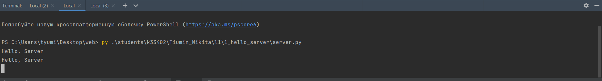
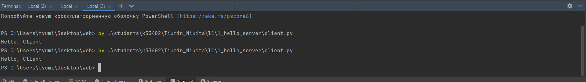
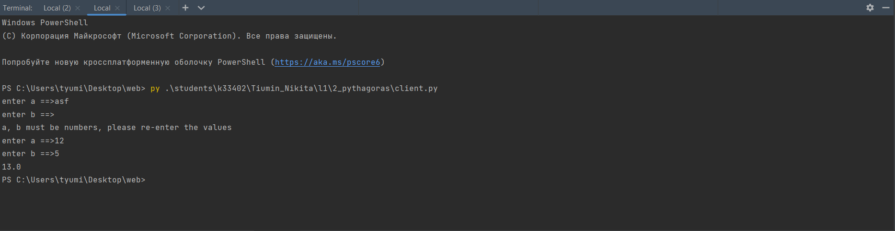
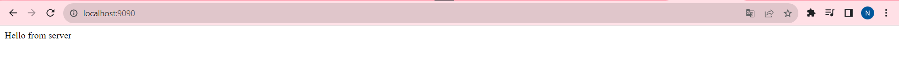
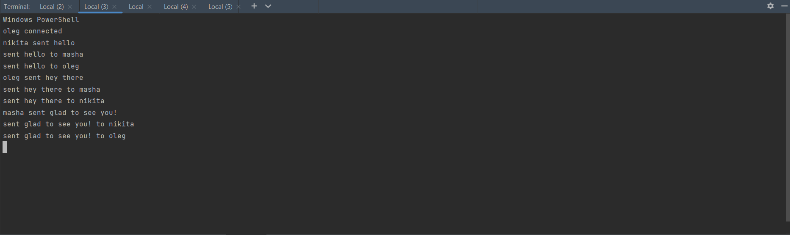
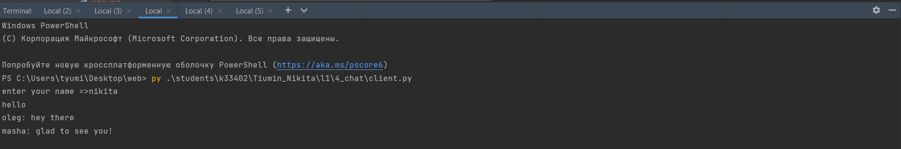
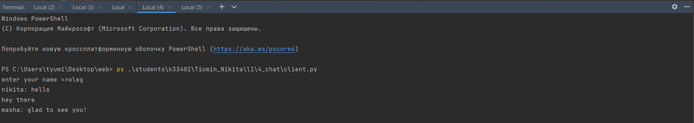
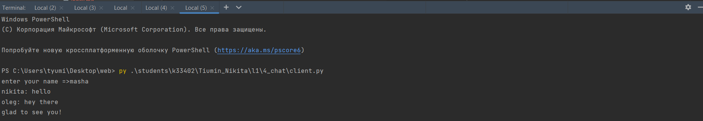
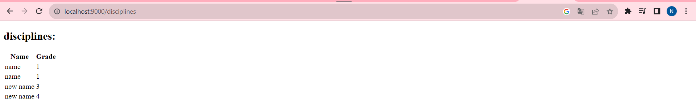
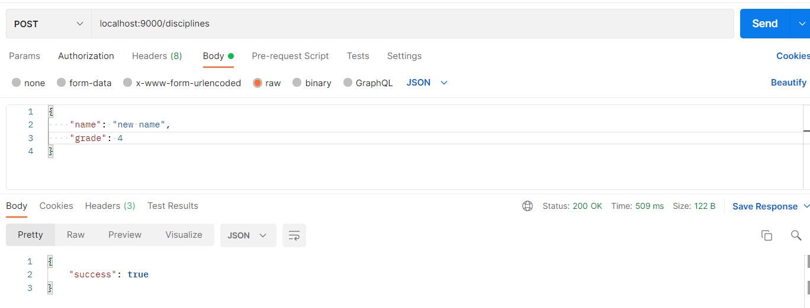

# Лабораторная работа №1

## Задание №1
Был реализован простой скрипт для клиента и сервера. 
При подключении клиента к серверу клиент отправляет сообщение на сервер
и принимает сообщение от последнего.
* Сервер:

* Клиент:

## Задание №2
Был реализован скрипт для клиента и сервера для расчета гипотенузы в 
прямоугольном треугольнике. Клиент вводит длины катетов и подключается
к серверу, с помощью библиотеки `pickle`, преобразует объект с введенными данными в байтовую строку,
после сервер посылает клиенту результаты расчета. При вводе
неверных данных, программа попросит пользователя ввести их заново
* Клиент:

## Задание №3
Был реализован скрпт, который возвращает HTTP ответ
с html-страницей с текстом hello server.

## Задание №4
Был реализован многопользовательский чат с помощью библиотеки `threading`.
Клиентский скрипт получает от пользователя имя и подключается к серверу. 
На стороне клиента работают два потока: один для отправки сообщений, второй
\- для получения новых сообщений в режиме реального времени.

На стороне сервера происходит следующее: работает поток для принятия подключений от 
новых клиентов. После того, как клиент подключился его имя записывается в словарь
и для него создается отдельный поток для получения сообщений. Когда от пользователя 
приходит новое сообщение, оно пересылается всем остальным пользователям. В случае,
когда клиент отключается, поток завершается, клиент удаляется из словаря.
* Сервер:

* Клиенты:

## Задание №5
Был реализован простой сервер.

При новом запросе к серверу, сервер получает из запроса название http-протокола
, метод и url. После парсятся url-параметры и, в случае, если это POST-запрос, 
парсится входящий json-объект.

После метод и url сопоставляются с имеющимися маршрутами, выполняется соответствующий код
и возвращаются данные (html-страница или json-объект).

После клиенту отправляется http-ответ: данные о протоколе, статус-код, нужные 
заголовки и html-страница, или json.

Реализованы два маршрута:
* GET /disciplines\
Возвращает все имеющиеся записи в виде html-страницы

* POST /disciplines\
Принимает данные в формате json и записывает их в бд

