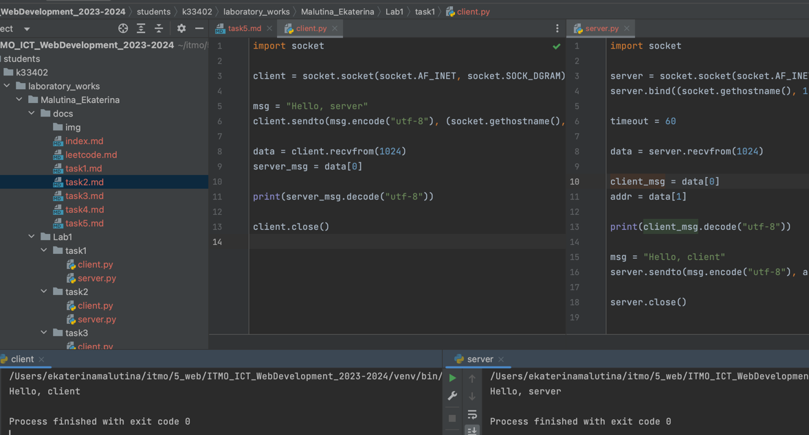

# Задание 1

Реализовать клиентскую и серверную часть приложения. Клиент отсылает серверу сообщение «Hello, server». Сообщение должно
отразиться на стороне сервера. Сервер в ответ отсылает клиенту сообщение «Hello, client». Сообщение должно отобразиться
у клиента.

Обязательно использовать библиотеку socket

Реализовать с помощью протокола UDP

## Ход выполнения работы

### Код task1/client.py

    import socket
    
    client = socket.socket(socket.AF_INET, socket.SOCK_DGRAM)
    
    msg = "Hello, server"
    client.sendto(msg.encode("utf-8"), (socket.gethostname(), 1234))
    
    data = client.recvfrom(1024)
    server_msg = data[0]
    
    print(server_msg.decode("utf-8"))
    
    client.close()

### Код task1/server.py

    import socket

    server = socket.socket(socket.AF_INET, socket.SOCK_DGRAM)
    server.bind((socket.gethostname(), 1234))
    
    timeout = 60
    
    data = server.recvfrom(1024)
    
    client_msg = data[0]
    addr = data[1]
    
    print(client_msg.decode("utf-8"))
    
    msg = "Hello, client"
    server.sendto(msg.encode("utf-8"), addr)
    
    server.close()

## Результат

