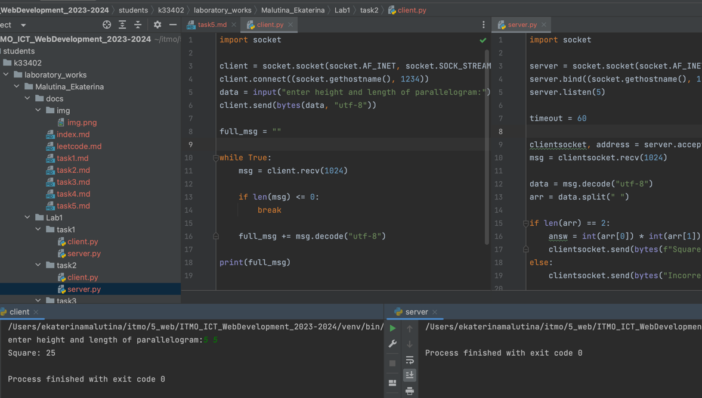

# Задание 2

Реализовать клиентскую и серверную часть приложения. Клиент запрашивает у сервера выполнение математической операции,
параметры, которые вводятся с клавиатуры. Сервер обрабатывает полученные данные и возвращает результат клиенту. Вариант:
Поиск площади параллелограмма.

Обязательно использовать библиотеку socket

Реализовать с помощью протокола TCP

## Ход выполнения работы

### Код task2/client.py

    import socket

    client = socket.socket(socket.AF_INET, socket.SOCK_STREAM)
    client.connect((socket.gethostname(), 1234))
    data = input("enter height and length of parallelogram")
    client.send(bytes(data, "utf-8"))
    
    full_msg = ""
    
    while True:
        msg = client.recv(1024)
    
        if len(msg) <= 0:
            break
    
        full_msg += msg.decode("utf-8")
    
    print(full_msg)

### Код task2/server.py

    import socket

    server = socket.socket(socket.AF_INET, socket.SOCK_STREAM)
    server.bind((socket.gethostname(), 1234))
    server.listen(5)
    
    timeout = 60
    
    clientsocket, address = server.accept()
    msg = clientsocket.recv(1024)
    
    data = msg.decode("utf-8")
    arr = data.split(" ")
    
    if len(arr) == 2:
        answ = int(arr[0]) * int(arr[1])
        clientsocket.send(bytes(f"Square: {answ}", "utf-8"))
    else:
        clientsocket.send(bytes("Incorrect", "utf-8"))
    
    clientsocket.close()

## Результат

