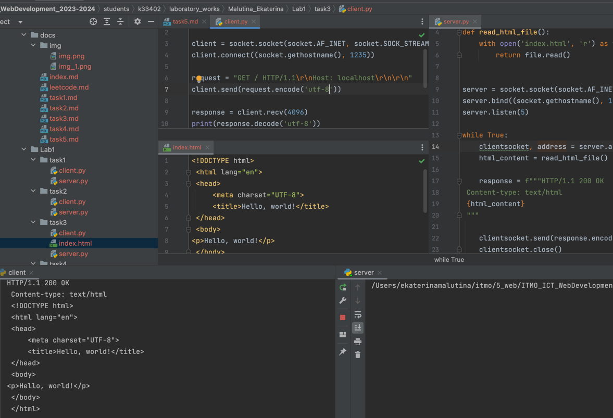

# Задание 3

Реализовать серверную часть приложения. Клиент подключается к серверу. В ответ клиент получает http-сообщение,
содержащее html-страницу, которую сервер подгружает из файла index.html.

Обязательно использовать библиотеку socket

## Ход выполнения работы

### Код task3/server.py

    if __name__ == '__main__':
        import socket
    
        sock = socket.socket(socket.AF_INET, socket.SOCK_STREAM)
        sock.bind(('localhost', 9090))
        sock.listen()
        print("Server is running on http://localhost:9090")
    
        while True:
            connection, address = sock.accept()
    
            data = connection.recv(1024)
            if not data:
                break
    
            print(data.decode("utf-8"))
    
            content = open("task3_index.html").read()
            response = "HTTP/1.1 200 OK\nContent-Type: text/html; charset=utf-8\n\n" + content
    
            connection.send(response.encode("utf-8"))
            connection.close()

### Код task3/client.py

    import socket

    client = socket.socket(socket.AF_INET, socket.SOCK_STREAM)
    client.connect((socket.gethostname(), 1235))
    
    request = "GET / HTTP/1.1\r\nHost: localhost\r\n\r\n"
    client.send(request.encode('utf-8'))
    
    response = client.recv(4096)
    print(response.decode('utf-8'))
    
    client.close()

### Код task3/index.html

    <!DOCTYPE html>
    <html lang="en">
    <head>
        <meta charset="UTF-8">
        <title>Hello, world!</title>
    </head>
    <body>
        
Hello, world!

    </body>
    </html>

## Результат

