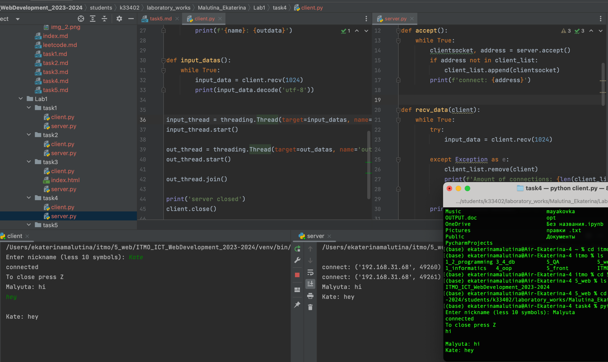

# Задание 4

Реализовать двухпользовательский или многопользовательский чат. Реализация многопользовательского часа позволяет получить максимальное количество баллов.

Обязательно использовать библиотеку threading

## Ход выполнения работы

### Код task4/server.py

    import socket
    import threading
    
    server = socket.socket(socket.AF_INET, socket.SOCK_STREAM)
    server.bind((socket.gethostname(), 1236))
    server.listen(5)
    
    client_list = list()
    client_threads = list()
    
    
    def accept():
        while True:
            clientsocket, address = server.accept()
            if address not in client_list:
                client_list.append(clientsocket)
            print(f'connect: {address}')
    
    
    def recv_data(client):
        while True:
            try:
                input_data = client.recv(1024)
    
            except Exception as e:
                client_list.remove(client)
                print(f'Amount of connections: {len(client_list)}')
                break
    
            print(input_data.decode('utf-8'))
    
            for cli in client_list:
                if cli != client:
                    cli.send(input_data)
    
    
    def out_datas():
        while True:
            print('')
            out_data = input('')
            print()
            if out_data == 'Z':
                break
            print(f'Send to all: {out_data}')
        for cli in client_list:
            cli.send(f'Server: {out_data}'.encode('utf-8)'))
    
    
    def input_datas():
        while True:
            for cli in client_list:
                if cli in client_threads:
                    continue
                index = threading.Thread(target=recv_data, args=(cli,))
                index.start()
                client_threads.append(cli)
    
    
    input_thread = threading.Thread(target=input_datas, name='input')
    input_thread.start()
    
    out_thread = threading.Thread(target=out_datas, name='out')
    out_thread.start()
    
    accept_thread = threading.Thread(target=accept(), name='accept')
    accept_thread.start()
    
    out_thread.join()
    
    # Выключите все серверы
    for client in client_list:
        client.close()
    print('server closed')

### Код task4/client.py

    import socket
    import threading
    
    client = socket.socket(socket.AF_INET, socket.SOCK_STREAM)
    
    while True:
        name = input('Enter nickname (less 10 symbols): ')
        if 1 < len(name) < 10:
            break
    
    client.connect((socket.gethostname(), 1236))
    print('connected')
    print('To close press Z')
    
    
    def out_datas():
        while True:
            outdata = input('')
            print()
            if outdata == 'Y':
                client.send(f'{name}: disconnected'.encode('utf-8'))
                break
    
            if outdata == '':
                continue
            client.send(f'{name}: {outdata}'.encode('utf-8'))
            print(f'{name}: {outdata}')
    
    
    def input_datas():
        while True:
            input_data = client.recv(1024)
            print(input_data.decode('utf-8'))
    
    
    input_thread = threading.Thread(target=input_datas, name='input')
    input_thread.start()
    
    out_thread = threading.Thread(target=out_datas, name='out')
    out_thread.start()
    
    out_thread.join()
    
    print('server closed')
    client.close()

## Результат

