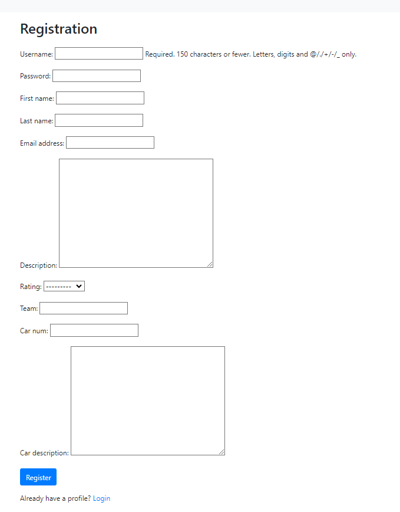
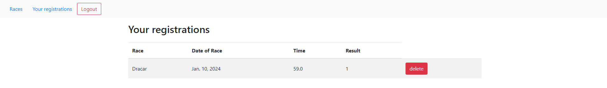
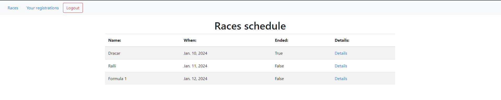
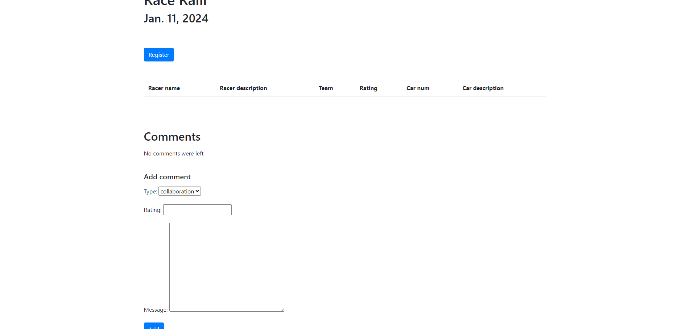
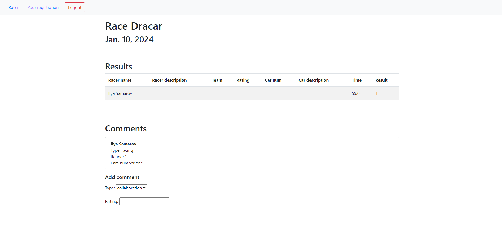
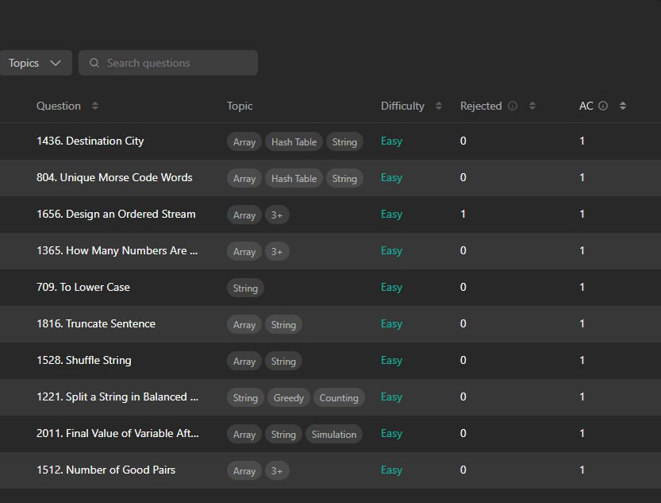
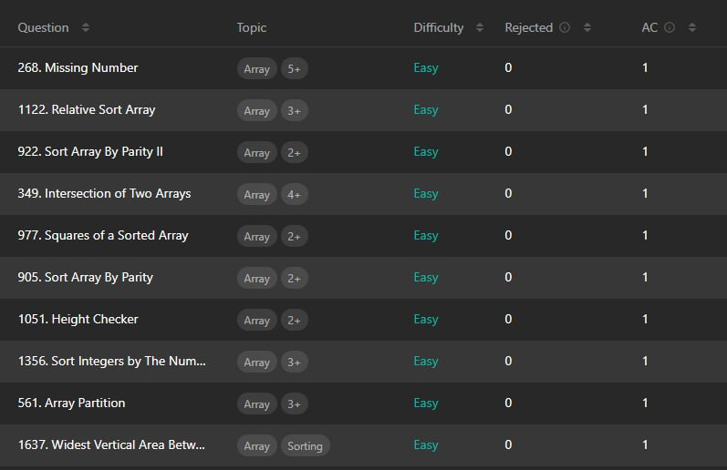

# Лабораторная работа 2: реализация простого сайта средствами DJANGO
## Дисциплина: Основы web-программирования

## Вариант 6: Табло победителей автогонок

Табло должно отображать информацию об участниках автогонок: ФИО участника,
название команды, описание автомобиля, описание участника, опыт и класс участника.
Необходимо реализовать следующий функционал:

- Регистрация новых пользователей.
- Просмотр автогонок и регистрацию гонщиков. Пользователь должен иметь
возможность редактирования и удаления своих регистраций.
- Написание отзывов и комментариев к автогонкам. Предварительно
комментатор должен зарегистрироваться. При добавлении комментариев
должны сохраняться даты заезда, текст комментария, тип комментария
(вопрос о сотрудничестве, вопрос о гонках, иное), рейтинг (1-10),
информация о комментаторе.
- Администратор должен иметь возможность указания времени заезда и
результата средствами Django-admin.
- В клиентской части должна формироваться таблица всех заездов и
результатов конкретной гонки.

## Скриншоты

## leetcode

