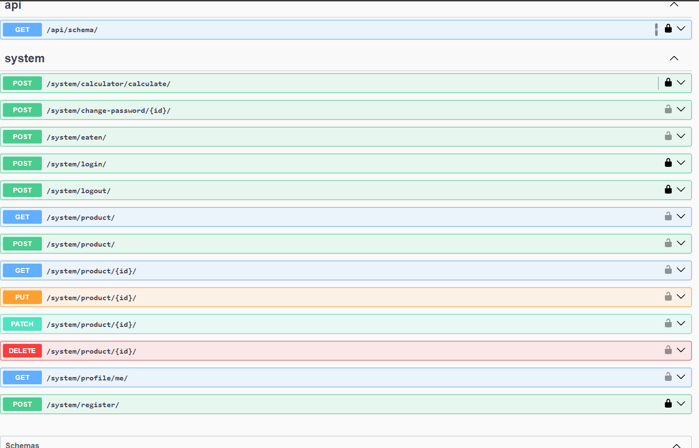
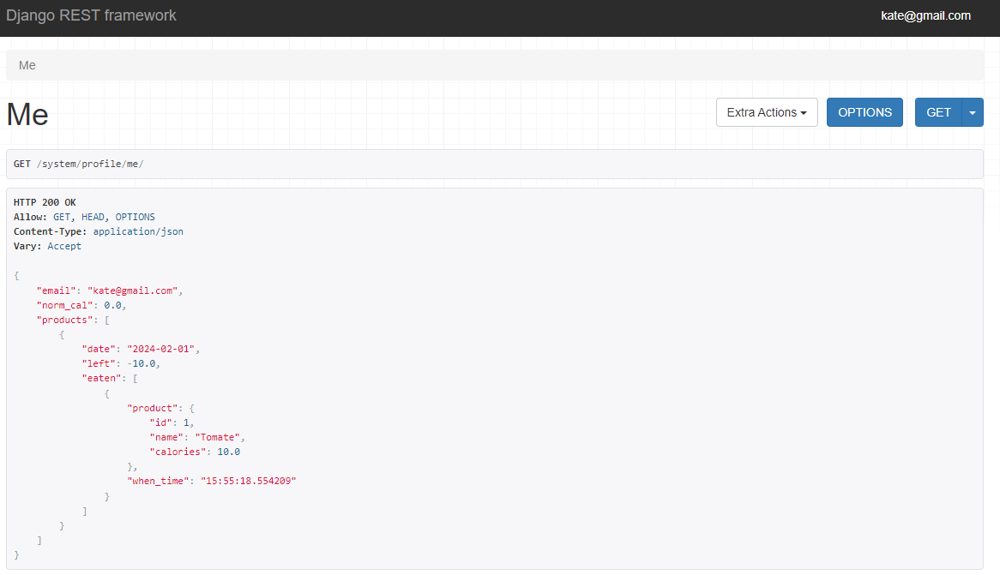
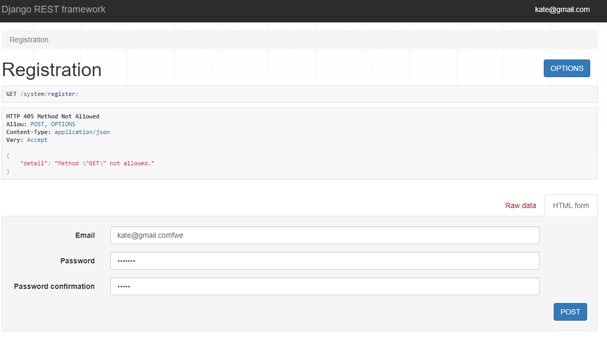
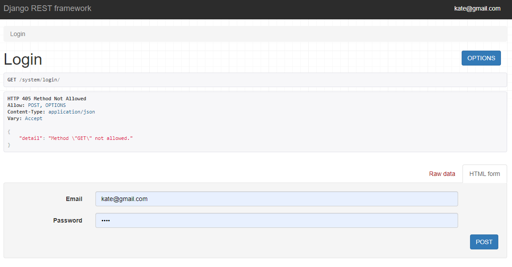
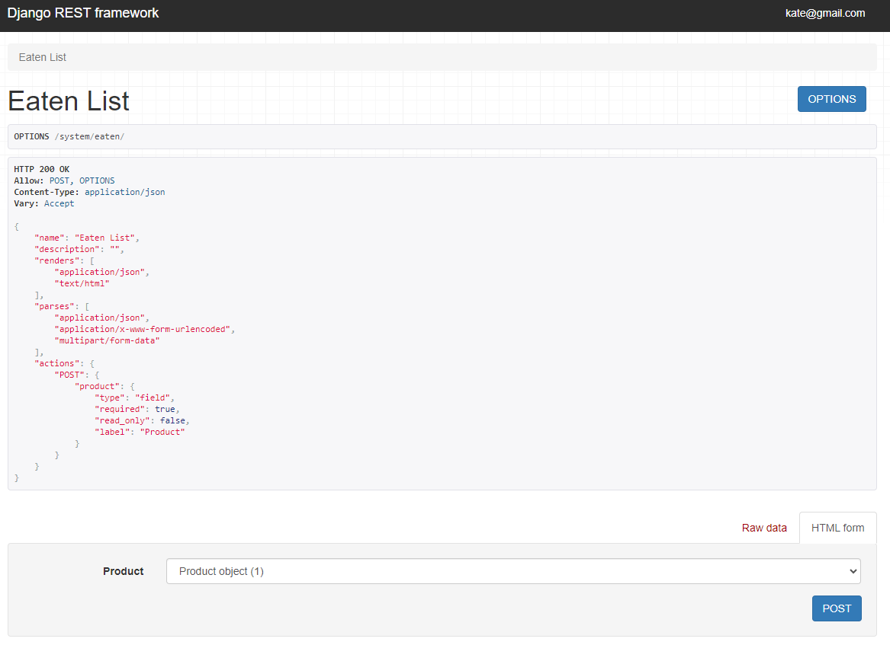
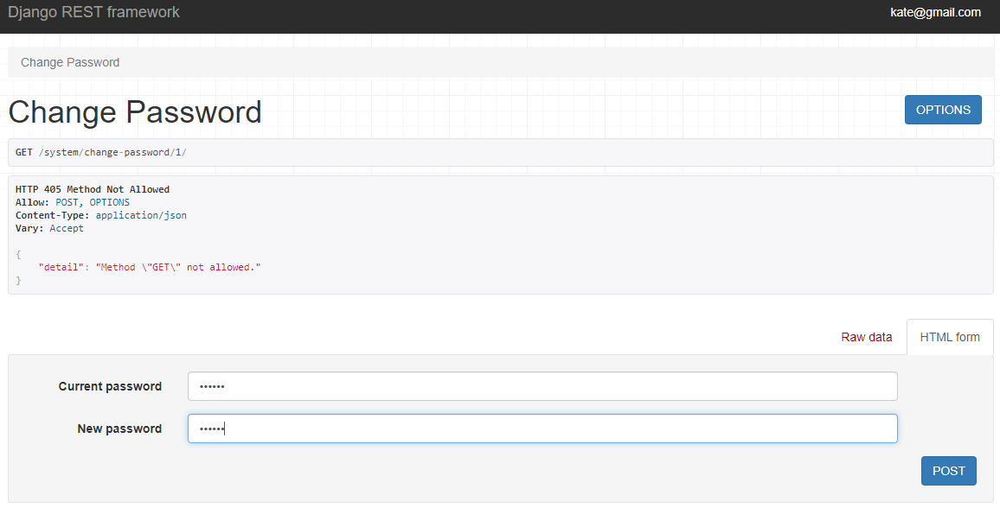

# Лабораторная работа 3: 
## Реализация серверной части приложения средствами DJANGO и Django REST Framework
**Дисциплина:** Основы web-программирования

**Цель:** овладеть практическими навыками и умениями реализации web-сервисов
средствами Django.

**Оборудование:** компьютерный класс.

**Программное обеспечение:** Python 3.6+, Django 3, Django REST Framework (DRF), PostgreSQL *.

**Практическое задание:** Реализовать сайт, используя фреймворк Django 3, Django REST Framework, Djoser и СУБД PostgreSQL, в соответствии с вариантом задания лабораторной работы.

**Вариант - Подсчет калорий:** 

Разработка инструмента для расчета нормы калорий с учетом введенных пользователем данных о поле, возрасте, росте, весе и уровне физической активности. Функционал:

1. Регистрация и авторизация по токенам, вывод информации о текущем пользователе средствами Djoser.
2. Подсчет суточной нормы калорий для юзера.
3. Запись ежедневного потребления калорий (с указанием продуктов) и отображение прогресса по дням и времени.

## Скриншоты

