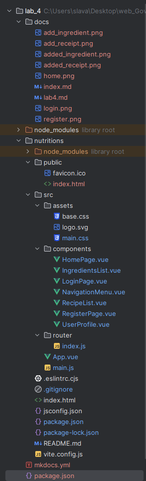

# Lab4

## structure


## HomePage.vue
```vue
<template>
  <main class="container-fluid w-auto align-items-center row vh-100">
    <div>
      <h1>Добро пожаловать!</h1>
      <div v-if="loggedOut" class="align-content-center">
        <router-link to="/login" class="navbar-brand">Войти</router-link>
        |
        <router-link to="/register" class="navbar-brand">Зарегистрироваться</router-link>
      </div>
    </div>
  </main>
</template>

<script setup>
import {computed} from "vue";

const loggedOut = computed(() => {
  return localStorage.getItem('access_token') === '';
});
</script>

<script>
export default {
  name: 'HomePage'
}
</script>

<style scoped>

</style>
```

## NavigationMenu.vue
```vue
<template>
  <nav class="navbar container-fluid p-2 m-auto flex-row vw-100">
      <router-link to="/" class="navbar-brand">Главная</router-link>
      <router-link to="/ingredients" class="navbar-brand">Ингридиенты</router-link>
      <router-link to="/recipes" class="navbar-brand">Рецепты</router-link>
      <router-link  to="/login"  class="navbar-brand" @click="logout">Выйти</router-link>
  </nav>
</template>

<script>
import router from "@/router/index.js";

export default {
  name: 'NavigationMenu',
  methods: {
    logout() {
      console.log('Token before logout:', localStorage.getItem('access_token'));
      localStorage.removeItem('access_token');
      console.log('Token after logout:', localStorage.getItem('access_token'));
      router.push('/login');
    }
  }
}
</script>
```

## LoginPage.vue
```vue
<template>
  <main class="container-fluid w-auto align-items-center row vh-100">
    <div>
      <h2>Войти</h2>
      <form @submit.prevent="login">
        <div>
          <label for="username">Никнейм:</label>
          <input id="username" v-model="username" type="text" required>
        </div>
        <div>
          <label for="password">Пароль:</label>
          <input id="password" v-model="password" type="password" required>
        </div>
        <button type="submit">Войти</button>
        <router-link to="/register">Зарегистрироваться</router-link>
      </form>
    </div>
  </main>
</template>

<script>
import axios from 'axios';

export default {
  name: 'LoginPage',
  data() {
    return {
      username: '',
      password: ''
    }
  },
  methods: {
    async login() {
      try {
        const response = await axios.post('http://127.0.0.1:8000/auth/token/login/', {
          username: this.username,
          password: this.password,
        });

        const accessToken = response.data.auth_token;
        localStorage.setItem('access_token', accessToken);
        console.log('Login successful. Token:', accessToken);

        this.$router.push('/');

      } catch (error) {
        console.error('Login failed:', error.response.data);
      }
    }

  }
}
</script>

<style scoped>
.container {
  max-width: 400px;
  margin: 0 auto;
  padding: 20px;
  text-align: center;
}

h2 {
  color: #333;
  font-size: 2em;
  margin-bottom: 20px;
}

form {
  display: flex;
  flex-direction: column;
  align-items: center;
}

label {
  margin-bottom: 5px;
}

input {
  margin-bottom: 10px;
  padding: 10px;
  font-size: 1em;
}

button {
  background-color: #3bbc55;
  color: #ffffff;
  padding: 10px;
  border: none;
  cursor: pointer;
  font-size: 1em;
  border-radius: 4px;
}
</style>
```

## router/index.js
```js
import HomePage from '../components/HomePage.vue';
import LoginPage from '../components/LoginPage.vue';
import RegisterPage from '../components/RegisterPage.vue';
import UserProfile from '../components/UserProfile.vue';
import {createRouter, createWebHistory} from 'vue-router';

const routes = [
  {
    path: '/',
    name: 'Home',
    component: HomePage
  },
  {
    path: '/login',
    component: LoginPage
  },
  {
    path: '/register',
    component: RegisterPage
  },
  {
    path: '/profile',
    component: UserProfile
  },
  {
    path: '/ingredients',
    component: () => import("@/components/IngredientsList.vue")
  },
  {
    path: '/recipes',
    component: () => import("@/components/RecipeList.vue")
  }
];

const router  = createRouter({
  history: createWebHistory(''),
  routes
});

export default router;
```

## App.vue
```js
<template>
  <div class="container-fluid justify-content-center row d-flex vw-100">
    <navigation-menu v-if="showHeader"/>
    <RouterView/>
  </div>
</template>

<script setup>
import NavigationMenu from "@/components/NavigationMenu.vue";
import {useRoute} from "vue-router";
import {computed} from "vue";

const route = useRoute();

const showHeader = computed(() => {
  return route.path !== '/login' && route.path !== '/register';
});
</script>

<style scoped>
nav {
  background: #3bbc55;
}
</style>
```

## main.js
```js
import './assets/main.css';

import {createApp} from 'vue';
import App from './App.vue';
import "bootstrap/dist/css/bootstrap.min.css";
import "bootstrap";
import router from './router';

createApp(App).use(router).mount('#app')
```

## index.html
```html
<!DOCTYPE html>
<html lang="">
<head>
    <meta charset="utf-8">
    <meta http-equiv="X-UA-Compatible" content="IE=edge">
    <meta name="viewport" content="width=device-width,initial-scale=1.0">
    <link rel="icon" href="<%= BASE_URL %>favicon.ico">
    <title>KateM Lab4</title>
</head>
<body>
<noscript>
    <strong>We're sorry but <%= htmlWebpackPlugin.options.title %> doesn't work properly without JavaScript enabled. Please enable it to continue.</strong>
</noscript>
<div id="app"></div>
<!-- built files will be auto injected -->
</body>
</html>
```