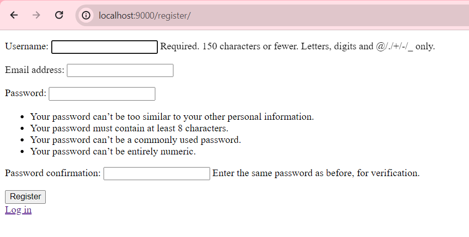
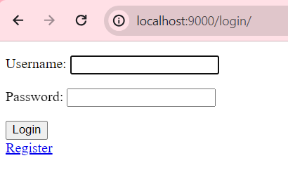
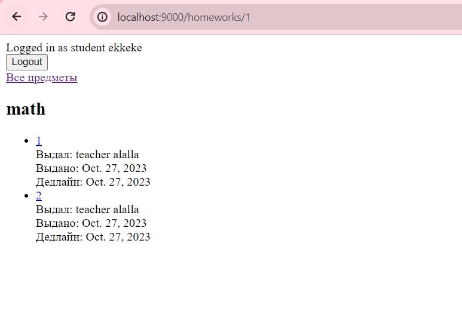
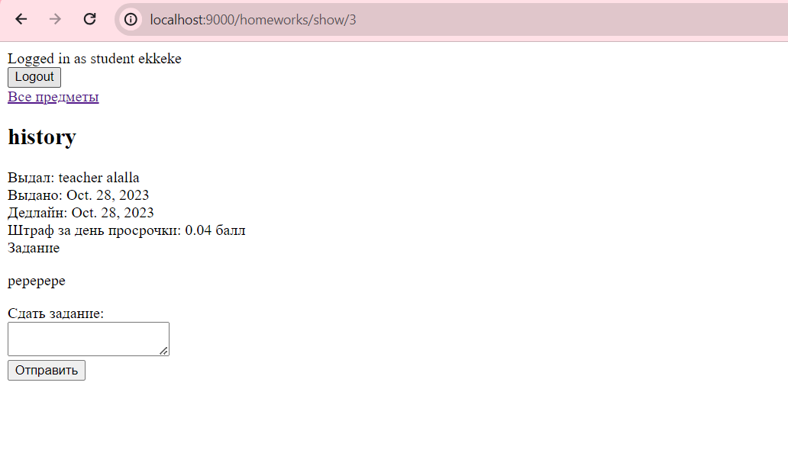
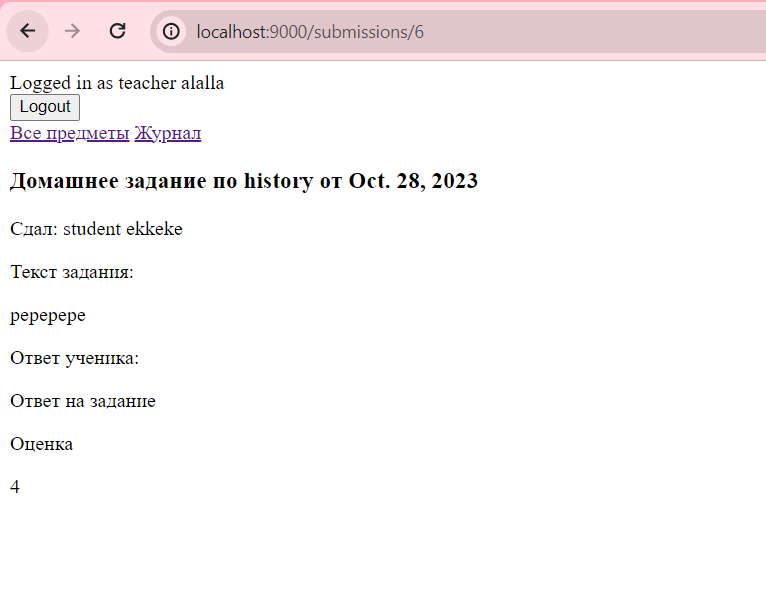
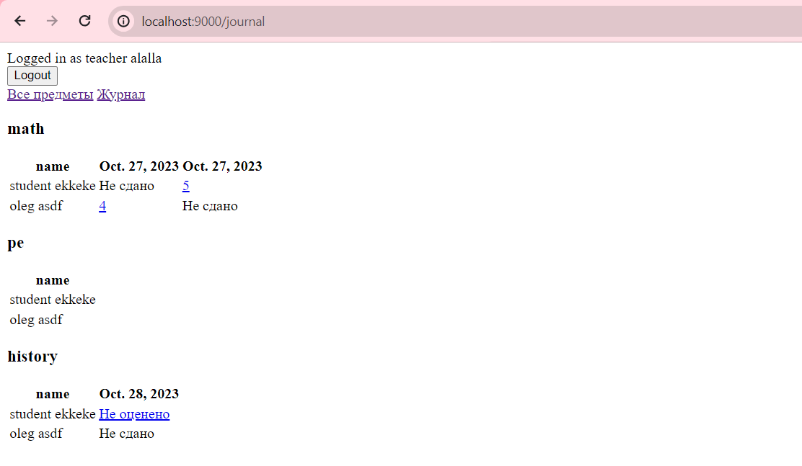

# Реализация простого сайта средствами Django
Цель: овладеть практическими навыками и умениями реализации web-сервисов средствами Django.
## Текст работы
Доска домашних заданий.\
О домашнем задании должна храниться следующая информация: предмет,
преподаватель, дата выдачи, период выполнения, текст задания, информация о штрафах.
Необходимо реализовать следующий функционал:

- Регистрация новых пользователей.
- Просмотр домашних заданий по всем дисциплинам (сроки выполнения,
описание задания).
- Сдача домашних заданий в текстовом виде.
- Администратор (учитель) должен иметь возможность поставить оценку за
задание средствами Django-admin.
- В клиентской части должна формироваться таблица, отображающая оценки
всех учеников класса.

## Модели
```
class User(AbstractUser):
    is_teacher = models.BooleanField(default=False)


class Subject(models.Model):
    name = models.CharField(max_length=100)

    def __str__(self):
        return self.name


class Homework(models.Model):
    subject = models.ForeignKey(Subject, on_delete=models.CASCADE)
    teacher = models.ForeignKey(get_user_model(), on_delete=models.CASCADE)
    issue_date = models.DateField()
    deadline = models.DateField()
    description = models.TextField()
    penalties = models.DecimalField(max_digits=5, decimal_places=2, default=0)

    def __str__(self):
        return f"Домашнее задание по {self.subject.name}"


class HomeworkSubmission(models.Model):
    student = models.ForeignKey(get_user_model(), on_delete=models.CASCADE)
    homework = models.ForeignKey(Homework, on_delete=models.CASCADE)
    submission_text = models.TextField()
    submission_date = models.DateField(auto_now_add=True)

    def __str__(self):
        return f"Сдача задания '{self.homework}' от {self.student.username}"


class HomeworkGrade(models.Model):
    homework_submission = models.OneToOneField(HomeworkSubmission, on_delete=models.CASCADE)
    grade = models.PositiveIntegerField()
    graded_by = models.ForeignKey(get_user_model(), on_delete=models.CASCADE)
    graded_date = models.DateField(auto_now_add=True)

    def __str__(self):
        return f"Оценка за сдачу '{self.homework_submission.homework}' от {self.homework_submission.student.username}"

```
Была переопределена стандартная модель пользователя. К ней был добавлен флаг для определения роли пользователя. По умолчанию при регистрации пользователю присваивается роль ученика. Для того, чтобы создать нового учителя, необходимо воспользоваться средствами django-admin.


## Маршруты приложения ``urls.py``
```
from django.urls import path
from django.contrib.auth.views import LogoutView
from . import views


urlpatterns = [
    #  Student
    path('', views.home, name='home'),
    path('homeworks/<int:subject_id>', views.index_homeworks, name='homeworks.index'),
    path('homeworks/show/<int:hw_id>', views.show_homeworks, name='homeworks.show'),
    path('submissions/', views.store_submission, name='submissions.store'),

    #  Teacher
    path('journal', views.journal, name='journal'),
    path('submissions/<int:s_id>', views.show_submission, name='submissions.show'),
    path('grades', views.store_grade, name='grades.store'),

    #  Auth
    path('register/', views.register, name='register'),
    path('login/', views.user_login, name='login'),
    path('logout/', views.user_logout, name='logout'),
]
```
Маршруты разбиты по логическим группам: маршруты для аутентификации, маршруты для студента и учителя.
## Контроллеры приложения ``views.py``
К маршрутам были добавлены соответствующие декораторы для проверки аутентификации. Не аутентифицированные пользователи могут
просматривать только страницы логина и регистрации, аутентифицированные, напротив - их просматривать не могут. 
Также в маршрутах, которые могут просматриваться только учителями, такие как журнал и выставление оценок, 
стоит проверка на роль пользователя.
```
from homeworks.forms import RegisterForm, LoginForm
from django.shortcuts import render, redirect
from django.contrib.auth import login, authenticate, logout
from django.contrib.auth.decorators import login_required
from django.utils import timezone
from django.core.exceptions import ObjectDoesNotExist
from functools import wraps
from django.db.models.functions import ExtractDay

from homeworks.models import Subject, Homework, HomeworkSubmission, User, HomeworkGrade


def anonymous_required(view_func):
    @wraps(view_func)
    def _wrapped_view(request, *args, **kwargs):
        if request.user.is_authenticated:
            return redirect('home')
        else:
            return view_func(request, *args, **kwargs)

    return _wrapped_view


# AUTH
@anonymous_required
def register(request):
    if request.method == 'POST':
        form = RegisterForm(request.POST)

        if form.is_valid():
            new_user = form.save(commit=False)
            new_user.is_teacher = False
            new_user.save()
            return redirect('login')
    else:
        form = RegisterForm()
    return render(request, 'auth/register.html', {'form': form})


@anonymous_required
def user_login(request):
    if request.method == 'POST':
        form = LoginForm(request, data=request.POST)
        if form.is_valid():
            user = form.get_user()
            login(request, user)
            return redirect('home')
    else:
        form = LoginForm()
    return render(request, 'auth/login.html', {'form': form})


@login_required
def user_logout(request):
    logout(request)

    return redirect('login')
#  System


def handler404(request, exception):
    return render(request, 'system/404.html', status=404)


#  Student
@login_required
def home(request):
    subjects = Subject.objects.all()

    return render(request, 'home.html', {
        'subjects': subjects,
    })


@login_required
def index_homeworks(request, subject_id):
    subject = Subject.objects.get(pk=subject_id)
    homeworks = Homework.objects.filter(subject_id=subject_id).all()

    return render(request, 'student/homeworks.index.html', {
        'subject': subject.name,
        'homeworks': homeworks,
    })


@login_required
def show_homeworks(request, hw_id):
    homework = Homework.objects.get(pk=hw_id)

    try:
        submission = HomeworkSubmission.objects.filter(student_id=request.user.id, homework_id=hw_id).get()
    except ObjectDoesNotExist:
        submission = None

    return render(request, 'student/homeworks.show.html', {
        'homework': homework,
        'submission': submission.submission_text if submission else None,
        'is_submitted': submission is not None,
    })


@login_required
def store_submission(request):
    data = request.POST

    submission = HomeworkSubmission(
        submission_text=data['submission_text'],
        homework_id=data['homework_id'],
        student_id=request.user.id,
        submission_date=timezone.now()
    )

    submission.save()

    return redirect(request.META.get('HTTP_REFERER'))


#  Teacher
@login_required
def journal(request):
    if not request.user.is_teacher:
        return redirect('home')

    students = User.objects.filter(is_teacher=False).all()
    subjects = Subject.objects.all()

    for subject in subjects:
        subject.homeworks = subject.homework_set.all()

    for student in students:
        student.grades = {}
        for subject in subjects:
            grades = []
            for homework in subject.homeworks:
                try:
                    submission = HomeworkSubmission.objects.get(student_id=student.id, homework_id=homework.id)

                    try:
                        grades.append({'id': submission.id, 'value': submission.homeworkgrade.grade})
                    except ObjectDoesNotExist:
                        grades.append({'id': submission.id, 'value': 'Не оценено'})
                except ObjectDoesNotExist:
                    grades.append({'id': None, 'value': 'Не сдано'})
            student.grades[subject.id] = grades

    return render(request, 'teacher/journal.html', {
        'students': students,
        'subjects': subjects,
    })


@login_required
def show_submission(request, s_id):
    if not request.user.is_teacher:
        return redirect('home')

    try:
        submission = HomeworkSubmission.objects.get(pk=s_id)
    except ObjectDoesNotExist:
        return redirect(request.META.get('HTTP_REFERER'))

    return render(request, 'teacher/submissions.show.html', {
        'submission': submission,
    })


@login_required
def store_grade(request):
    if not request.user.is_teacher:
        return redirect('home')

    data = request.POST

    submission = HomeworkSubmission.objects.get(pk=data['submission_id'])

    if submission.submission_date > submission.homework.deadline:
        from datetime import datetime

        d1 = datetime.strptime(str(submission.submission_date), "%Y-%m-%d")
        d2 = datetime.strptime(str(submission.homework.deadline), "%Y-%m-%d")
        days_overdue = (d1 - d2).days

        penalty = submission.homework.penalties * days_overdue

    else:
        penalty = 0

    grade = round(int(data['grade']) - penalty)

    homework_grade = HomeworkGrade(
        homework_submission_id=data['submission_id'],
        grade=grade,
        graded_by=request.user,
        graded_date=timezone.now(),
    )

    homework_grade.save()

    return redirect(request.META.get('HTTP_REFERER'))

```
## Обзор страниц
### Регистрация новых пользователей

Ученики могут зарегистрироваться на сайте.



### Аутентификация пользователей

Страница входа на сайт.



### Домашняя страница

На домашней странице выведены все предметы.


### Просмотр домашних заданий

На сайте ученики могут просматривать список домашних заданий по всем дисциплинам. Для каждого задания отображается срок выполнения и описание.



### Сдача домашних заданий

Ученики могут сдавать домашние задания, предоставляя текстовое описание выполненной работы.



### Оценка заданий

Администратор (учитель) может оценивать задания.


Оцененное задание:


### Отображение оценок учеников

В клиентской части сайта формируется таблица, отображающая оценки всех учеников класса.



### Заключение

В процессе лабораторной работы был создан веб-сайт для выдачи, сдачи и оценки домашних заданий

