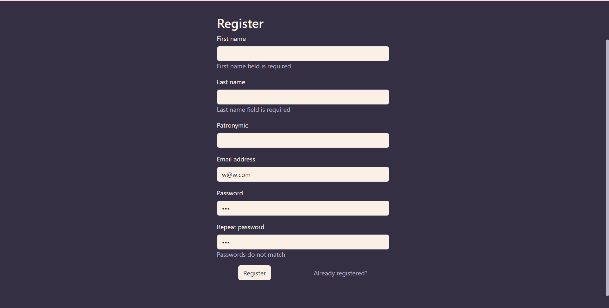
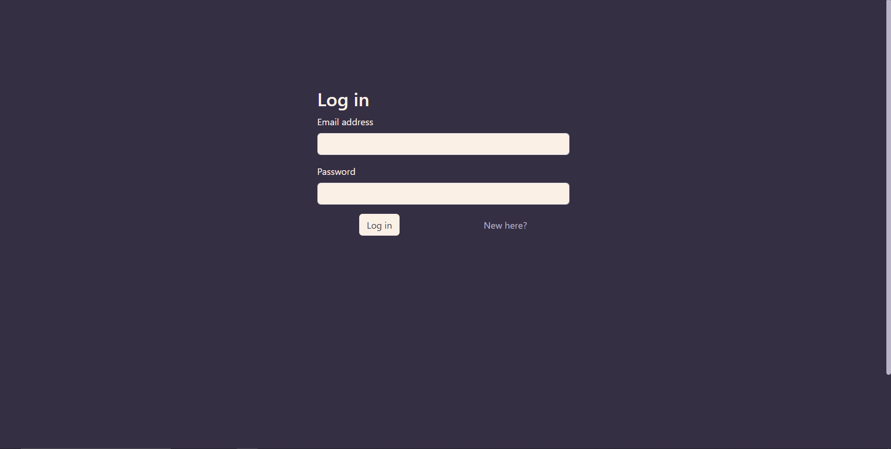
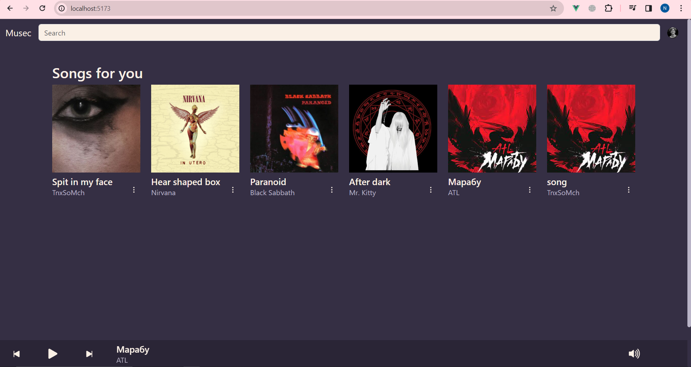
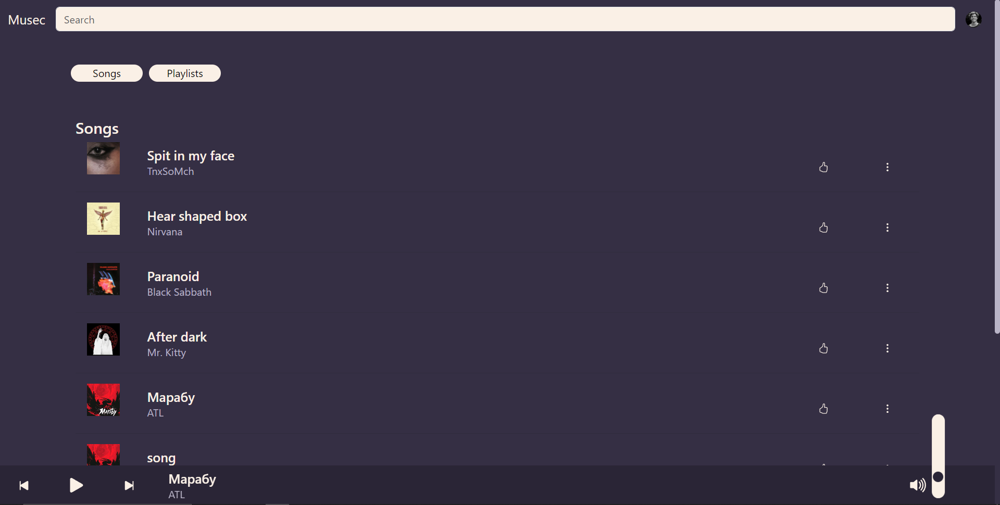
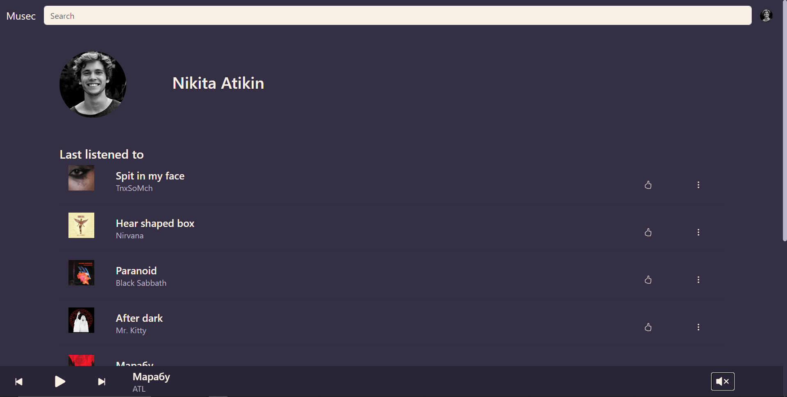
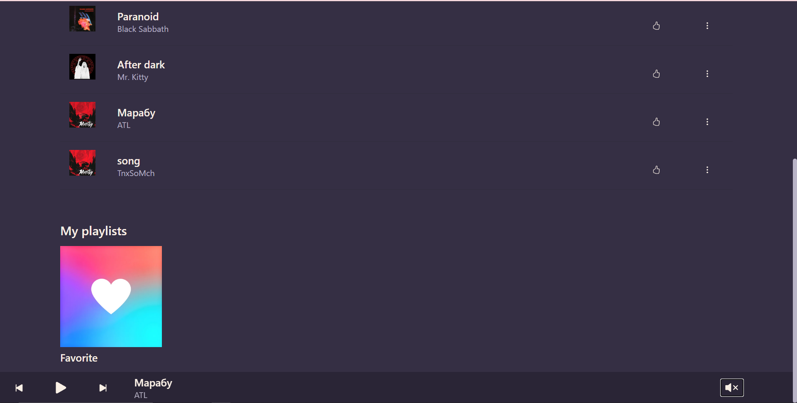

# Реализация простого сайта средствами Django
Цель: Реализация клиентской части приложения средствами vue.js
## Текст работы

Музыкальный плеер

## Ход работы

В работе использовался vue-router для маршрутизации:
``@/router/routes.js``
```javascript
import HomePage from "../views/HomePage.vue";
import ProfilePage from "../views/ProfilePage.vue";
import SearchPage from "../views/SearchPage.vue";

import LoginPage from "../views/auth/LoginPage.vue";
import RegisterPage from "../views/auth/RegisterPage.vue";

import NotFoundPage from "../views/NotFoundPage.vue";

import SecureComponent from "../components/SecureComponent.vue";
import PublicComponent from "../components/PublicComponent.vue";

export default [
    {
        path: '',
        meta: { requiresAuth: true },
        component: SecureComponent,
        children: [
            {
                path: '',
                name: 'home',
                component: HomePage
            },
            {
                path: '/profile',
                name: 'profile',
                component: ProfilePage
            },
            {
                path: '/search',
                name: 'search',
                component: SearchPage
            },
        ],
    },
    {
        path: '',
        meta: { blockedForAuthenticated: true },
        component: PublicComponent,
        children: [
            {
                path: '/login',
                name: 'login',
                component: LoginPage,
            },
            {
                path: '/register',
                name: 'register',
                component: RegisterPage,
            },
        ],
    },
    {
        name: '404',
        path: '/:catchAll(.*)',
        component: NotFoundPage
    }
]
```
``@/router/index.js``
```javascript
import { createRouter, createWebHistory } from 'vue-router'
import routes from './routes.js'
import useAuthStore from "../pinia/auth";

const router = createRouter({
  history: createWebHistory(import.meta.env.BASE_URL),
  routes: routes,
})

router.beforeEach(async (to, from) => {
  let user
  let authStore = useAuthStore()

  user = await authStore.getUser()

  if(to.meta.requiresAuth && !user) {
    return {
      name: 'login'
    }
  }
  if(to.meta.blockedForAuthenticated && user) {
    return {
      name: 'home'
    }
  }
})

export default router
```
Перед рендером страницы роутер проверяет, аутентифицирован ли
пользователь, и разрешает или блокирует доступ к защищенным страницам
соответственно.

В качестве менеджера состояния используется pinia. Всего в приложении два
store’a для работы с проигрываемыми треками и аутентификацией
пользователя
``@/pinia/auth.js``
```javascript
import { defineStore } from 'pinia'
import router from "../router";
import http from "../services/httpClient";

const useAuthStore = defineStore('auth', {
  state: () => ({
    user: null,
  }),
  getters: {
    isAuthenticated() {
      return this.user !== null
    },
  },
  actions: {
    setUser(user) {
      this.user = user
    },
    register(user) {
      http.post(
        'register',
        {...user},
        ).then(res => {
          router.push({name: 'login'})
      }).catch(e => {
        //
      })
    },
    login(user) {
      http.post(
        'login',
        {...user}
      ).then(res => {
        router.push({name: 'home'})
      }).catch(err => {
        //
      })
    },
    logout() {
      http.post(
        'logout',
      ).then(res => {
        this.$reset()
        router.push({name: 'login'})
      })
    },
    async getUser() {
      if (!this.user) {
        let user
        try {
          user = (await http.get('me')).data
        } catch (e) {
          user = null
        }

        this.user = user
      }

      return this.user
    },
  },
  persist: true,
})

export default useAuthStore
```

``@/pinia/player.js``
```javascript
import { defineStore } from 'pinia'

const usePlayerStore = defineStore('player', {
  state: () => ({
    currentSong: null,
    playlist: [],
  }),
  getters: {
    getCurrentSong() {
      return this.playlist[this.currentSong]
    },
  },
  actions: {
    setCurrentSong(song) {
      this.playlist = [song]

      this.currentSong = 0
    },
    addToPlaylist(song) {
      this.playlist.push(song)
    },

    setCurrentPlaylist(playlist, play = true) {
      this.playlist = playlist

      if (play) {
        this.currentSong = 0
      }
    },

    playNextSong() {
      if (this.playlist.length > this.currentSong + 1) {
        this.currentSong += 1
      }
    },
    playPreviousSong() {
      if (this.currentSong > 0) {
        this.currentSong -= 1
      }
    },
  },
  persist: true,
})

export default usePlayerStore
```
Для сохранения состояния используется библиотека pinia-plugin-persistedstate.
Сохранение состояние позволяет сохранять сессию аутентификации и
проигрываемый плейлист после перезагрузки страницы.

Для обращения к api использовался axios:
``@/services/httpClient.js``
```javascript
import axios from "axios"


class HttpClient {
  get(
    url,
    params
  ) {
    return new Promise((resolve, reject) => {
      axios.get(url, {params: params}).then(res => {
        resolve(res.data)
      }).catch(e => {
        reject(e) 
      })
    })
  }

  post(
    url,
    data
  ) {
    return new Promise((resolve, reject) => {
      axios.post(url, data).then(res => {
        resolve(res.data)
      }).catch(e => {
        reject(e) 
      })
    })
  }

}


export default new HttpClient()
```

## Скриншоты страниц приложения
Страница регистрации

Страница логина

Домашняя страница

Страница поиска

Страница профиля


## Заключение

В процессе лабораторной работы было создано клиентское приложения на vue.js, использующее реализованное
в прошлой лабораторной работе API, для поиска и прослушиваня аудиодорожек,
с возможностью регистрации, добавления дорожек в понравившиеся, составления плейлистов

