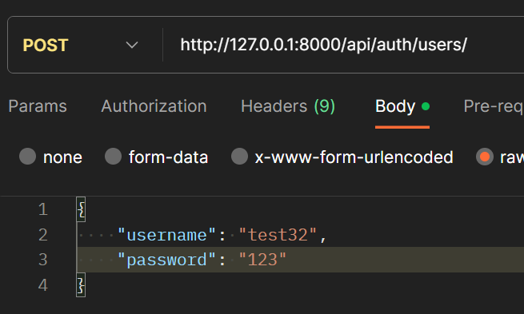
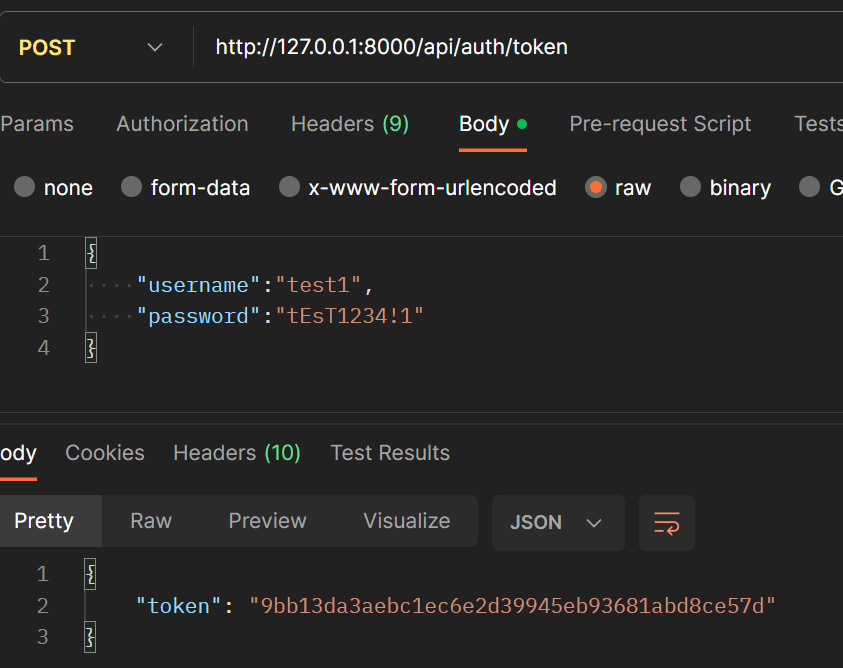
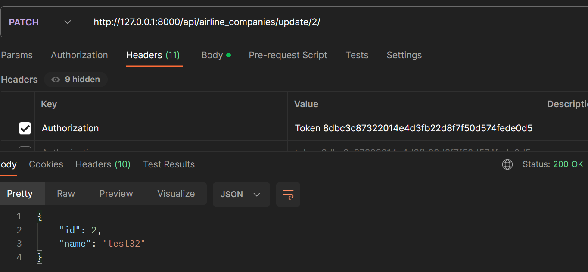

Для авторизации необходимо создать пользователя
`http://127.0.0.1:8000/api/auth/users/`

Затем получить токен
`http://127.0.0.1:8000/api/auth/token`

Теперь мы можем получить доступ ко всем защищенным методам добавив в хедер токен

