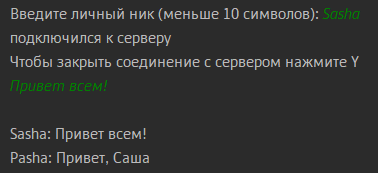
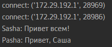
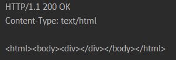
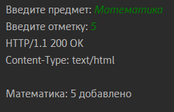
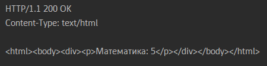

# Отчет по лабораторной работе №1

#### Цель работы:

Овладеть практическими навыками и умениями реализации web-серверов и
использования сокетов.

## Задание 1

#### Текст задания:

Реализовать клиентскую и серверную часть приложения. Клиент отсылает серверу
сообщение «Hello, server». Сообщение должно отразиться на стороне сервера.
Сервер в ответ отсылает клиенту сообщение «Hello, client». Сообщение должно
отобразиться у клиента.
Обязательно использовать библиотеку socket
Реализовать с помощью протокола UDP

#### Ход решения:

Сервер:

```
import socket

server = socket.socket(socket.AF_INET, socket.SOCK_DGRAM)
server.bind((socket.gethostname(), 1234))

timeout = 60

while True:
    server.settimeout(timeout)

    try:
        data = server.recvfrom(1024)

    except socket.timeout:
        print('Time is out. {0} seconds have passed'.format(timeout))
        break

    client_msg = data[0]
    addr = data[1]

    print("Clients message: " + client_msg.decode("utf-8"))

    msg = "Hello, client"
    server.sendto(msg.encode("utf-8"), addr)

server.close()
```

Создаем сокет, задаем серверу таймаут и в цикле прослушиваем порт 1234, когда ответ получен отправляем на клиент сообщение "Hello, client".

Клиент:

```
import socket

client = socket.socket(socket.AF_INET, socket.SOCK_DGRAM)

msg = "Hello, server"
client.sendto(msg.encode("utf-8"), (socket.gethostname(), 1234))

data = client.recvfrom(1024)
server_msg = data[0]

print("Servers message: " + server_msg.decode("utf-8"))

client.close()
```

Также создаем сокет, отправляем на сервер сообщение "Hello, server" и принимаем ответ, выводя его в консоль.

## Задание 2

#### Текст задания:

Реализовать клиентскую и серверную часть приложения. Клиент запрашивает у
сервера выполнение математической операции, параметры, которые вводятся с
клавиатуры. Сервер обрабатывает полученные данные и возвращает результат
клиенту. Варианты:

d. Поиск площади параллелограмма.

Обязательно использовать библиотеку socket
Реализовать с помощью протокола TCP

#### Ход решения:

Сервер:

```
import socket

server = socket.socket(socket.AF_INET, socket.SOCK_STREAM)
server.bind((socket.gethostname(), 1234))
server.listen(5)

timeout = 60

while True:

    server.settimeout(timeout)

    try:
        clientsocket, address = server.accept()
        print("succesfull connect!")
        msg = clientsocket.recv(1024)
        if not msg:
            break

    except socket.timeout:
        print('Time is out. {0} seconds have passed'.format(timeout))
        break


    data = msg.decode("utf-8")
    arr = data.split(" ")

    if len(arr) == 2:
        answ = int(arr[0]) * int(arr[1])
        clientsocket.send(bytes(f"Площадь параллелограмма: {answ}", "utf-8"))
    else:
        clientsocket.send(bytes("Некорректные данные", "utf-8"))

    clientsocket.close()
```

Создаем сокет TCP на порте 1234, ставим таймаут 60с. В цикле устанавливаем коннект с клиентом и получаем от него данные. Затем парсим данные с клиента и производим подсчет площади параллелограмма. Отправляем на клиент ответ, либо сообщаем о некорректных данных.

Клиент:

```
import socket

client = socket.socket(socket.AF_INET, socket.SOCK_STREAM)
client.connect((socket.gethostname(), 1234))
print("Введите высоту и длинну основания параллелограмма")
data = input("Пример: 2 7: ")
client.send(bytes(data, "utf-8"))

full_msg = ""

while True:
    msg = client.recv(1024)

    if len(msg) <= 0:
        break

    full_msg += msg.decode("utf-8")

print(full_msg)
```

Соединяемся с сервером через сокет. Предлагаем пользователю ввести данные задачи и отправляем их на сервер. Получаем с сервера ответ.

## Задание 3

#### Текст задания:

Реализовать серверную часть приложения. Клиент подключается к серверу. В ответ
клиент получает http-сообщение, содержащее html-страницу, которую сервер
подгружает из файла index.html.

#### Ход решения:

HTML документ:

```
<!DOCTYPE html>
<html lang="en">
<head>
    <meta charset="UTF-8">
    <title>Hello, world!</title>
</head>
<body>

</body>
</html>
```

Создаем простой index.html файл

Сервер:

```
import socket

def read_html_file():
    with open('index.html', 'r') as file:
        return file.read()

server = socket.socket(socket.AF_INET, socket.SOCK_STREAM)
server.bind((socket.gethostname(), 1235))
server.listen(5)

while True:
    clientsocket, address = server.accept()
    html_content = read_html_file()

    response = f"""HTTP/1.1 200 OK
Content-type: text/html
{html_content}
"""

    clientsocket.send(response.encode('utf-8'))
    clientsocket.close()
```

Создаем сокет TCP на порте 1235, устанавливаем соединение с входящим клиентом, затем читаем html файл и отправляем на клиент ответ содержащий ответ на GET запрос с нашим index.html

Клиент:

```
import socket

client = socket.socket(socket.AF_INET, socket.SOCK_STREAM)
client.connect((socket.gethostname(), 1235))

request = "GET / HTTP/1.1\r\nHost: localhost\r\n\r\n"
client.send(request.encode('utf-8'))

response = client.recv(4096)
print(response.decode('utf-8'))

client.close()
```

Создаем сокет и коннектимся к серверу на порте 1235, отправляем GET запрос и получаем ответ.

## Задание 4

#### Текст задания:

Реализовать двухпользовательский или многопользовательский чат. Реализация
многопользовательского часа позволяет получить максимальное количество
баллов.
Обязательно использовать библиотеку threading.

Для применения с TCP необходимо запускать клиентские подключения И прием
и отправку сообщений всем юзерам на сервере в потоках. Не забудьте сохранять юзеров,
чтобы потом отправлять им сообщения.

#### Ход решения:

Сервер:

```
import socket, threading

server = socket.socket(socket.AF_INET, socket.SOCK_STREAM)
server.bind((socket.gethostname(), 1234))
server.listen(5)

client_list = list()
client_threads = list()

def accept():
    while True:
        clientsocket, address = server.accept()
        if address not in client_list:
            client_list.append(clientsocket)
        print(f'connect: {address}')

def recv_data(client):
    while True:
        try:
            input_data = client.recv(1024)

        except Exception as e:
            client_list.remove(client)
            print(f'Количество подключений: {len(client_list)}')
            break

        print(input_data.decode('utf-8'))

        for cli in client_list:
            # Перенаправить информацию от клиента и отправить ее другим клиентам
            if cli != client:
                cli.send(input_data)

def out_datas():
    while True:
        print('')
        out_data = input('')
        print()
        if out_data == 'Y':
            break
        print(f'Отправить всем: {out_data}')

    # Отправлять информацию каждому клиенту
    for cli in client_list:
        cli.send(f'Сервер: {out_data}'.encode('utf-8)'))


def input_datas():
    while True:
        for cli in client_list:
            if cli in client_threads:
                continue
            index = threading.Thread(target=recv_data, args=(cli,))
            index.start()
            client_threads.append(cli)

input_thread = threading.Thread(target=input_datas, name='input')
input_thread.start()

out_thread = threading.Thread(target=out_datas, name='out')
out_thread.start()

accept_thread = threading.Thread(target=accept(), name='accept')
accept_thread.start()

out_thread.join()

# Выключите все серверы
for client in client_list:
    client.close()
print('сервер отключен')

```

Создаем сокет на порте 1234. Инициализируем список подключенных клиентов и список тех, кто уже создал потоки. Далее пишем функции на подключение новых клиентов, получение данных от них и отправки сообщений. Запускаем отдельные потоки для каждой функции (подключения, приема и отправки сообщений). Когда прекращает работу поток отсылающий сообщения, прекращаем соединения со всеми клиентами - отключаем сервер.

Клиент:

```
import socket, threading

client = socket.socket(socket.AF_INET, socket.SOCK_STREAM)

while True:
    name = input ('Введите личный ник (меньше 10 символов): ')
    if 1 < len(name) < 10:
        break

client.connect((socket.gethostname(), 1234))
print ('подключился к серверу')
print ('Чтобы закрыть соединение с сервером нажмите Y' )


def out_datas():
    while True:
        # Введите информацию, которая будет отправлена на сервер
        outdata = input('')
        print()
        if outdata == 'Y':
            client.send(f'{name}: отключился'.encode('utf-8'))
            break

        if outdata == '':
            continue
            # Отправить на сервер
        client.send(f'{name}: {outdata}'.encode('utf-8'))
        print(f'{name}: {outdata}')

def input_datas():
    while True:
        # Принимаем информацию с сервера
        input_data = client.recv(1024)

        # Расшифровать полученную информацию
        print(input_data.decode('utf-8'))

input_thread = threading.Thread(target=input_datas, name='input')
input_thread.start()

out_thread = threading.Thread(target=out_datas, name='out')
out_thread.start()

out_thread.join()

# Закрыть соединение
print('сервер отключен')
client.close()
```

Просим пользователя ввесит имя, далее устанавливаем соединение с сервером. Создаем функции отправки и приема сообщений. Запускаем потоки для каждой функции. При прекращении приема информации закрываем сокет.

Работа клиента:



Работа сервера:



## Задание 5

#### Текст задания:

Необходимо написать простой web-сервер для обработки GET и POST http
запросов средствами Python и библиотеки socket.

Задание: сделать сервер, который может:
<br/>● Принять и записать информацию о дисциплине и оценке по дисциплине.
<br/>● Отдать информацию обо всех оценах по дсициплине в виде html-страницы.

#### Ход решения:

Сервер:

```
import socket

class MyHTTPServer:
    def __init__(self, ip, port):

        self.conn = socket.socket(socket.AF_INET, socket.SOCK_STREAM)
        self.conn.setsockopt(socket.SOL_SOCKET, socket.SO_REUSEADDR, 1)
        self.conn.bind((host, port))
        self.conn.listen(5)

        self.grades = {}

    # Старт сервера
    def serve_forever(self):
        while True:
            client, addr = self.conn.accept()
            self.serve_client(client)

    # Прослушивание клиента
    def serve_client(self, client):
        data = client.recv(2 * 16384).decode(encoding="utf-8", errors="ignore")
        self.parse_request(client, data)

    # Парсим запросы
    def parse_request(self, client, data):
        lines = data.split("\n")
        method, url, version = lines[0].split()

        if method == "GET":
            params = (
                {p.split("=")[0]: p.split("=")[1] for p in url.split("?")[1].split("&")}
                if "?" in url
                else None
            )

        elif method == "POST":
            body = data.split("\n")[-1]
            params = {p.split("=")[0]: p.split("=")[1] for p in body.split("&")}

        else:
            params = None

        self.handle_request(client, method, params)

    # Обработка  запросов
    def handle_request(self, client, method, params):
        if method == "GET":
            self.send_response(client, 200, "OK", self.generate_html())
            print("GET 200 OK")
        elif method == "POST":
            discipline = params.get("discipline")
            grade = params.get("grade")
            self.grades[discipline] = grade
            self.send_response(client, 200, "OK", f'{discipline}: {grade} добавлено')
            print("POST 200 OK")
        else:
            self.send_response(client, 404, "Not Found")
            print("ERR  404")

    # Отправка ответа
    def send_response(self, client, code, reason, body):
        response = f"HTTP/1.1 {code} {reason}\nContent-Type: text/html\n\n{body}"
        client.send(response.encode("utf-8"))
        client.close()

    # Генерация HTML
    def generate_html(self):
        page = (
            "<html><body><div>"
            f"{''.join([f'<p>{discipline}: {grade}</p>' for discipline, grade in self.grades.items()])}"
            "</div></body></html>"
        )
        return page

if __name__ == "__main__":
    host = "localhost"
    port = 8000
    server = MyHTTPServer(host, port)
    try:
        server.serve_forever()
    except KeyboardInterrupt:
        server.conn.close()
```

В приведенном шаблоне инициализируем сервер. Создаем словарь в который будем заносить отметки. Создаем функцию запускающую наш сервер. Пишем функцию прослушивания клиента, далее парсим полученные с клиента запросы, получая на выходе два типа запросов GET или POST. Разделяем запросы на метод и параметры. Приступаем к обработке запросов. При получении GET запроса отправляем на клиент сгенерированную страничку html. При получении POST запроса получаем параметры и записываем их в словарь с оценками, отправляем на клиент сообщение об успешном выполнении запроса. Функция для создания html берет оценки из словаря и создает простой список с ними. Запускаем сервер на порте 8000.

GET запрос:

```
import socket

sock = socket.socket(socket.AF_INET, socket.SOCK_STREAM)
sock.connect(("localhost", 8000))

request = "GET /scores?subject=test HTTP/1.1\nContent-Type: text"
sock.send(request.encode())

response = sock.recv(2 * 1024).decode()
print(response)
```

Подключаемся к серверу и отправляем ему составленный GET запрос, обрабатываем и выводим ответ.

POST запрос:

```
import socket

sock = socket.socket(socket.AF_INET, socket.SOCK_STREAM)
sock.connect(("localhost", 8000))

discipline = input('Введите предмет: ')
grade = input('Введите отметку: ')

request = "POST /discipline HTTP/1.1\nHost: localhost\nContent-Type: application/x-www-form-urlencoded\nContent-Length: 38\n\n"
body = f"discipline={discipline}&grade={grade}"

sock.send((request + body).encode())

response = sock.recv(2*1024).decode()
print(response)
```

Подключаемся к серверу, просим пользователя ввести предмет и оценку, составляем POST запрос, отправляем его на сервер. Получаем ответ об успешном/неудачном выполнении.

Результат выполнения первого GET запроса:



POST запрос:



Второй GET зарос:



## Вывод

В ходе выполнения работы я осовил работу с сокетами, научился писать простейшие TCP и UDP сервера, HTTP сервера, а также научился составлять и работать с запросами.
