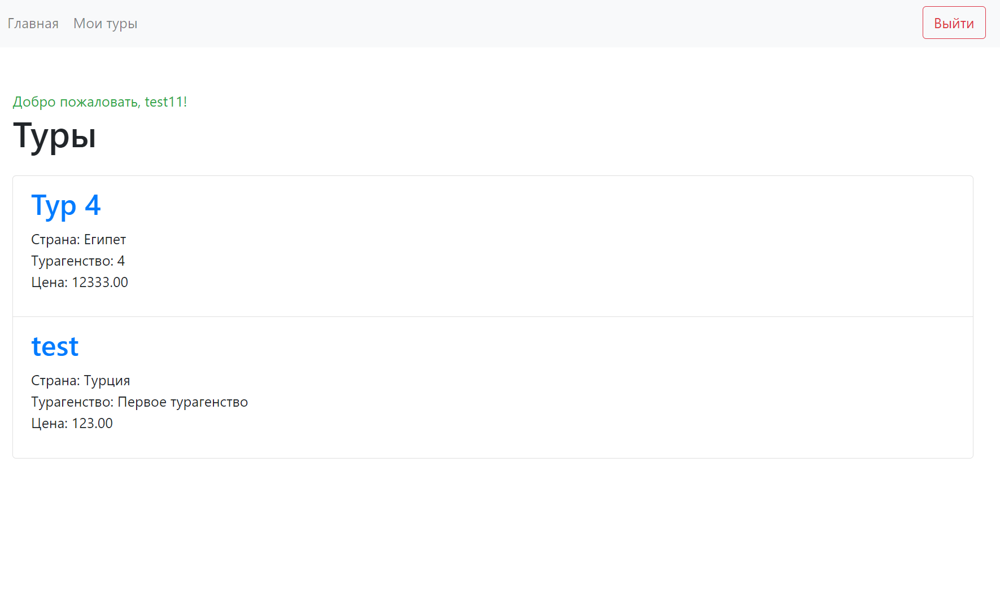
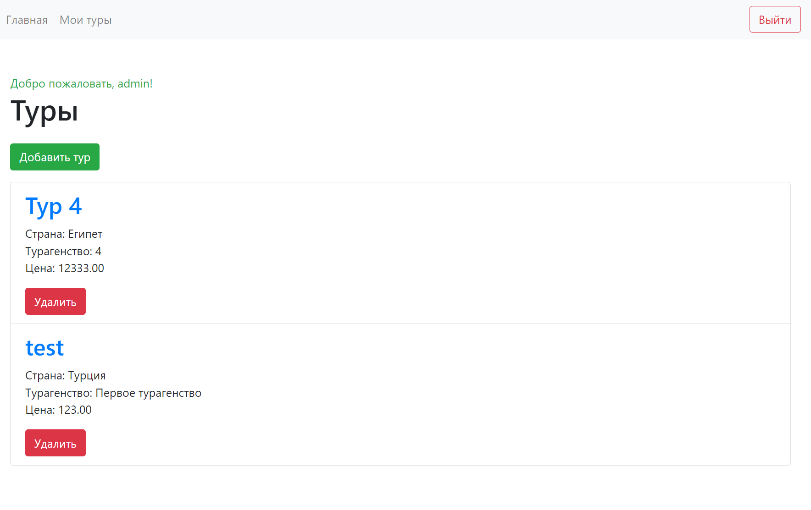
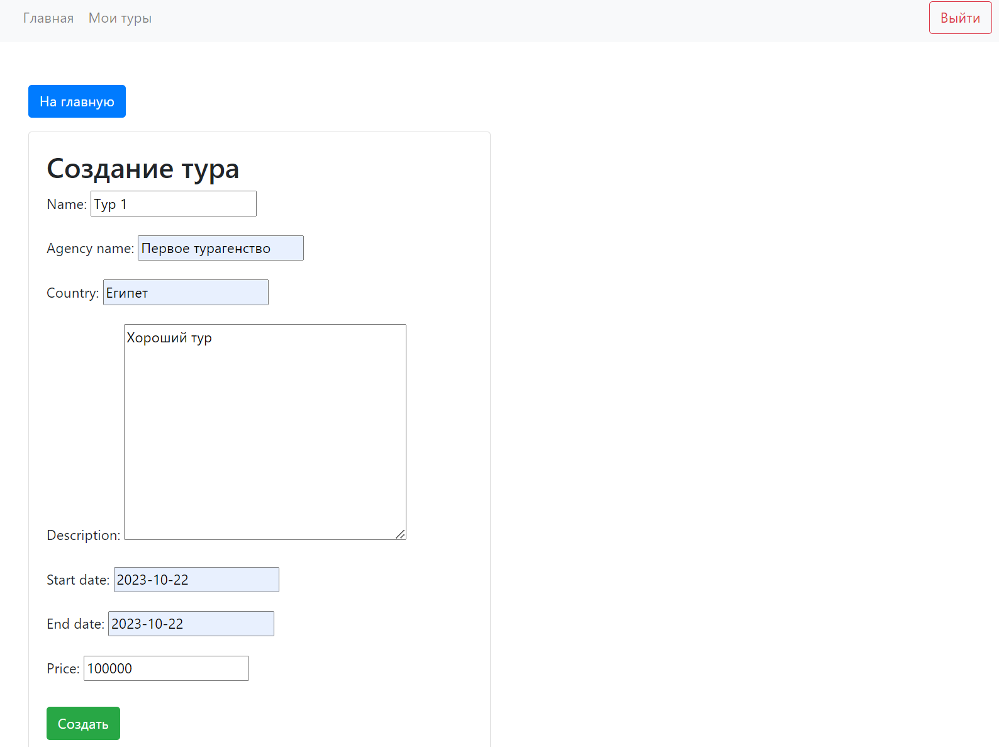
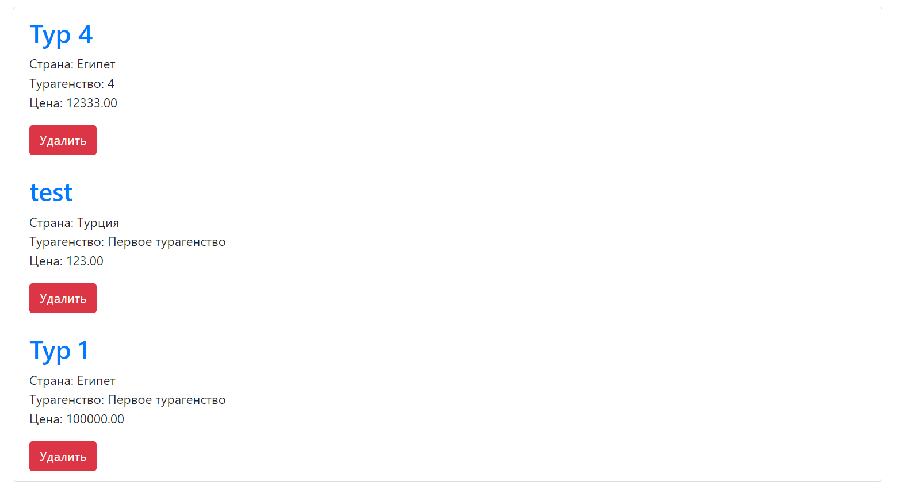
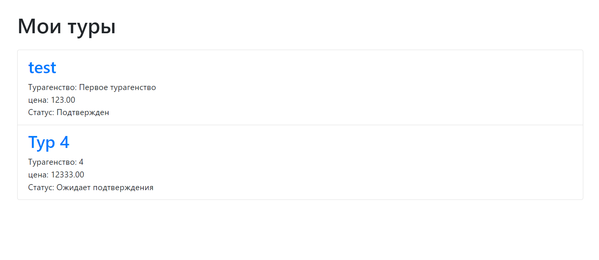
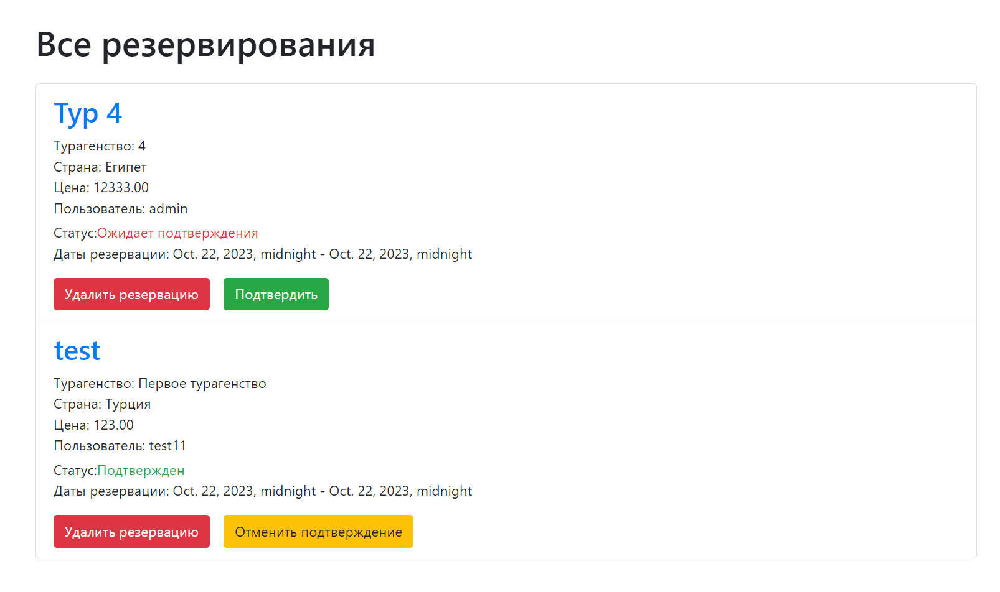
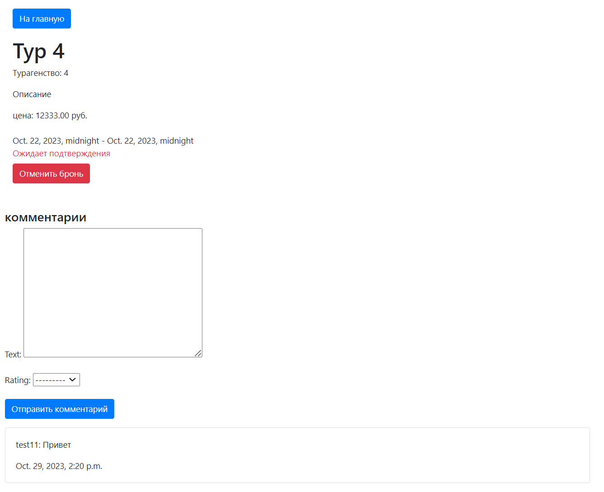

# Отчет по лабораторной работе №2

#### Цель работы:

Овладеть практическими навыками и умениями реализации web-сервисов
средствами Django 2.2.

## Задание

#### Текст задания:

Реализовать сайт используя фреймворк Django 3 и СУБД PostgreSQL \*, в
соответствии с вариантом задания лабораторной работы.

Хранится информация о названии тура, турагенстве, описании тура, периоде
проведения тура, условиях оплаты.
Необходимо реализовать следующий функционал:

- Регистрация новых пользователей.
- Просмотр и резервирование туров. Пользователь должен иметь возможность
  редактирования и удаления своих резервирований.
- Написание отзывов к турам. При добавлении комментариев, должны
  сохраняться даты тура, текст комментария, рейтинг (1-10), информация о
  комментаторе.
- Администратор должен иметь возможность подтвердить резервирование
  тура средствами Django-admin.
- В клиентской части должна формироваться таблица, отображающая все
  проданные туры по странам.

#### Ход Выполнения:

Для начала были созданы два приложения, одно отвечает за авторизацию и регистрацию пользователей, а второе за основную часть приложения. Также были созданы модели для базы данных и пользователь был наследован от AbstractUser для возможности авториации в системе.
Код моделей:

```
from django.contrib.auth.models import AbstractUser, Group, Permission
from django.db import models
from django.contrib.contenttypes.models import ContentType


class Tour(models.Model):
    id = models.AutoField(primary_key=True)
    name = models.CharField(max_length=100)
    agency_name = models.CharField(max_length=100)
    country = models.CharField(max_length=50)
    description = models.TextField()
    start_date = models.DateField()
    end_date = models.DateField()
    price = models.DecimalField(max_digits=10, decimal_places=2)


class User(AbstractUser):
    id = models.AutoField(primary_key=True)
    birth_date = models.DateField(null=True)
    email = models.EmailField(unique=True, null=True)
    reserved_tours = models.ManyToManyField(Tour, through='Reservation')

    def __str__(self):
        return self.username


class Reservation(models.Model):
    id = models.AutoField(primary_key=True)
    tour = models.ForeignKey(Tour, on_delete=models.CASCADE)
    user = models.ForeignKey(User, on_delete=models.CASCADE)
    # reservation_date = models.DateTimeField()
    start_date = models.DateTimeField()
    end_date = models.DateTimeField()
    STATUS_CHOICES = [
        ('Ожидает подтверждения', 'Ожидает подтверждения'),
        ('Подтвержден', 'Подтвержден'),
    ]
    status = models.CharField(max_length=50, choices=STATUS_CHOICES)


class TourComment(models.Model):
    id = models.AutoField(primary_key=True)
    user = models.ForeignKey(User, on_delete=models.CASCADE)
    tour = models.ForeignKey(Tour, on_delete=models.CASCADE)
    text = models.TextField()
    rating = models.PositiveIntegerField(choices=zip(range(1, 11), range(1, 11)))
    date_written = models.DateTimeField(auto_now_add=True)

```

#### Приложение регистрации

Начнем с приложения отвечающего за работу с пользователем.
Приложение сожержит следующие маршруты:

```
urlpatterns = [
    path('register/', views.RegistrationView, name='register'),
    path('login/', views.LoginView, name='login'),
    path('logout/', LogoutView.as_view(), name='logout'),
]
```

Для функций создания и логина пользователя, были определены формы, основанные на встроенных функциях

```
class CustomUserCreationForm(UserCreationForm):
    class Meta:
        model = User
        fields = ('username', 'email', 'birth_date', 'groups')


class CustomAuthenticationForm(AuthenticationForm):
    class Meta:
        model = User
```

Обработка запросов выглядит следующим образом:

```
from users.forms import CustomUserCreationForm, CustomAuthenticationForm


def RegistrationView(request):
    if request.method == 'POST':
        form = CustomUserCreationForm(request.POST)
        if form.is_valid():
            form.save()
            username = form.cleaned_data.get('username')
            password = form.cleaned_data.get('password')
            user = authenticate(username=username, password=password)
            login(request, user)
            return redirect('index')
    else:
        form = CustomUserCreationForm()
    return render(request, 'users/register.html', {'form': form})


def LoginView(request):
    if request.method == 'POST':
        form = CustomAuthenticationForm(data=request.POST)
        if form.is_valid():
            user = form.get_user()
            login(request, user)
            return redirect('index')
    else:
        form = CustomAuthenticationForm()
    return render(request, 'users/login.html', {'form': form})
```

В файле admin были созданы две группы пользователей

```
user_group, created = Group.objects.get_or_create(name='Пользователь')
admin_group, created = Group.objects.get_or_create(name='Администратор')
```

Также созданы шаблоны для каждой формы регистрации и входа.

#### Основное приложение

Теперь перейдем к основному приложению.
Роуты выглядят следующим образом:

```
urlpatterns = [

    path('', views.index, name='index'),
    path('my_tours', views.my_tours, name='my_tours'),
    path('tour/<int:tour_id>', views.tour_page, name='tour_page'),

    path('delete_comment/<int:comment_id>/', views.delete_comment, name='delete_comment'),

    path('tour/<int:tour_id>/create_reservation/', views.create_reservation, name='create_reservation'),
    path('tour/<int:tour_id>/delete_reservation/', views.delete_reservation, name='delete_reservation'),

    path('tour/<int:reservation_id>/access_reservation_admin/', views.access_reservation_admin, name='access_reservation_admin'),
    path('tour/<int:reservation_id>/delete_reservation_admin/', views.delete_reservation_admin, name='delete_reservation_admin'),
    path('tour/<int:reservation_id>/cancel_reservation_admin/', views.cancel_reservation_admin, name='cancel_reservation_admin'),

    path('create_tour/', views.create_tour, name='create_tour'),
    path('<int:tour_id>/delete_tour/', views.delete_tour, name='delete_tour'),
]
```

Здесь указаны пути для основной страницы и страницы с турами, на которые существует бронь у пользователя, а также функции добавления удаления комментариев, создание удаление резервирований, функции для работы администратора с резервированиями и созданием и удалением тура.

##### Главная страница

У обычного пользователя она выглядит следующим образом:

От сюда можно перейти на страницу конкретнго тура или на страницу с резервированиями.

Если у пользователя есть права администратора, то на странице появляются функции добавления нового тура и удаления уже существующих


Добавление нового тура:



##### Страница резервирований

У обычного клиента она выглядит так:


При переходе на определенный тур открывается страница тура.

У администратора здесь отображаются все резервирования всех пользователей


Администратор может подтвердить или отменить подтверждение резервирования тура, а также удалить резервацию.

##### Страница тура

Страница тура выглядит так:


Здесь есть функция добавления резервирования, а также комментарии.
Свои комментарии можно удалять.

## Вывод

В ходе выполнения работы я понял основные принципы фреймворка Django и научился создавать сайт с базовым функционалом.
