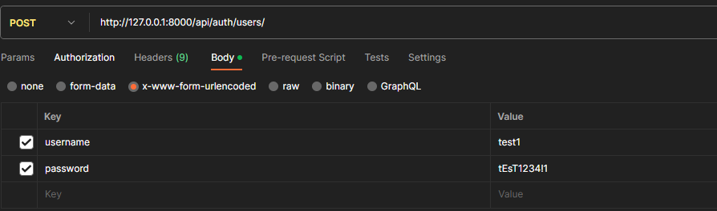
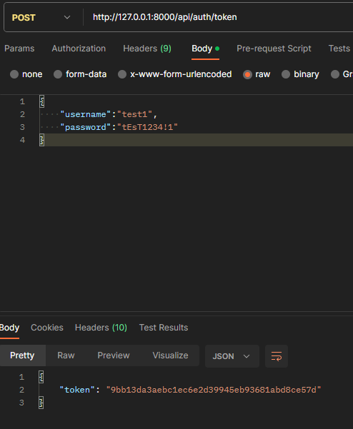
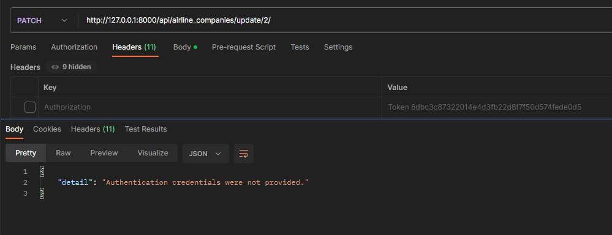
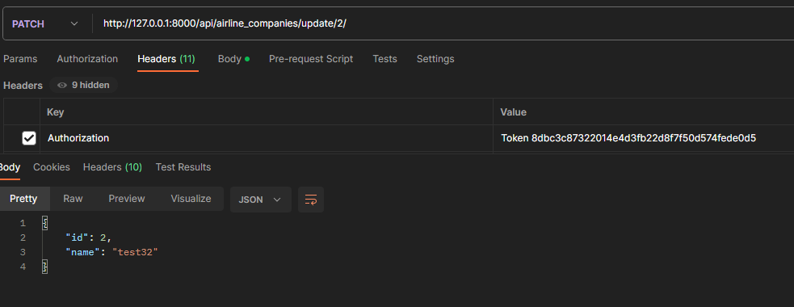

# Отчет по лабораторной работе №2

#### Цель работы:

Реализация серверной части приложения средствами django и djangorestframework в соответствии с заданием из текста работы.

## Задание

#### Текст задания:

Выбрать вариант или предложить свой, есть 3 способа:
2.1. Предложить свой вариант.
2.3. Выбрать вариант из вариантов по курсу «Основы баз данных»

Реализовать модель базы данных средствами DjangoORM (согласовать с преподавателем на консультации).
При необходимости, студент может согласовать модель базы данных с преподавателем и только потом приступить к описанию модели средствами Django ORM
Полезные материалы:
Создание модели данных в Django ORM (Видео)

3.1
Реализовать логику работу API средствами Django REST Framework (используя методы сериализации).
Полезные материалы:
Пункты 4, 5, 6 в Практической работе 3.1
DJANGO API VIEWS, GENERICS, FILTER (Видео)
JSON. Сериализация данных. Пишем свой сериализатор. Разбираем Django REST Framework Serializers (Видео)
Работа с Django ORM (Видео)

Подключить регистрацию / авторизацию по токенам / вывод информации о текущем пользователе средствами Djoser.
Полезные материалы:
Djoser (DRF + Djoser часть 1. Регистрация, авторизация по токенам, получение и изменение данных пользователя) (Видео)

Выполнить практическую работу 3.2 по оформлению документации (в процессе разработки)

Реализовать документацию, описывающую работу всех используемых endpoint-ов из пункта 3 и 4 средствами Read the Docs или MkDocs.

#### Ход Выполнения:

Сначала инициализируем django приложение и добавляем необходимиы библиотеки, в частности rest_framework.
Создадим основное приложение, в котором и будет находиться апи, а также настроим urls

```
urlpatterns = [
    path('admin/', admin.site.urls),
    path('api/', include('main.urls')),
    path('doc/swagger/', schema_view.with_ui('swagger', cache_timeout=0), name='schema-swagger-ui'),
    path('doc/redoc', schema_view.with_ui('redoc', cache_timeout=0), name='schema-redoc')
]
```

Далее перейдем к созданию представлений для апи.
Определим необходимые ендпоинты:

```
urlpatterns = [

    path('auth/', include('djoser.urls')),
    path('auth/token', obtain_auth_token, name='token'),
    path('logout', Logout.as_view()),

    # Общие методы
    path('airline_companies/all/', AirlineCompanyListView.as_view(), name='airline_company_list'),
    path('airline_companies/<int:pk>/', AirlineCompanyRetrieveView.as_view(), name='airline_company_detail'),
    path('airline_companies/new/', AirlineCompanyCreateView.as_view(), name='airline_company_create'),
    path('airline_companies/update/<int:pk>/', AirlineCompanyUpdateView.as_view(), name='airline_company_update'),

    path('airplanes/all/', AirplaneListView.as_view(), name='airplane_list'),
    path('airplanes/<int:pk>/', AirplaneRetrieveView.as_view(), name='airplane_detail'),
    path('airplanes/new/', AirplaneCreateView.as_view(), name='airplane_create'),
    path('airplanes/update/<int:pk>/', AirplaneUpdateView.as_view(), name='airplane_update'),

    path('crews/all/', CrewListView.as_view(), name='crew_list'),
    path('crews/<int:pk>/', CrewRetrieveView.as_view(), name='crew_detail'),
    path('crews/new/', CrewCreateView.as_view(), name='crew_create'),
    path('crews/update/<int:pk>/', CrewUpdateView.as_view(), name='crew_update'),

    path('crew_members/all/', CrewMemberListView.as_view(), name='crew_member_list'),
    path('crew_members/<int:pk>/', CrewMemberRetrieveView.as_view(), name='crew_member_detail'),
    path('crew_members/new/', CrewMemberCreateView.as_view(), name='crew_member_create'),
    path('crew_members/update/<int:pk>/', CrewMemberUpdateView.as_view(), name='crew_member_update'),

    path('routes/all/', RouteListView.as_view(), name='route_list'),
    path('routes/<int:pk>/', RouteRetrieveView.as_view(), name='route_detail'),
    path('routes/new/', RouteCreateView.as_view(), name='route_create'),
    path('routes/update/<int:pk>/', RouteUpdateView.as_view(), name='route_update'),

    path('flights/all/', FlightListView.as_view(), name='flight_list'),
    path('flights/<int:pk>/', FlightRetrieveView.as_view(), name='flight_detail'),
    path('flights/new/', FlightCreateView.as_view(), name='flight_create'),
    path('flights/update/<int:pk>/', FlightUpdateView.as_view(), name='flight_update'),

    # Выбрать марку самолета, которая чаще всего летает по маршруту.
    path('most_frequent_airplane_brand/<int:route_id>/', MostFrequentAirplaneBrand.as_view(), name='most_frequent_airplane_brand'),

    # Выбрать маршрут/маршруты, по которым летают рейсы, заполненные менее чем на ХХ %.
    path('routes_below_capacity/<str:percentage>/', RoutesBelowCapacity.as_view(), name='routes_below_capacity'),

    # Определить наличие свободных мест на заданный рейс.
    path('available_seats/<int:flight_id>/', AvailableSeats.as_view(), name='available_seats'),

    # Определить количество самолетов, находящихся в ремонте.
    path('airplanes_under_repair/', AirplanesUnderRepair.as_view(), name='airplanes_under_repair'),

    # Определить количество работников компания-авиаперевозчика.
    path('total_employees/<int:company_id>/', TotalEmployees.as_view(), name='total_employees'),
]
```

Для каждой модели создадим сериализацию:

```
class AirlineCompanySerializer(serializers.ModelSerializer):
    class Meta:
        model = AirlineCompany
        fields = '__all__'
```

А затем напишем представления для просмотра/добавления/удаления/изменения каждой модели:

```
class AirlineCompanyListView(generics.ListAPIView):
    queryset = AirlineCompany.objects.all()
    serializer_class = AirlineCompanySerializer
    permission_class = [permissions.IsAuthenticatedOrReadOnly]

class AirlineCompanyRetrieveView(generics.RetrieveAPIView):
    queryset = AirlineCompany.objects.all()
    serializer_class = AirlineCompanySerializer
    permission_class = [permissions.IsAuthenticatedOrReadOnly]

class AirlineCompanyCreateView(generics.CreateAPIView):
    queryset = AirlineCompany.objects.all()
    serializer_class = AirlineCompanySerializer
    permission_classes = [permissions.IsAuthenticated,]

class AirlineCompanyUpdateView(generics.UpdateAPIView):
    queryset = AirlineCompany.objects.all()
    serializer_class = AirlineCompanySerializer
    permission_classes = [permissions.IsAuthenticated,]
```

Далее напишем кастомные методы по варианту:

```
class MostFrequentAirplaneBrand(APIView):
    permission_classes = [permissions.IsAuthenticated]
    def get(self, request, route_id):
        most_frequent_airplane = Flight.objects.filter(route_id=route_id).values('airplanes__plane_type')\
            .annotate(count=Count('airplanes')).order_by('-count').first()

        if most_frequent_airplane:
            most_frequent_brand = most_frequent_airplane['airplanes__plane_type']
            return Response({'most_frequent_brand': most_frequent_brand})
        else:
            return Response({'most_frequent_brand': None})

class RoutesBelowCapacity(APIView):
    permission_classes = [permissions.IsAuthenticated]
    def get(self, request, percentage):
        threshold = (100 - float(percentage)) / 100
        under_capacity_routes = Route.objects.annotate(
            average_capacity=Count('flights__sold_tickets') / Count('flights')
        ).filter(average_capacity__lt=threshold)
        serializer = RouteSerializer(under_capacity_routes, many=True)
        return Response({'under_capacity_routes': serializer.data})

class AvailableSeats(APIView):
    permission_classes = [permissions.IsAuthenticated]
    def get(self, request, flight_id):
        try:
            flight = Flight.objects.get(pk=flight_id)
        except Flight.DoesNotExist:
            return Response({'error': 'Flight not found'}, status=status.HTTP_404_NOT_FOUND)

        available_seats = flight.airplanes.first().seats_capacity - flight.sold_tickets
        return Response({'available_seats': available_seats})

class AirplanesUnderRepair(APIView):
    permission_classes = [permissions.IsAuthenticated]
    def get(self, request):
        under_repair_count = Airplane.objects.filter(under_repair=True).count()
        return Response({'airplanes_under_repair': under_repair_count})

class TotalEmployees(APIView):
    permission_classes = [permissions.IsAuthenticated]
    def get(self, request, company_id):
        try:
            company = AirlineCompany.objects.get(pk=company_id)
        except AirlineCompany.DoesNotExist:
            return Response({'error': 'Company not found'}, status=status.HTTP_404_NOT_FOUND)

        total_employees = CrewMember.objects.filter(company=company).count()
        return Response({'total_employees': total_employees})
```

#### Проверка:

Для проверки работоспособности воспользуемся postman
Создаем пользователя:


Получаем токен доступа для него:


Пробуем изменить название компании без токена:

Доступа нет

Пробуем тоже самое с токеном:

Данные успешно изменены

Ограничения доступа работают, к методам api может получить доступ только авторизованный пользователь.
