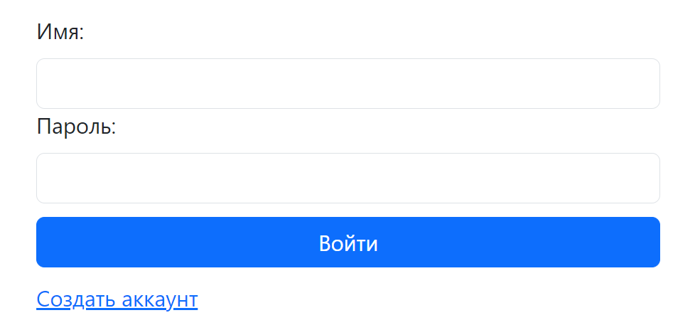
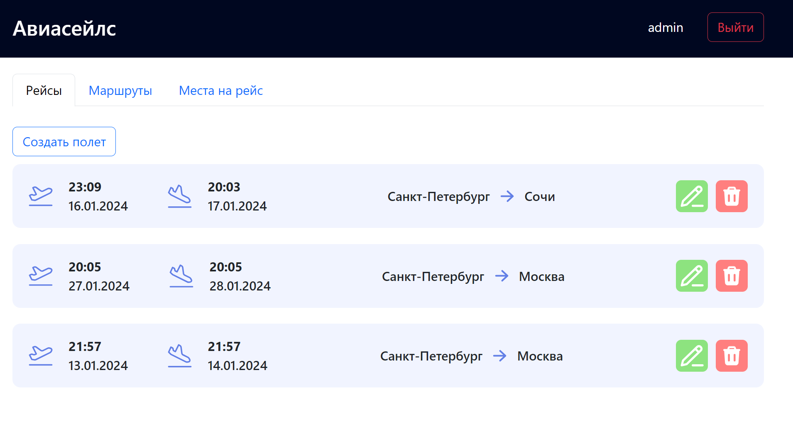
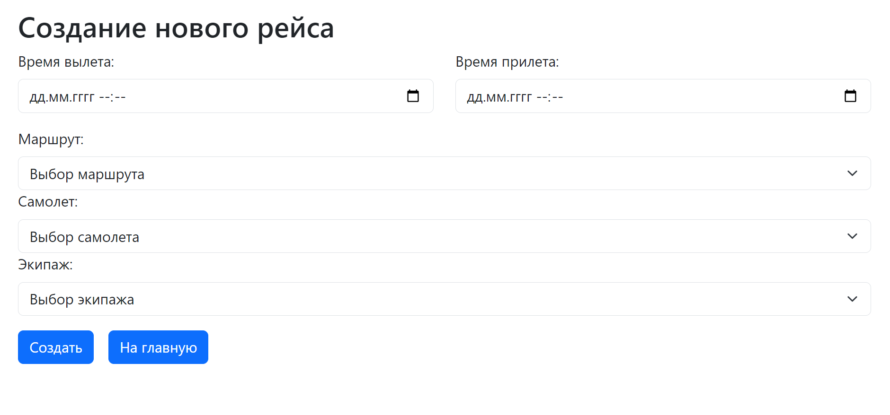
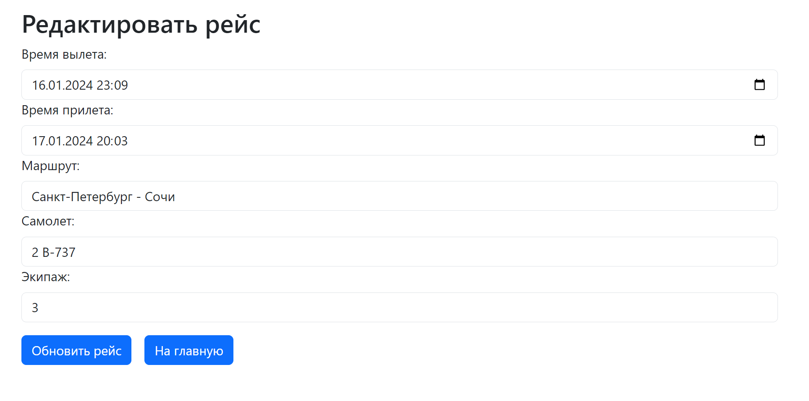
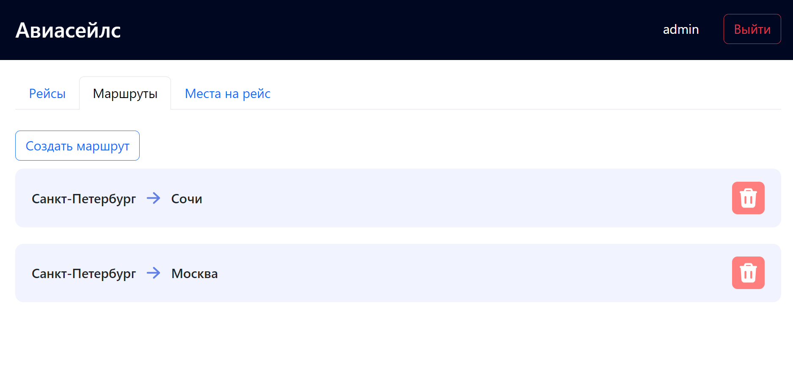
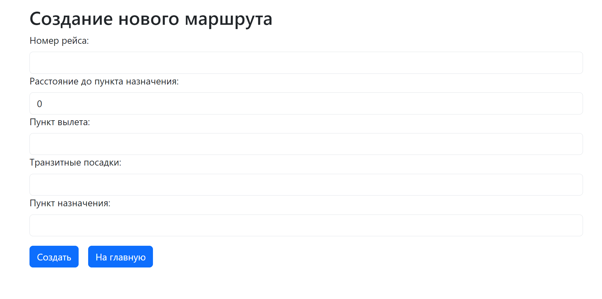
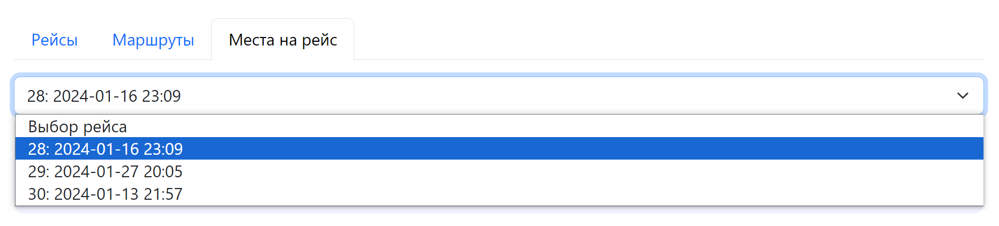
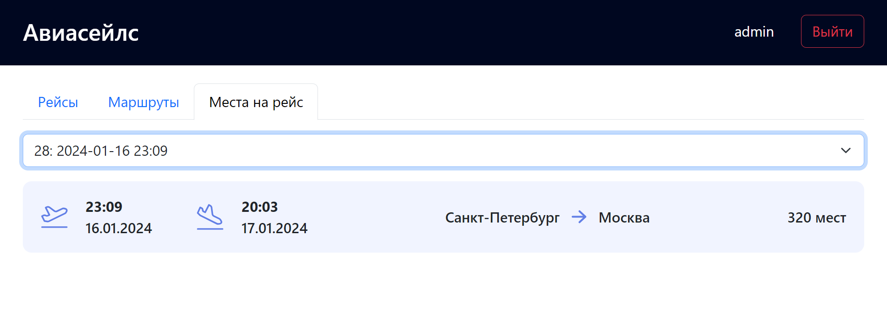

# Отчет по лабораторной работе №4

#### Цель работы:

Ознакомиться с принципами разработки форнтенда для созданного api

## Задание

Создать фронтенд часть для 3 лабораторной работы

#### Ход Выполнения:

Для написания приложения был взят фреймворк ReactJS.
Была реализована страница регистрации и входа в аккаунт:

Для пользователя также предусмортен выход из аккаунта в хедере

Сайт содержит 3 страницы:

На первой отображены все рейсы добавленные в базу данных, их можно добавлять, удалять и редактировать

На второй странице отображены доступные маршруты

Их также можно удалять и добавлять новые

На третей странице можно получить информацию о свободных местах на рейс

