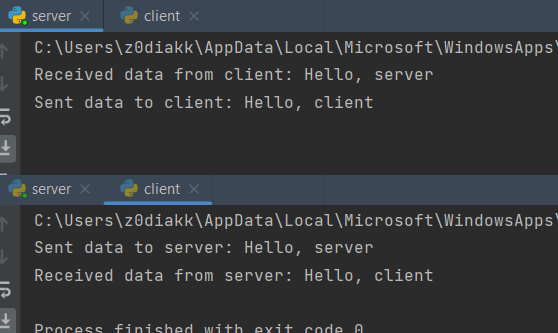
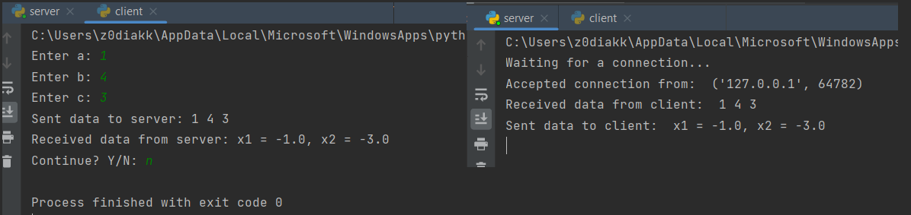
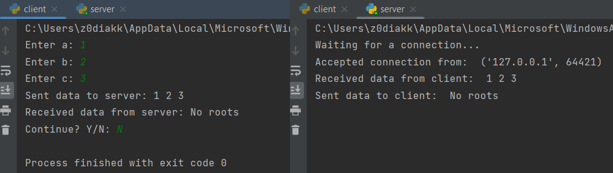
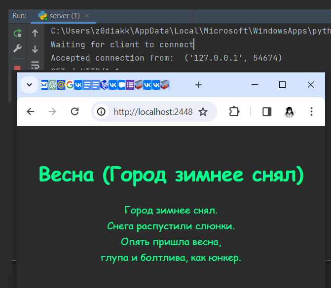
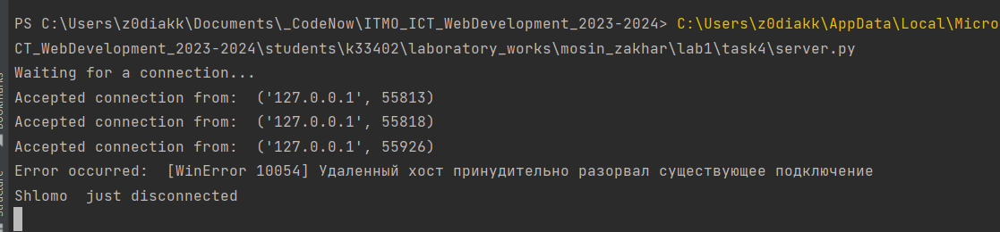
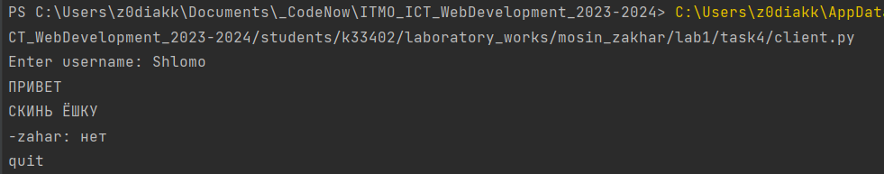
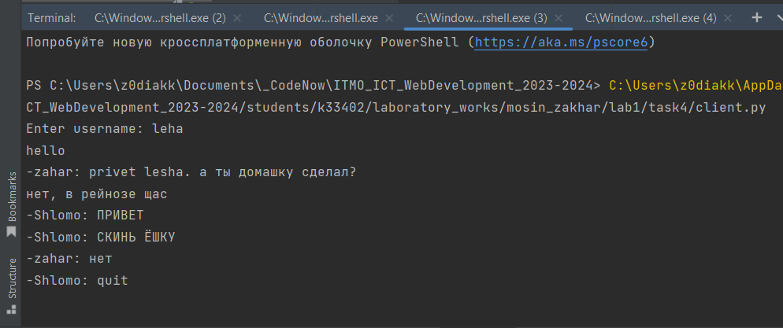
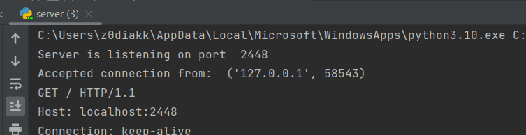
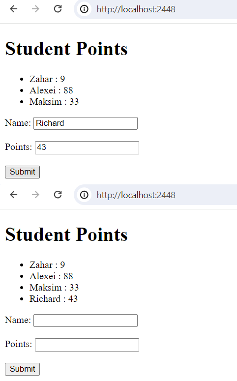

# ЛАБОРАТОРНАЯ РАБОТА №1 : Работа с сокетами #
**Цель:** Овладеть практическими навыками и умениями реализации web-серверов и использования сокетов.

## Выполнение работы ##
### Задание 1 ###
Реализовать клиентскую и серверную часть приложения. Клиент отсылает серверу сообщение «Hello, server». Сообщение должно отразиться на стороне сервера. Сервер в ответ отсылает клиенту сообщение «Hello, client». Сообщение должно отобразиться у клиента.

**Требования:**

* Обязательно использовать библиотеку socket.
* Реализовать с помощью протокола UDP

**client.py:**
```python
import socket

enc = "utf-8"
port = 2448
buffsize = 1024

s = socket.socket(socket.AF_INET, socket.SOCK_DGRAM)
s.connect(("localhost", port))

data = bytes("Hello, server", enc)
s.send(data)
print("Sent data to server:", data.decode(enc))

data = s.recv(buffsize)
print("Received data from server:", data.decode(enc))
```

**server.py:**
```python
import socket
import signal

enc = "utf-8"
port = 2448
buffsize = 1024

s = socket.socket(socket.AF_INET, socket.SOCK_DGRAM)
s.bind(("localhost", port))
signal.signal(signal.SIGINT, signal.SIG_DFL)

while True:
    s.settimeout(60)

    try:
        data, addr = s.recvfrom(buffsize)
        print("Received data from client:", data.decode(enc))

        data = bytes("Hello, client", enc)
        s.sendto(data, addr)
        print("Sent data to client:", data.decode(enc))

    except socket.timeout:
        print("No data has been received from client within 60 seconds ._.")
        break

    except KeyboardInterrupt:
        print("Server terminated by user :(")
        break

s.close()
```

#### Демонстрация работы задания 1 ####



### Задание 2 ###
Реализовать клиентскую и серверную часть приложения. Клиент запрашивает у сервера выполнение математической операции, параметры, которые вводятся с клавиатуры. Сервер обрабатывает полученные данные и возвращает результат клиенту.

**Варианты:**

* a.	Теорема Пифагора
* b.	Решение квадратного уравнения. (Мой вариант)
* c.	Поиск площади трапеции.
* d.	Поиск площади параллелограмма.

**Требования**:

* Обязательно использовать библиотеку socket.
* Реализовать с помощью протокола TCP.

client.py:
```python
import socket

enc = "utf-8"
port = 2448
buffsize = 1024

s = socket.socket(socket.AF_INET, socket.SOCK_STREAM)
s.connect(("localhost", port))

while True:
    a = int(input("Enter a: "))
    b = int(input("Enter b: "))
    c = int(input("Enter c: "))

    data = "{} {} {}".format(a, b, c)
    s.send(data.encode(enc))
    print("Sent data to server:", data)

    response = s.recv(buffsize)
    print("Received data from server:", response.decode(enc))

    if input("Continue? Y/N: ").lower() == "n":
        break

s.close()
```

server.py:
```python
import socket
import signal

enc = "utf-8"
port = 2448


def solve_quadratic_equation(a, b, c):
    if a == 0 or a is None:
        return None, None

    if b == 0 or b is None:
        return None, None

    if c == 0 or c is None:
        return 0, 0

    d = b ** 2 - 4 * a * c

    if d < 0:
        return None, None

    x1 = (-b + d ** 0.5) / (2 * a)
    x2 = (-b - d ** 0.5) / (2 * a)

    return x1, x2

s = socket.socket(socket.AF_INET, socket.SOCK_STREAM)
s.setsockopt(socket.SOL_SOCKET, socket.SO_REUSEADDR, 1)
s.bind(("localhost", port))
s.listen(1)
signal.signal(signal.SIGINT, signal.SIG_DFL)

print("Waiting for a connection...")
while True:
    try:
        client_socket, client_address = s.accept()
        print("Accepted connection from: ", client_address)

        data = client_socket.recv(1024)
        print("Received data from client: ", data.decode(enc))

        a, b, c = map(int, data.decode(enc).split())

        x1, x2 = solve_quadratic_equation(a, b, c)

        if x1 is None:
            response = "No roots"

        else:
            response = "x1 = {}, x2 = {}".format(x1, x2)

        client_socket.send(response.encode(enc))
        print("Sent data to client: ", response)

        client_socket.close()

    except KeyboardInterrupt:
        print("Server terminated by user.")
        break

s.close()
```


#### Демонстрация работы задания 2 ####




### Задание 3 ###
Реализовать серверную часть приложения. Клиент подключается к серверу. В ответ клиент получает http-сообщение, содержащее html-страницу, которую сервер подгружает из файла index.html. 

**Требования**: 

* Обязательно использовать библиотеку socket.

server.py
```python
import socket
import signal

port = 2448
buffsize = 1024

s = socket.socket(socket.AF_INET, socket.SOCK_STREAM)
s.bind(("localhost", port))
s.listen(1)
signal.signal(signal.SIGINT, signal.SIG_DFL)

def send_html_response(client_socket):
    with open("index.html", "rb") as html_file:
        html_content = html_file.read()
        response = b"HTTP/1.1 200 OK\r\n"
        response += b"Content-Type: text/html\r\n"
        response += b"Content-Length: " + str(len(html_content)).encode() + b"\r\n"
        response += b"\r\n"
        response += html_content

        client_socket.send(response)

while True:
    try:
        print("Waiting for client to connect")
        client_socket, client_address = s.accept()
        print("Accepted connection from: ", client_address)
        request = client_socket.recv(buffsize)
        print(request.decode())

        send_html_response(client_socket)
        client_socket.close()

    except KeyboardInterrupt:
        print("Server terminated by user.")
        break
```       


#### Демонстрация работы задания 3 ####


### Задание 4 ###
Реализовать двухпользовательский или многопользовательский чат. Реализация многопользовательского часа позволяет получить максимальное количество баллов.
Обязательно использовать библиотеку 

**Требования:**

* Реализовать с помощью протокола TCP – 100% баллов, с помощью UDP – 80%.
* Обязательно использовать библиотеку threading. 
* Для реализации с помощью UDP, thearding использовать для получения сообщений у клиента.
* Для применения с TCP необходимо запускать клиентские подключения И прием и отправку сообщений всем юзерам на сервере в потоках. Не забудьте сохранять юзеров, чтобы потом отправлять им сообщения. 

client.py:
```python
import socket
import threading

enc = "utf-8"
port = 2448

def receive_messages(client_socket):
    while True:
        try:
            incoming_message = client_socket.recv(1024).decode(enc)
            if not incoming_message:
                break
            else:
                print(f"-{incoming_message.strip()}")
        except Exception as e:
            print("Error while receiving message:", e)
            break

def main():
    client_socket = socket.socket(socket.AF_INET, socket.SOCK_STREAM)
    client_socket.connect(("localhost", port))

    username = input("Enter username: ")
    client_socket.send(username.encode(enc))

    receive_thread = threading.Thread(target=receive_messages, args=(client_socket,))
    receive_thread.daemon = True  # thread dies when main thread (the only non-daemon thread) exits.
    receive_thread.start()

    while True:
        message = input("")
        client_socket.send(message.encode(enc))
        if message.lower() == "quit":
            break

    client_socket.close()

if __name__ == "__main__":
    main()
```

server.py:
```python
import socket
import threading
import signal

enc = "utf-8"
port = 2448
buffsize = 1024

clients = {}

def handle_client(client_socket, username):
    try:
        while True:
            message = client_socket.recv(1024).decode(enc)
            if not message:
                break

            for client, user in clients.items():
                if client != client_socket:
                    client.send(f"{username}: {message}".encode(enc))

    except Exception as e:
        print("Error occurred: ", e)

    finally:
        del clients[client_socket]
        client_socket.close()
        print(username, " just disconnected")

def main():
    server_socket = socket.socket(socket.AF_INET, socket.SOCK_STREAM)
    server_socket.bind(("localhost", port))
    server_socket.listen(5)
    signal.signal(signal.SIGINT, signal.SIG_DFL)
    print("Waiting for a connection...")

    while True:
        client_socket, client_address = server_socket.accept()
        print("Accepted connection from: ", client_address)

        username = client_socket.recv(buffsize).decode(enc).strip()
        clients[client_socket] = username

        client_thread = threading.Thread(target=handle_client, args=(client_socket, username))
        client_thread.start()

if __name__ == "__main__":
    main()
```


#### Демонстрация работы задания 4 ####






### Задание 5 ###
Необходимо написать простой web-сервер для обработки GET и POST http запросов средствами Python и библиотеки socket.

**Задание:** сделать сервер, который может:

* Принять и записать информацию о дисциплине и оценке по дисциплине.
* Отдать информацию обо всех оценах по дсициплине в виде html-страницы.

server.py:
```python
import socket
import re
import signal

port = 2448
enc = "utf-8"

student_marks = {
    "Zahar": [9],
    "Alexei": [88],
    "Maksim": [33]
}

html_template = """
<!DOCTYPE html>
<html>
<head>
    <title>Points</title>
</head>
<body>
    <h1>Student Points</h1>
    <ul>
        {student_list}
    </ul>
<form method="post" action="/">
    <label for="name">Name:</label>
    <input type="text" id="name" name="name" required>
    <br><br>
    <label for="marks">Points:</label>
    <input type="number" id="marks" name="marks" required>
    <br><br>
    <input type="submit" value="Submit">
</form>
</body>
</html>
"""

def generate_student_list():
    student_list = ""
    for name, marks in student_marks.items():
        mark_str = ", ".join(map(str, marks))
        student_list += f"<li> {name} : {mark_str}"
    return student_list

def handle_request(request):
    print(request)
    if request.startswith("GET"):
        response_body = html_template.format(student_list=generate_student_list())
        response = f"HTTP/1.1 200 OK\r\nContent-Length: {len(response_body)}\r\n\r\n{response_body}"

    elif request.startswith("POST"):
        match = re.search(r"name=(\w+)&marks=(\d+)", request).groups()

        if match:
            post_data = match
            name, mark = post_data[0], int(post_data[1])
            if name in student_marks:
                student_marks[name].append(mark)
            else:
                student_marks[name] = []
                student_marks[name].append(mark)
            response = "HTTP/1.1 302 Found\r\nLocation: /"

        else:
            response = "HTTP/1.1 400 Bad Request\r\nContent-Length: 0\r\n\r\n"
    else:
        response = "HTTP/1.1 400 Bad Request\r\nContent-Length: 0\r\n\r\n"

    return response

def main():
    server_socket = socket.socket(socket.AF_INET, socket.SOCK_STREAM)
    server_socket.bind(("localhost", port))
    server_socket.listen(5)
    signal.signal(signal.SIGINT, signal.SIG_DFL)

    print("Server is listening on port ", port)

    while True:
        client_socket, client_address = server_socket.accept()
        print("Accepted connection from: ", client_address)

        request = client_socket.recv(1024).decode(enc)
        response = handle_request(request)
        client_socket.sendall(response.encode(enc))
        client_socket.close()

if __name__ == "__main__":
    main()
```

#### Демонстрация работы задания 5 ####


