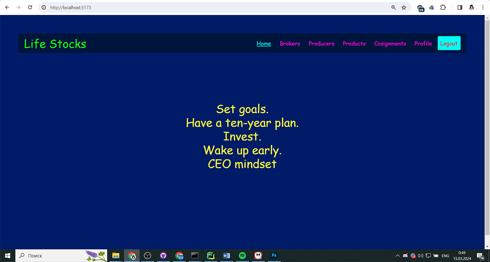
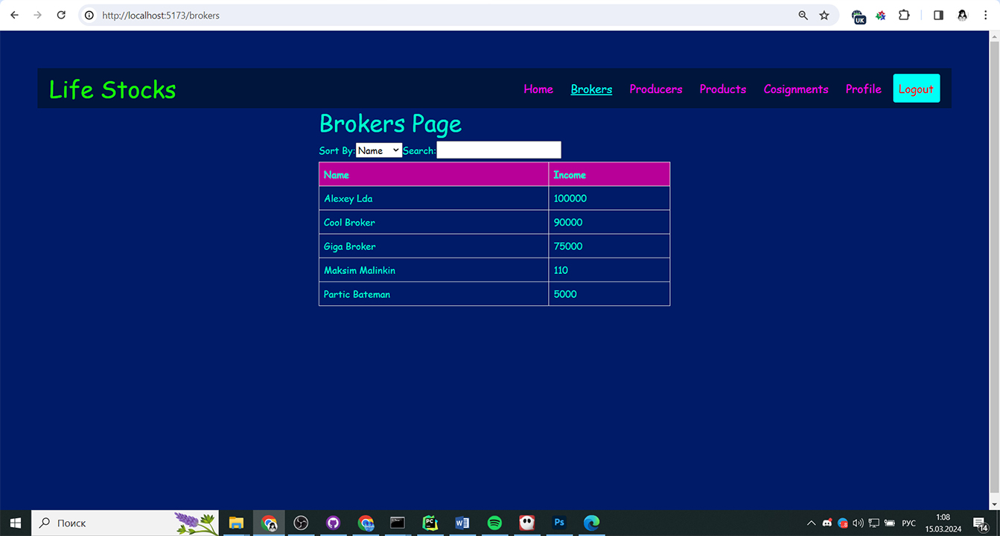
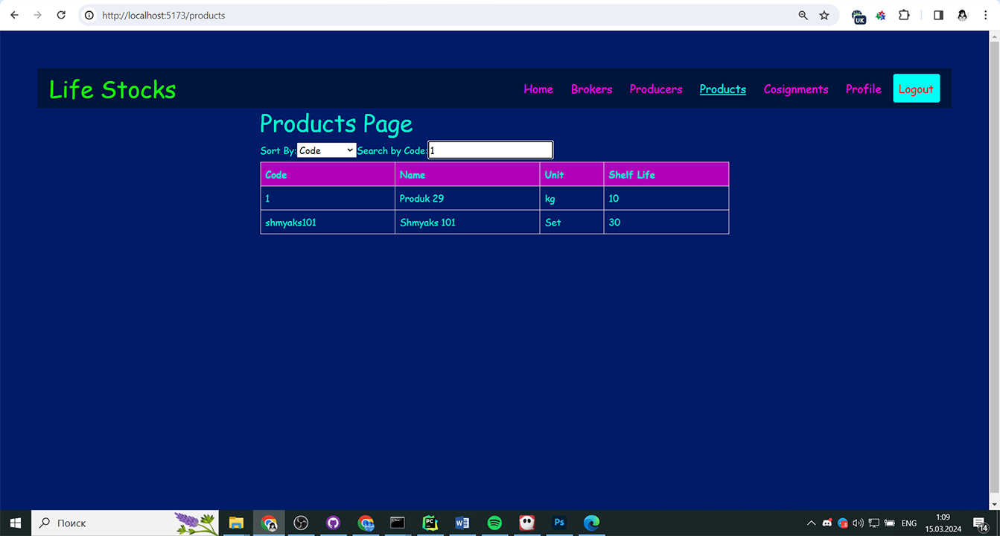
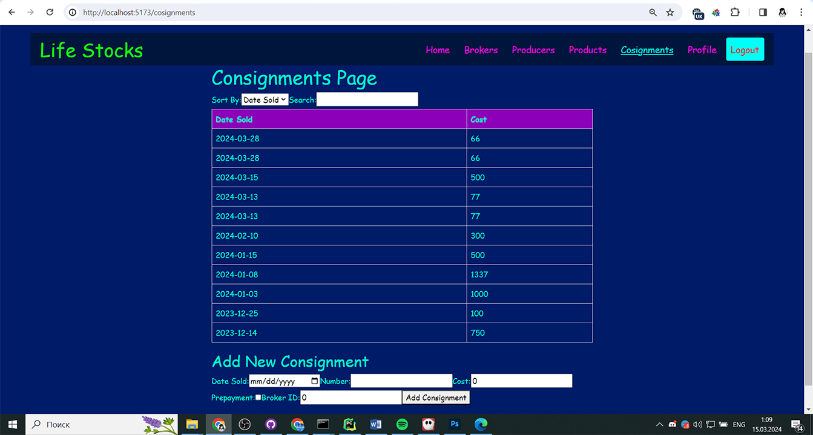
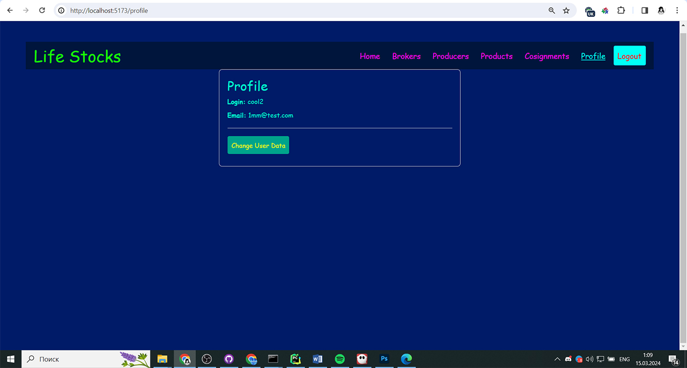

# ЛАБОРАТОРНАЯ РАБОТА №4 :  Реализация клиентской части средствами Vue.js. #
**Цель:** Ознакомится с базовыми конструкциями JavaScript.
**Задание:** Реализовать клиентскую часть приложения средствами vue.js.

## Выполнение работы ##
Порядок выполнения работы:

* Выполнить практическую работу 4.1 Базовые конструкции языка JavaScript). (https://docs.google.com/document/d/1lurVq_ddbKQ-rORvxF3T9PlPPy-sOgHwFazCI0yEqYY/edit?usp=sharing)
* Выполнить практическую работу 4.2. Работа с Vue.JS. (https://docs.google.com/document/d/1kSXkW6Vcis8z-TunNALcapCVmMHps3jaDdIP4rZkV9E/edit?usp=sharing)
* Настроить для серверной части, реализованной в лабораторной работе №3 CORS (Cross-origin resource sharing) в соответствии с Практической работой 4.3
* Утвердить с одним из преподавателей список интерфейсов для взаимодействия с серверной частью в соответствии с вашей предметной областью (это очень важный пункт, тк бывает такое, что не все студенты понимают суть своих вариантов).
* Реализовать интерфейсы авторизации, регистрации и изменения учётных данных и настроить взаимодействие с серверной частью. Полезные материалы:
Настройка авторизации средствами Vue.js и Django REST framework (DjangoSchool) (ссылка)
* Реализовать клиентские интерфейсы и настроить взаимодействие с серверной частью (интерфейсы из пункта 4). Полезные материалы:
Пункты 4.2, 4.3, 4.5 в Практической работе 4.2
Уроки 6, 7 и 10-13 из данного плейтиста (DjangoSchool) (ссылка)
* Подключить vuetify или аналогичную библиотеку. Полезные материалы:
Пункт 3.1 в Практической работе 4.2
* Реализовать документацию, описывающую работу разработанных интерфейсов средствами MkDocs.


**Components:**

Login.vue
```vue
<template>
  <div class="container">
    <h2>Войти</h2>
    <form @submit.prevent="loginUser">
      <label for="username">Имя пользователя:</label>
      <input type="text" id="username" v-model="username" required />

      <label for="password">Пароль:</label>
      <input type="password" id="password" v-model="password" required />

      <button type="submit">Войти</button>
    </form>
  </div>
</template>

<script>
import axios from 'axios';

export default {
  data() {
    return {
      username: '',
      password: '',
    };
  },
  methods: {
    async loginUser() {
      try {
        const response = await axios.post('http://localhost:8000/auth/token/login/', {
          username: this.username,
          password: this.password,
        });

        const accessToken = response.data.auth_token;

        localStorage.setItem('access_token', accessToken);

        console.log('Login successful. Token:', accessToken);

        // Set isAuthenticated to true in the root Vue instance
        this.$root.isAuthenticated = true;

        // Redirect the user to the profile page or another page
        this.$router.push('/profile');

        console.log('Login successful. Token:', accessToken);
      } catch (error) {
        console.error('Login failed:', error.response.data);
      }
    },
  },
};
</script>
```

Navbar.vue
```vue
<template>
    <header>
      <h1 class="logo">Life Stocks</h1>
      <nav>
        <router-link to="/" class="nav-link" :class="{ 'active': $route.path === '/' }">Home</router-link>
        <router-link v-if="!isAuthPage()" to="/brokers" class="nav-link" :class="{ 'active': $route.path === '/brokers' }">Brokers</router-link>
        <router-link v-if="!isAuthPage()" to="/producers" class="nav-link" :class="{ 'active': $route.path === '/producers' }">Producers</router-link>
        <router-link v-if="!isAuthPage()" to="/products" class="nav-link" :class="{ 'active': $route.path === '/products' }">Products</router-link>
        <router-link v-if="!isAuthPage()" to="/cosignments" class="nav-link" :class="{ 'active': $route.path === '/cosignments' }">Cosignments</router-link>
        <router-link v-if="!isAuthenticated" to="/login" class="nav-link" :class="{ 'active': $route.path === '/login' }">Login</router-link>
        <router-link v-if="!isAuthenticated" to="/register" class="nav-link" :class="{ 'active': $route.path === '/register' }">Register</router-link>
        <router-link v-if="isAuthenticated" to="/profile" class="nav-link" :class="{ 'active': $route.path === '/profile' }">Profile</router-link>
        <button v-if="isAuthenticated" @click="logout" class="nav-link logout-button">Logout</button>
      </nav>
    </header>
  </template>
  
  <script>
  export default {
    name: 'Navbar',
    data() {
      return {
        isAuthenticated: false,
      };
    },
    methods: {
      isAuthPage() {
        const authPages = ['/login', '/register'];
        return authPages.includes(this.$route.path);
      },
      logout() {
        // Clear authentication token from local storage
        localStorage.removeItem('access_token');
  
        // Update the isAuthenticated status
        this.isAuthenticated = false;
  
        // Redirect to the login page
        this.$router.push('/login');
      },
    },
    created() {
      // Check if the user is already authenticated
      this.isAuthenticated = localStorage.getItem('access_token') !== null;
    },
  };
  </script>
  
  <style scoped>
  header {
    background-color: #00153c;
    color: #ff00ea;
    padding: 10px 20px;
    display: flex;
    justify-content: space-between;
    align-items: center;
  }
  
  .logo {
    margin: 0;
    color: #18ff00;
  }
  
  nav {
    display: flex;
  }
  
  .nav-link {
    text-decoration: none;
    color: #ff00ea;
    font-size: 1.2em;
    padding: 10px;
    border: none;
    cursor: pointer;
    font-size: 1.2em;
    border-radius: 4px;
    margin-left: 10px;
    transition: color 0.3s;
  }
  
  .nav-link:hover,
  .active {
    text-decoration: underline;
    color: #00ffea;
  }
  
  .logout-button {
    background-color: #00fff6;
    color: #ff0000;
    padding: 10px;
    border: none;
    cursor: pointer;
    font-size: 1.2em;
    border-radius: 4px;
    margin-left: 10px;
    transition: color 0.3s;
  }
  
  .logout-button:hover {
    color: #000000;
    text-decoration: underline;
  }
  </style>
```

Profile.vue
```vue
<template>
  <div class="container">
    <div class="profile-info">
      <h2>Profile</h2>
      <div class="info-item"><strong>Login:</strong> {{ userData.username }}</div>
      <div class="info-item"><strong>Email:</strong> {{ userData.email }}</div>
    </div>

    <div class="profile-settings">
      <div class="settings-panel">
        <button @click="toggleSettingsPanel">Change User Data</button>

        <div v-show="showSettingsPanel" class="settings-dropdown">
          <button @click="toggleChangeUsernameForm">Change Username</button>
          <button @click="toggleChangePasswordForm">Change Password</button>
        </div>
      </div>

      <div v-if="showChangePasswordForm" class="change-form">
        <form @submit.prevent="changePassword" class="form">
          <label for="currentPassword">Current Password:</label>
          <input type="password" v-model="currentPassword" required />

          <label for="newPassword">New Password:</label>
          <input type="password" v-model="newPassword" required />

          <button type="submit">Change Password</button>
        </form>
      </div>

      <div v-if="showChangeUsernameForm" class="change-form">
        <form @submit.prevent="changeUsername" class="form">
          <label for="currentPassword">Current Password:</label>
          <input type="password" v-model="currentPassword" required />

          <label for="newUsername">New Username:</label>
          <input type="text" v-model="newUsername" required />

          <button type="submit">Change Username</button>
        </form>
      </div>
    </div>
  </div>
</template>

<script>
import axios from 'axios';

export default {
  data() {
    return {
      showChangePasswordForm: false,
      showChangeUsernameForm: false,
      showSettingsPanel: false,
      currentPassword: '',
      newPassword: '',
      newUsername: '',
      userData: {},
    };
  },
  mounted() {
    this.fetchUserData();
  },
  methods: {
    async fetchUserData() {
      console.log('Fetching user data...');

      try {
        const response = await axios.get('/auth/users/me/', {
          headers: {
            'Authorization': `Token ${localStorage.getItem('access_token')}`,
          },
        });
        this.userData = response.data;
        console.log('User data:', this.userData);
      } catch (error) {
        console.error('Error fetching user data:', error.response.data);
      }
    },
    async changePassword() {
      try {
        const response = await axios.post('/auth/users/set_password/', {
          new_password: this.newPassword,
          current_password: this.currentPassword,
        }, {
          headers: {
            'Authorization': `Token ${localStorage.getItem('access_token')}`,
          },
        });

        console.log('Password changed successfully:', response.data);
        this.showChangePasswordForm = false;
      } catch (error) {
        console.error('Password change failed:', error.response.data);
      }
    },
    async changeUsername() {
      try {
        const response = await axios.post('/auth/users/set_username/', {
          current_password: this.currentPassword,
          new_username: this.newUsername,
        }, {
          headers: {
            'Authorization': `Token ${localStorage.getItem('access_token')}`,
          },
        });

        console.log('Username changed successfully:', response.data);
        this.showChangeUsernameForm = false;
      } catch (error) {
        console.error('Username change failed:', error.response.data);
      }
    },
    toggleSettingsPanel() {
      this.showSettingsPanel = !this.showSettingsPanel;
    },
    toggleChangePasswordForm() {
      this.showChangePasswordForm = !this.showChangePasswordForm;
    },
    toggleChangeUsernameForm() {
      this.showChangeUsernameForm = !this.showChangeUsernameForm;
    },
  },
};
</script>

<style scoped>
.container {
  max-width: 600px;
  margin: 0 auto;
  padding: 20px;
  border: 1px solid #ddd;
  border-radius: 8px;
  box-shadow: 0 0 10px rgba(0, 0, 0, 0.1);
}

.profile-info {
  margin-bottom: 20px;
}

.info-item {
  margin-bottom: 10px;
}

.profile-settings {
  border-top: 1px solid #ddd;
  padding-top: 20px;
}

.settings-panel {
  display: flex;
  justify-content: space-between;
  align-items: center;
}

.settings-dropdown {
  display: flex;
  flex-direction: column;
  align-items: center; /* Center the buttons */
}

.change-form {
  margin-top: 20px;
}

.form {
  display: flex;
  flex-direction: column;
}

label {
  margin-bottom: 5px;
}

input {
  margin-bottom: 10px;
  padding: 8px;
  border: 1px solid #ddd;
  border-radius: 4px;
}

button {
  padding: 10px;
  background-color: #00a48b;
  color: #fcff00;
  border: none;
  border-radius: 4px;
  cursor: pointer;
  margin-bottom: 10px; /* Add margin for spacing between buttons */
}

button:hover {
  background-color: #ff0000;
}
</style>
```

Register.vue
```
<template>
    <div class="container">
      <h2>Зарегистрироваться</h2>
      <form @submit.prevent="registerUser">
        <label for="username">Имя пользователя:</label>
        <input type="text" v-model="username" required />
  
        <label for="email">Электронная почта:</label>
        <input type="email" v-model="email" required />
  
        <label for="password">Пароль:</label>
        <input type="password" v-model="password" required />
  
        <button type="submit">Зарегистрироваться</button>
      </form>
    </div>
  </template>
  
  <script>
  import axios from 'axios';
  
  export default {
    data() {
      return {
        username: '',
        email: '',
        password: '',
      };
    },
    methods: {
      async registerUser() {
        try {
          const response = await axios.post('http://localhost:8000/auth/users/', {
            username: this.username,
            email: this.email,
            password: this.password,
          });
  
          console.log('User registered successfully:', response.data);
          this.$router.push('/login');
        } catch (error) {
          console.error('Registration failed:', error.response.data);
        }
      },
    },
  };
  </script>
```

Brokers.vue

```vue
<template>
  <div class="brokers-table">
    <h1>Brokers Page</h1>

    <!-- Sorting options -->
    <label>Sort By:</label>
    <select v-model="sortBy" @change="sortBrokers">
      <option value="name">Name</option>
      <option value="income">Income</option>
    </select>

    <!-- Search input -->
    <label>Search:</label>
    <input v-model="searchTerm" @input="filterBrokers" />

    <!-- Table of brokers -->
    <table>
      <thead>
        <tr>
          <th>Name</th>
          <th>Income</th>
        </tr>
      </thead>
      <tbody>
        <tr v-for="broker in filteredBrokers" :key="broker.id">
          <td>{{ broker.name }}</td>
          <td>{{ broker.income }}</td>
        </tr>
      </tbody>
    </table>
  </div>
</template>

<script>
import axios from 'axios';

export default {
  name: 'Brokers',
  data() {
    return {
      brokers: [],
      sortBy: 'name',
      searchTerm: '',
    };
  },
  computed: {
    sortedBrokers() {
      return this.brokers.slice().sort((a, b) => {
        if (this.sortBy === 'name') {
          return a.name.localeCompare(b.name);
        } else if (this.sortBy === 'income') {
          return b.income - a.income;
        }
        return 0;
      });
    },
    filteredBrokers() {
      const search = this.searchTerm.toLowerCase();
      return this.sortedBrokers.filter(
        broker => broker.name.toLowerCase().includes(search)
      );
    },
  },
  methods: {
    async fetchBrokers() {
      try {
        const response = await axios.get('http://127.0.0.1:8000/main/brokers/', {
          headers: {
            Authorization: `Token ${localStorage.getItem('access_token')}`,
          },
        });
        this.brokers = response.data;
      } catch (error) {
        console.error('Error fetching broker data:', error);
      }
    },
    sortBrokers() {
      // Triggered when sorting option changes
    },
    filterBrokers() {
      // Triggered when search term changes
    },
  },
  created() {
    this.fetchBrokers();
  },
};
</script>

<style scoped>

body{
    min-height: 500px;
    background-color: #001b68;
}

.brokers-table {
  margin: 0 auto; /* Центрирует элемент по горизонтали */
  max-width: 600px; /* Максимальная ширина таблицы */
}

table {
  width: 100%;
  border-collapse: collapse; /* Сводит границы ячеек вместе */
}

th, td {
  border: 1px solid #ddd; /* Границы для ячеек */
  padding: 8px;
  text-align: left;
}

th {
  background-color: #b80098; /* Цвет фона для заголовков */
}
</style>
```

```vue
<template>
  <div class="consignments-page">
    <h1>Consignments Page</h1>

    <div class="consignments-table">
      <label>Sort By:</label>
      <select v-model="sortBy" @change="sortConsignments">
        <option value="date_sold">Date Sold</option>
        <option value="cost">Cost</option>
      </select>

      <label>Search:</label>
      <input v-model="searchTerm" @input="filterConsignments" />

      <table>
        <thead>
          <tr>
            <th>Date Sold</th>
            <th>Cost</th>
          </tr>
        </thead>
        <tbody>
          <tr v-for="consignment in filteredConsignments" :key="consignment.id">
            <td>{{ consignment.date_sold }}</td>
            <td>{{ consignment.cost }}</td>
          </tr>
        </tbody>
      </table>
    </div>

    <div>
      <h2>Add New Consignment</h2>
      <form @submit.prevent="addConsignment">
        <label for="dateSold">Date Sold:</label>
        <input type="date" v-model="newConsignment.date_sold" required />

        <label for="num">Number:</label>
        <input type="text" v-model="newConsignment.num" required />

        <label for="cost">Cost:</label>
        <input type="number" v-model="newConsignment.cost" required />

        <label for="prepayment">Prepayment:</label>
        <input type="checkbox" v-model="newConsignment.prepayment" />

        <label for="broker">Broker ID:</label>
        <input type="number" v-model="newConsignment.broker" required />

        <button type="submit">Add Consignment</button>
      </form>
    </div>
  </div>
</template>

<script>
import axios from 'axios';

export default {
  name: 'Consignments',
  data() {
    return {
      consignments: [],
      sortBy: 'date_sold',
      searchTerm: '',
      newConsignment: {
        date_sold: '',
        num: '',
        cost: 0,
        prepayment: false,
        broker: 0,
      },
    };
  },
  computed: {
    sortedConsignments() {
      return this.consignments.slice().sort((a, b) => {
        if (this.sortBy === 'date_sold') {
          return new Date(b.date_sold) - new Date(a.date_sold);
        } else if (this.sortBy === 'cost') {
          return b.cost - a.cost;
        }
        return 0;
      });
    },
    filteredConsignments() {
      const search = this.searchTerm.toLowerCase();
      return this.sortedConsignments.filter(
        consignment => consignment.date_sold.toLowerCase().includes(search)
      );
    },
  },
  methods: {
    async fetchConsignments() {
      try {
        const response = await axios.get('http://127.0.0.1:8000/main/consignments/', {
          headers: {
            Authorization: `Token ${localStorage.getItem('access_token')}`,
          },
        });
        this.consignments = response.data;
      } catch (error) {
        console.error('Error fetching consignment data:', error);
      }
    },
    sortConsignments() {
      // Triggered when sorting option changes
    },
    filterConsignments() {
      // Triggered when search term changes
    },
    async addConsignment() {
      try {
        const response = await axios.post('http://127.0.0.1:8000/main/consignments/', this.newConsignment, {
          headers: {
            Authorization: `Token ${localStorage.getItem('access_token')}`,
          },
        });
        console.log('Consignment added successfully:', response.data);
      } catch (error) {
        console.error('Error adding consignment:', error.response.data);
      }
    },
  },
  created() {
    this.fetchConsignments();
  },
};
</script>

<style scoped>
.consignments-page {
  max-width: 800px;
  margin: 0 auto;
}

.consignments-table {
  margin-bottom: 20px;
}

table {
  width: 100%;
  border-collapse: collapse;
}

th, td {
  border: 1px solid #ddd;
  padding: 8px;
  text-align: left;
}

th {
  background-color: #8b00b8;
}
</style>
```

Home.vue
```vue
<template>
    <div>
      <h1 class="title">Set goals.<br>Have a ten-year plan.<br>Invest.<br>Wake up early.<br>CEO mindset</h1>
    </div>
  </template>
  
  <script>
  export default {
    name: 'Home',
  };
  </script>
  
  <style scoped>
  .title {
    color: #f8ff39;
    text-align: center;
    margin-top: 50vh;
    transform: translateY(-100%);
    animation: flicker 0.5s steps(1) infinite;
  }

  @keyframes flicker {
  0% { opacity: 1; }
  50% { opacity: 0; }
  100% { opacity: 1; }
}

@keyframes colorShift {
  0% { background-color: #f500ff; }
  50% { background-color: #f500ff; }
  100% { background-color: #f500ff; }
}

  </style>

```

Producers.vue
```vue
<template>
  <div class="producers-table">
    <h1>Producers Companies Page</h1>

    <!-- Search input -->
    <label>Search by Name:</label>
    <input v-model="searchTerm" @input="filterProducers" />

    <!-- Table of producers -->
    <table>
      <thead>
        <tr>
          <th>Name</th>
        </tr>
      </thead>
      <tbody>
        <tr v-for="producer in filteredProducers" :key="producer.id">
          <td>{{ producer.name }}</td>
        </tr>
      </tbody>
    </table>
  </div>
</template>

<script>
import axios from 'axios';

export default {
  name: 'Producers',
  data() {
    return {
      producers: [],
      searchTerm: '',
    };
  },
  computed: {
    filteredProducers() {
      const search = this.searchTerm.toLowerCase();
      return this.producers.filter(
        producer => producer.name.toLowerCase().includes(search)
      );
    },
  },
  methods: {
    async fetchProducers() {
      try {
        const response = await axios.get('http://127.0.0.1:8000/main/companies/', {
          headers: {
            Authorization: `Token ${localStorage.getItem('access_token')}`,
          },
        });
        this.producers = response.data;
      } catch (error) {
        console.error('Error fetching producer data:', error);
      }
    },
    filterProducers() {
      // Triggered when search term changes
    },
  },
  created() {
    this.fetchProducers();
  },
};
</script>

<style scoped>
.producers-table {
  margin: 0 auto; /* Центрирует элемент по горизонтали */
  max-width: 600px; /* Максимальная ширина таблицы */
}

table {
  width: 100%;
  border-collapse: collapse; /* Сводит границы ячеек вместе */
}

th, td {
  border: 1px solid #ddd; /* Границы для ячеек */
  padding: 8px;
  text-align: left;
}

th {
  background-color: #b80000; /* Цвет фона для заголовков */
}
</style>
```

Products

```vue
<template>
  <div class="products-table">
    <h1>Products Page</h1>

    <!-- Sorting options -->
    <label>Sort By:</label>
    <select v-model="sortBy" @change="sortProducts">
      <option value="code">Code</option>
      <option value="name">Name</option>
      <option value="unit">Unit</option>
      <option value="shelf_life">Shelf Life</option>
    </select>

    <!-- Search input -->
    <label>Search by Code:</label>
    <input v-model="searchTerm" @input="filterProducts" />

    <!-- Table of products -->
    <table>
      <thead>
        <tr>
          <th>Code</th>
          <th>Name</th>
          <th>Unit</th>
          <th>Shelf Life</th>
        </tr>
      </thead>
      <tbody>
        <tr v-for="product in filteredProducts" :key="product.id">
          <td>{{ product.code }}</td>
          <td>{{ product.name }}</td>
          <td>{{ product.unit }}</td>
          <td>{{ product.shelf_life }}</td>
        </tr>
      </tbody>
    </table>
  </div>
</template>

<script>
import axios from 'axios';

export default {
  name: 'Products',
  data() {
    return {
      products: [],
      sortBy: 'code',
      searchTerm: '',
    };
  },
  computed: {
    sortedProducts() {
      return this.products.slice().sort((a, b) => {
        if (this.sortBy === 'code') {
          return a.code.localeCompare(b.code);
        } else if (this.sortBy === 'name') {
          return a.name.localeCompare(b.name);
        } else if (this.sortBy === 'unit') {
          return a.unit.localeCompare(b.unit);
        } else if (this.sortBy === 'shelf_life') {
          return a.shelf_life - b.shelf_life;
        }
        return 0;
      });
    },
    filteredProducts() {
      const search = this.searchTerm.toLowerCase();
      return this.sortedProducts.filter(
        product => product.code.toLowerCase().includes(search)
      );
    },
  },
  methods: {
    async fetchProducts() {
      try {
        const response = await axios.get('http://127.0.0.1:8000/main/products/', {
          headers: {
            Authorization: `Token ${localStorage.getItem('access_token')}`,
          },
        });
        this.products = response.data;
      } catch (error) {
        console.error('Error fetching product data:', error);
      }
    },
    sortProducts() {
      // Triggered when sorting option changes
    },
    filterProducts() {
      // Triggered when search term changes
    },
  },
  created() {
    this.fetchProducts();
  },
};
</script>

<style scoped>
.products-table {
  margin: 0 auto; /* Центрирует элемент по горизонтали */
  max-width: 800px; /* Максимальная ширина таблицы */
}

table {
  width: 100%;
  border-collapse: collapse; /* Сводит границы ячеек вместе */
}

th, td {
  border: 1px solid #ddd; /* Границы для ячеек */
  padding: 8px;
  text-align: left;
}

th {
  background-color: #b100b8; /* Цвет фона для заголовков */
}
</style>

```

App.vue:

```vue
<template>
  <div id="app" class="web-1-0">
    <Navbar />
    <router-view></router-view>
  </div>
</template>

<script>
import Navbar from './components/Navbar.vue';

export default {
  name: 'App',
  components: {
    Navbar,
  },
};
</script>

<style>
#app {
  background-color: #001b68;
  min-height: 768px;
  margin: 0 auto;
  padding: 2rem;
  font-weight: normal;
}
.web-1-0 {
  background-color: #001b68; /* Bright yellow */
  font-family: Comic Sans MS, cursive, sans-serif;
  color: #00ffcc; /* Bright red */
}
</style>


```

main.js
```js
import { createApp } from 'vue';
import { createRouter, createWebHistory } from 'vue-router';
import 'bootstrap/dist/css/bootstrap.min.css';
import axios from 'axios';
import App from './App.vue';
import Login from './components/Login.vue';
import Register from './components/Register.vue';
import Profile from './components/Profile.vue';
import Home from './views/Home.vue';
import Brokers from './views/Brokers.vue';
import Producers from './views/Producers.vue';
import Products from './views/Products.vue';
import Cosignments from './views/Cosignments.vue'

axios.defaults.baseURL = 'http://127.0.0.1:8000/';

const app = createApp(App);
app.config.globalProperties.isAuthenticated = false;

const router = createRouter({
  history: createWebHistory(),
  routes: [
    { path: '/login', component: Login },
    { path: '/register', component: Register },
    { path: '/profile', component: Profile, meta: { requiresAuth: true } },
    { path: '/', component: Home },
    { path: '/brokers', component: Brokers, meta: { requiresAuth: true } },
    { path: '/producers', component: Producers, meta: { requiresAuth: true } },
    { path: '/products', component: Products, meta: { requiresAuth: true } },
    { path: '/cosignments', component: Cosignments, meta: { requiresAuth: true } },
  ],
});

router.beforeEach((to, from, next) => {
  if (to.matched.some(record => record.meta.requiresAuth)) {
    if (!localStorage.getItem('access_token')) {
      next({
        path: '/login',
        query: { redirect: to.fullPath },
      });
    } else {
      next();
    }
  } else {
    next();
  }
});

app.use(router);

app.mount('#app');
```

### Демонстрация сайта ###









