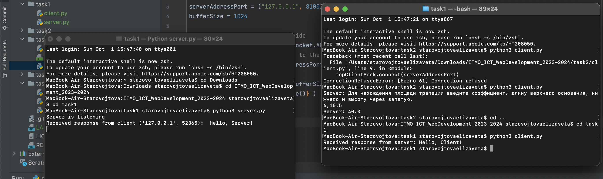
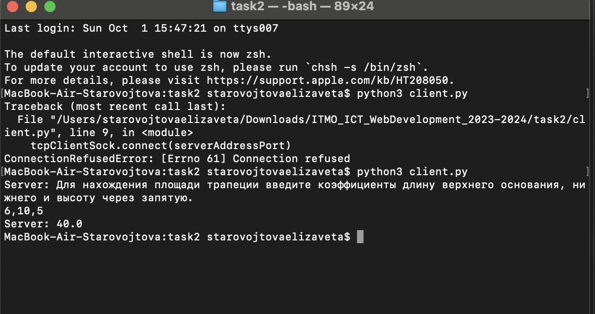
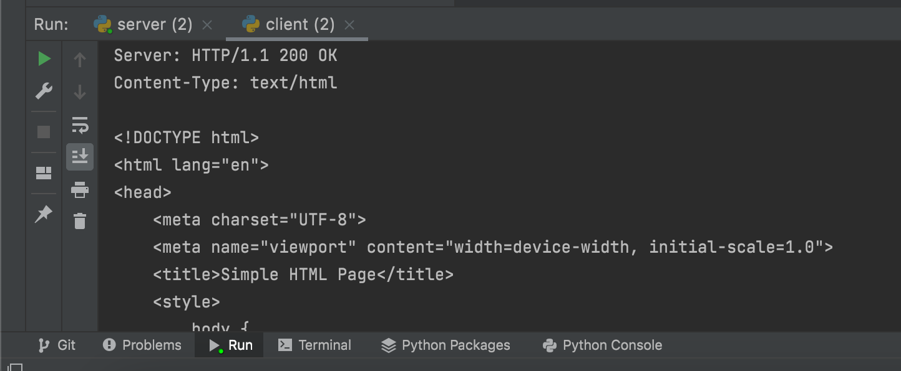
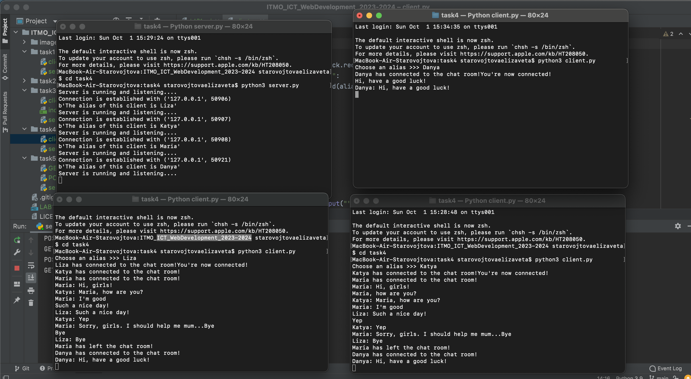
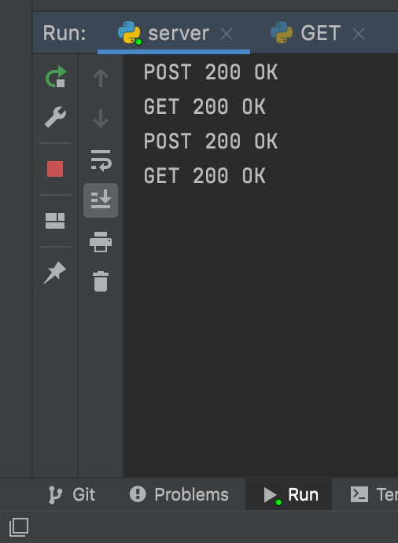
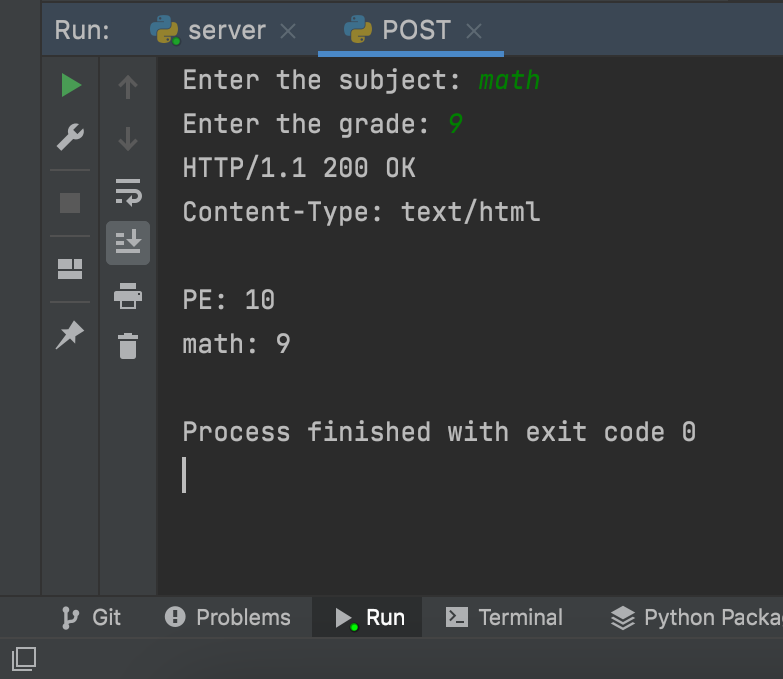
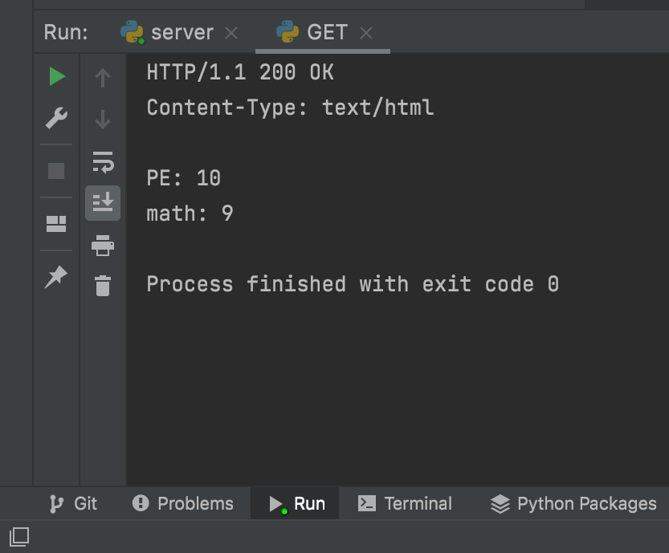

# Отчет по лабораторной работе №1

## Выполнила: Старовойтова Елизавета, K33402

#### Цель работы:

Овладеть практическими навыками и умениями реализации web-серверов и использования сокетов.

## Задание 1

#### Текст задания:

Реализовать клиентскую и серверную часть приложения. Клиент отсылает серверу сообщение «Hello, server». Сообщение должно отразиться на стороне сервера. Сервер в ответ отсылает клиенту сообщение «Hello, client». Сообщение должно отобразиться у клиента. Обязательно использовать библиотеку socket. Реализовать с помощью протокола UDP.

#### Решение:

Сервер:

```
import socket

serverAddressPort = ("127.0.0.1", 2001)
bufferSize = 1024
msgFromServer = "Hello, Client!"

udpServerSock = socket.socket(socket.AF_INET, socket.SOCK_DGRAM)
# bind to address and IP
udpServerSock.bind(serverAddressPort)
print("Server is listening")

while True:
    msg, clientAddress = udpServerSock.recvfrom(bufferSize)
    print(f'Received response from client {clientAddress}:  {msg.decode("utf-8")}')
    udpServerSock.sendto(msgFromServer.encode("utf-8"), clientAddress)

```

Создание сокета, прослушивание порта 2001, когда ответ получен отправляем на клиент сообщение "Hello, Сlient!".

Клиент:

```
import socket

msgFromClient = "Hello, Server!"
serverAddressPort = ("127.0.0.1", 2001)
bufferSize = 1024

# create UDP socket at client side
udpClientSock = socket.socket(socket.AF_INET, socket.SOCK_DGRAM)

# sent msg to server
udpClientSock.sendto(msgFromClient.encode('utf-8'), serverAddressPort)

msgFromServer = udpClientSock.recvfrom(bufferSize)
print(f'Received response from server: {msgFromServer[0].decode("utf-8")}')

```

Создание сокета, отправка на сервер сообщение "Hello, Server!", вывод ответа.



## Задание 2

#### Текст задания:

Реализовать клиентскую и серверную часть приложения. Клиент запрашивает у
сервера выполнение математической операции, параметры, которые вводятся с
клавиатуры. Сервер обрабатывает полученные данные и возвращает результат
клиенту. Вариант с учетом номера в журнале:

__Найти площадь трапеции__

Обязательно использовать библиотеку socket
Реализовать с помощью протокола TCP

#### Решение:

Сервер:

```
import socket

serverAddressPort = ("127.0.0.1", 2005)
bufferSize = 1024

tcpServerSock = socket.socket(socket.AF_INET, socket.SOCK_STREAM)
# bind to address and IP
tcpServerSock.bind(serverAddressPort)

# listen() puts the socket into server mode, and accept() waits for an incoming connection
tcpServerSock.listen(10)
while True:
    connection, clientAddress = tcpServerSock.accept()
    print(f"Connected by {clientAddress}")
    with connection:
                startMessage = """Для нахождения площади трапеции введите коэффициенты длину верхнего основания, нижнего и высоту через запятую."""
                connection.sendall(startMessage.encode('utf-8'))

                recieved = connection.recv(bufferSize)
                recieved = recieved.decode('utf-8')
                print(f'Client: {recieved}')

                a, b, h = map(float, recieved.split(','))
                result = str((a + b) * h / 2)
                connection.sendall(result.encode("utf-8"))
```

Создание сокета TCP. Установка коннекта в цикле с клиентом и получение от него данных для решения задачи. Затем парсим данные с клиента и считаем площадь трапеции. Отправляем ответ.

Клиент:

```
import socket

serverAddressPort = ("127.0.0.1", 2005)
bufferSize = 1024

# create TCP socket at client side
tcpClientSock = socket.socket(socket.AF_INET, socket.SOCK_STREAM)
# to attach the socket directly to the remote address
tcpClientSock.connect(serverAddressPort)

msgFromServer = tcpClientSock.recvfrom(bufferSize)
print(f'Server: {msgFromServer[0].decode("utf-8")}')

data = input()
tcpClientSock.sendall(data.encode("utf-8"))

msgFromServer = tcpClientSock.recvfrom(bufferSize)
print(f'Server: {msgFromServer[0].decode("utf-8")}')

tcpClientSock.close()
```

Также создаем сокет. Пользователь вводит данные такие как, основания трапеции и высота, и отправляем их на сервер. Получаем с сервера ответ.



## Задание 3

#### Текст задания:

Реализовать серверную часть приложения. Клиент подключается к серверу. В ответ
клиент получает http-сообщение, содержащее html-страницу, которую сервер
подгружает из файла index.html.

#### Решение:

HTML документ:

```
<!DOCTYPE html>
<html lang="en">
<head>
    <meta charset="UTF-8">
    <meta name="viewport" content="width=device-width, initial-scale=1.0">
    <title>Simple HTML Page</title>
    <style>
        body {
            background-color: lightpink;
            text-align: center;
        }
        p {
            display: block;
            width: 400px;
            margin: auto;
        }
    </style>
</head>
<body>
    <h1>Hello, World!</h1>
    <p>Lorem ipsum dolor sit amet, consectetur adipiscing elit, sed do eiusmod tempor incididunt ut labore et dolore magna aliqua.
        Ut enim ad minim veniam, quis nostrud exercitation ullamco laboris nisi ut aliquip ex ea commodo consequat.
        Duis aute irure dolor in reprehenderit in voluptate velit esse cillum dolore eu fugiat nulla pariatur.
        Excepteur sint occaecat cupidatat non proident, sunt in culpa qui officia deserunt mollit anim id est laborum.</p>
</body>
</html>

```

Сервер:

```
import socket

serverAddressPort = ("127.0.0.1", 8100)
bufferSize = 1024

tcpServerSock = socket.socket(socket.AF_INET, socket.SOCK_STREAM)
# bind to address and IP
tcpServerSock.bind(serverAddressPort)

# listen() puts the socket into server mode, and accept() waits for an incoming connection
tcpServerSock.listen(10)
while True:
    connection, clientAddress = tcpServerSock.accept()
    print(f"Connected by {clientAddress}")
    with connection:
        with open("index.html", "r") as f:
            html = f.read()
        response = f"HTTP/1.1 200 OK\r\nContent-Type: text/html\r\n\r\n{html}"
        connection.sendall(response.encode())

```

Создание сокета TCP, устанановка соединения, затем читаем html файл и отправляем на клиент ответ содержащий ответ с нашим index.html.

Клиент:

```
import socket

serverAddressPort = ("127.0.0.1", 8100)
bufferSize = 1024

# create TCP socket at client side
tcpClientSock = socket.socket(socket.AF_INET, socket.SOCK_STREAM)
# to attach the socket directly to the remote address
tcpClientSock.connect(serverAddressPort)

response = tcpClientSock.recv(bufferSize)
print(f'Server: {response.decode()}')

tcpClientSock.close()

```

Создание сокета и коннект с сервером, отправлка запроса и получение ответ.

Скриншот:




## Задание 4

#### Текст задания:

Реализовать двухпользовательский или многопользовательский чат. Реализация многопользовательского часа позволяет получить максимальное количество
баллов. Обязательно использовать библиотеку threading.

Для применения с TCP необходимо запускать клиентские подключения. И прием, и отправку сообщений всем юзерам на сервере в потоках. Не забудьте сохранять юзеров,
чтобы потом отправлять им сообщения.

#### Ход решения:

Сервер:

```
import socket
import threading

host = "127.0.0.1"
port = 59000
buffSize = 1024

tcpServerSock = socket.socket(socket.AF_INET, socket.SOCK_STREAM)
tcpServerSock.bind((host, port))
tcpServerSock.listen()
clients = []
aliases = []


# func which send messages for all clients
def broadcast(message):
    for client in clients:
        client.send(message)


def handle_client(client):
    while True:
        try:
            message = client.recv(1024)
            broadcast(message)
        except:
            index = clients.index(client)
            clients.remove(client)
            client.close()
            alias = aliases[index]
            broadcast(f'{alias} has left the chat room!'.encode("utf-8"))
            aliases.remove(alias)
            break


def receive():
    while True:
        print("Server is running and listening....")
        client, address = tcpServerSock.accept()
        print(f'Connection is established with {str(address)}')
        client.send("alias?".encode("utf-8"))
        alias = client.recv(buffSize).decode("utf-8")
        aliases.append(alias)
        clients.append(client)
        print(f"The alias of this client is {alias}".encode("utf-8"))
        broadcast(f"{alias} has connected to the chat room!".encode("utf-8"))
        client.send("You're now connected!".encode("utf-8"))
        thread = threading.Thread(target=handle_client, args=(client,))
        thread.start()

if __name__ == "__main__":
    receive()

```

Создание сокета, списка клиентов и их ников. Здесь реализованы функции для трансляции сообщений всем клиентам, для отлавливания клиентов и для самого общения. Запускаем потоки с помощью библиотеки _threading_.

Клиент:

```
import threading
import socket

host = "127.0.0.1"
port = 59000
buffSize = 1024

alias = input("Choose an alias >>> ")
tcpClientSock = socket.socket(socket.AF_INET, socket.SOCK_STREAM)
tcpClientSock.connect((host, port))


def client_receive():
    while True:
        try:
            message = tcpClientSock.recv(buffSize).decode("utf-8")
            if message == "alias?":
                tcpClientSock.send(alias.encode("utf-8"))
            else:
                print(message)
        except:
            print("Error!")
            tcpClientSock.close()
            break


def client_send():
    while True:
        message = f'{alias}: {input("")}'
        tcpClientSock.send(message.encode("utf-8"))


receive_thread = threading.Thread(target=client_receive)
receive_thread.start()

send_thread = threading.Thread(target=client_send)
send_thread.start()

```

Пользователь вводит своя Ник, далее установка соединения с сервером. Функции для получения и отправки сообщений. Запускаем потоки для каждой функции.

Скриншот:




## Задание 5

#### Текст задания:

Необходимо написать простой web-сервер для обработки GET и POST http
запросов средствами Python и библиотеки socket.

Задание: сделать сервер, который может:
<br/>● Принять и записать информацию о дисциплине и оценке по дисциплине.
<br/>● Отдать информацию обо всех оценках по дисциплине в виде html-страницы.

#### Решение:

Сервер:

```
import socket

host = '127.0.0.1'
port = 14560
bufferSize = 1024


class MyHTTPServer:
    def __init__(self, host, port):
        self.conn = socket.socket(socket.AF_INET, socket.SOCK_STREAM)
        self.conn.setsockopt(socket.SOL_SOCKET, socket.SO_REUSEADDR, 1)
        self.conn.bind((host, port))
        self.conn.listen(10)
        self.grades = {}

    def start_server(self):
        while True:
            client, address = self.conn.accept()
            self.listen_client(client)

    def listen_client(self, client):
        data = client.recv(bufferSize).decode("utf-8")
        self.parse_request(client, data)

    def parse_request(self, client, data):
        lines = data.split('\n')
        method, url, vers = lines[0].split()

        if method == 'POST':
            body = data.split('\n')[-1]
            params = {p.split('=')[0]: p.split('=')[1] for p in body.split('&')}

        elif method == 'GET':
            params = (
                {p.split('=')[0]: p.split('=')[1] for p in url.split('?')[1].split('&')}
                if '?' in url
                else None
            )
        else:
            params = None

        self.create_response(client, method, params)

    def create_response(self, client, method, params):
            if method == 'POST':
                subj = params.get("subj")
                grade = params.get("grade")
                self.grades[subj] = grade
                self.send_response(client, 200, self.generate_html(), "OK")
                print('POST 200 OK')
            elif method == 'GET':
                self.send_response(client, 200, self.generate_html(), "OK")
                print('GET 200 OK')
            else:
                self.send_response(client, 404, 'Not Found')
                print('Error 404')

    def send_response(self, client, code, body, reason):
            resp = f'HTTP/1.1 {code} {reason}\nContent-Type: text/html\n\n'
            resp += body
            client.send(resp.encode("utf-8"))
            client.close()


    def generate_html(self):
            grades_list = [f'{subj}: {grade}' for subj, grade in self.grades.items()]
            return '\n'.join(grades_list)


if __name__ == '__main__':
    server = MyHTTPServer(host, port)
    server.start_server()

```

Использован предоставленный шаблон. Инициализация сервера и создание словаря, куда будем заносить оценки. Создание функции, которая запускает наш сервер. Функция прослушивания клиента. Дальше парсим полученные с клиента запросы, на выходе два типа запросов GET или POST. Запросы разделяем на метод и параметры, обрабатываем их. При POST запросе получаем параметры и записываем их в отметки, отправляем на клиент сообщение об успешном выполнении запроса. При GET запросе отправляем на клиент сгенерированную страницу html.

POST запрос:

```
import socket

host = '127.0.0.1'
port = 14560
bufferSize = 1024


tcpSock = socket.socket(socket.AF_INET, socket.SOCK_STREAM)
tcpSock.connect((host, port))

subj = input('Enter the subject: ')
grade = input('Enter the grade: ')

request = "POST /subj HTTP/1.1\nHost: localhost\nContent-Type: application/x-www-form-urlencoded\nContent-Length: 38\n\n"
body = f"subj={subj}&grade={grade}"

tcpSock.send((request + body).encode('utf-8'))
response = tcpSock.recv(bufferSize).decode('utf-8')
print(response)

```

GET запрос:

```
import socket

host = '127.0.0.1'
port = 14560
bufferSize = 1024


tcpSock = socket.socket(socket.AF_INET, socket.SOCK_STREAM)
tcpSock.connect((host, port))

request = "GET /scores?subj=test HTTP/1.1\nContent-Type: text"
tcpSock.send(request.encode('utf-8'))

response = tcpSock.recv(bufferSize).decode('utf-8')
print(response)

```

Результат в скриншотах:



POST запрос:



GET запрос:



## Вывод

При выполнении данной лабораторной работы я изучила работу с сокетами, TCP, UDP, HTTP сервера, научилась работать с запросами.