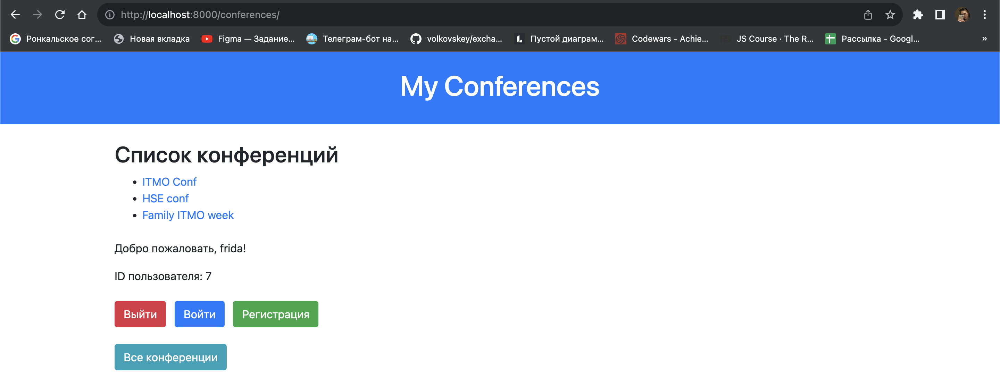
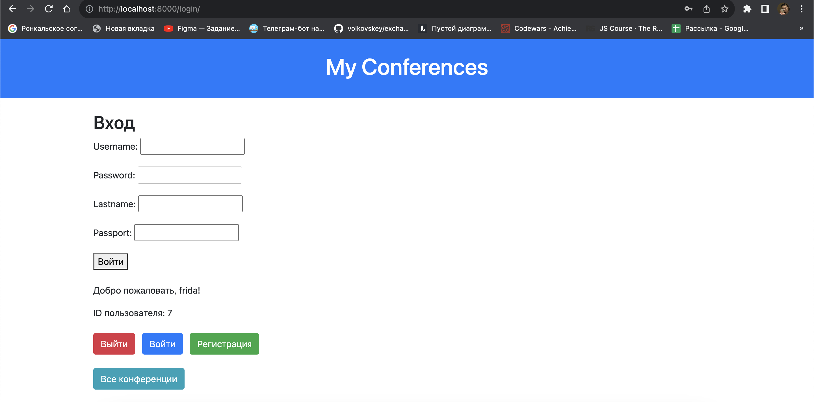
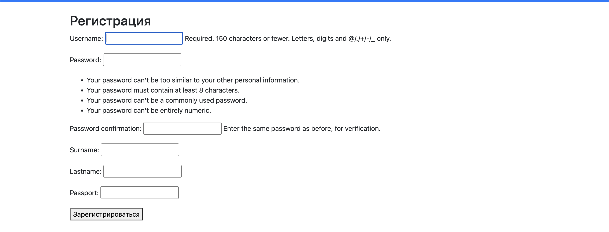

# Отчет по лабораторной работе №2

## Выполнила: Старовойтова Елизавета, K33402

#### Цель работы:

овладеть практическими навыками и умениями реализации web-сервисов
средствами Django 2.2.

## Задание

#### Текст задания:

Реализовать сайт используя фреймворк Django 3 и СУБД PostgreSQL *, в
соответствии с вариантом задания лабораторной работы.

Список научных конференций
Интерфейс описывает названия конференций, список тематик, место проведения,
период проведения, описание конференций, описание место проведения, условия участия.
Необходимо реализовать следующий функционал:
- Регистрация новых пользователей.
- Просмотр конференций и регистрацию авторов для выступлений.
Пользователь должен иметь возможность редактирования и удаления своих
регистраций.
- Написание отзывов к конференциям. При добавлении комментариев,
должны сохраняться даты конференции, текст комментария, рейтинг (1-10),
информация о комментаторе.
- Администратор должен иметь возможность указания результатов
выступления (рекомендован к публикации или нет) средствами Django-
admin.
- В клиентской части должна формироваться таблица, отображающая всех
участников по конференциям.
#### Решение:

Models.py:

```
from django.db import models
from django.contrib.auth.models import User

class UserProfile(models.Model):
    user = models.OneToOneField(User, on_delete=models.CASCADE)
    surname = models.CharField(max_length=30)
    lastname = models.CharField(max_length=30)
    passport = models.CharField(max_length=20)

class Conference(models.Model):
    members = models.ManyToManyField(User, through='AuthorRegistration', related_name='conferences_attending')
    name = models.CharField(max_length=100)
    date = models.DateField()
    topics = models.TextField()
    location = models.CharField(max_length=100)


class AuthorRegistration(models.Model):
    user = models.ForeignKey(User, on_delete=models.CASCADE)
    conference = models.ForeignKey(Conference, on_delete=models.CASCADE)
    date_registered = models.DateTimeField(auto_now=True)


class Comment(models.Model):
    user = models.ForeignKey(User, on_delete=models.CASCADE, related_name='comments')
    conference = models.ForeignKey(Conference, on_delete=models.CASCADE, related_name='comments')
    date_created = models.DateTimeField(auto_now_add=True)
    text = models.TextField()
    rating = models.IntegerField()


```

Создали модели приложения и определили структуру базы данных. Для решение проблемы со связью многие ко многим создали доп. модель.

Views.py:

```
from django.contrib import messages
from django.shortcuts import redirect, get_object_or_404, render
from django.views import View
from django.contrib.auth.mixins import LoginRequiredMixin
from django.contrib.auth import login, logout
from django.views.generic import (
    ListView,
    DetailView,
    CreateView,
    UpdateView,
    DeleteView,
)
from django.urls import reverse_lazy
from .models import Conference, AuthorRegistration, Comment
from .forms import CommentForm, RegistrationForm, LoginForm
from django.contrib.auth.decorators import login_required

class ConferenceListView(ListView):
    model = Conference
    template_name = 'conference_list.html'
    context_object_name = 'conferences'

@login_required(login_url='/login/')
def user_confs_view(request, username):
    all_confs = Conference.objects.all()
    user_confs = []

    for conf in all_confs:
        if request.user in conf.members.all():
            user_confs.append(conf)
    return render(request, 'user_confs.html', {'user_confs': user_confs})
class ConferenceDetailView(DetailView):
    model = Conference
    template_name = 'conference_detail.html'
    context_object_name = 'conference'

    def get_context_data(self, **kwargs):
        context = super().get_context_data(**kwargs)
        context['registrations'] = AuthorRegistration.objects.filter(conference=self.object)
        context['comments'] = Comment.objects.filter(conference=self.object)
        return context


class RegisterAuthorView(LoginRequiredMixin, View):

    def get(self, request, *args, **kwargs):
        conference = get_object_or_404(Conference, pk=self.kwargs['pk'])

        is_registered = AuthorRegistration.objects.filter(user=request.user, conference=conference).exists()

        if is_registered:
            return redirect('conference_detail', pk=conference.pk)
        else:
            # Если пользователь не зарегистрирован, создаем запись в AuthorRegistration
            AuthorRegistration.objects.create(user=request.user, conference=conference)
            return redirect('conference_detail', pk=conference.pk)

    def get_success_url(self):
        return reverse_lazy('conference_list')

    def post(self, request, *args, **kwargs):
        print("Handling post request for registration")
        conference = get_object_or_404(Conference, pk=self.kwargs['pk'])
        registration = AuthorRegistration.objects.create(user=request.user, conference=conference)
        print(f"New registration created: {registration}")
        return redirect('conference_detail', pk=conference.pk)

class WriteCommentView(LoginRequiredMixin,CreateView):
    model = Comment
    form_class = CommentForm
    template_name = 'write_comment.html'

    def get_context_data(self, **kwargs):
        context = super().get_context_data(**kwargs)
        context['conference'] = get_object_or_404(Conference, pk=self.kwargs['pk'])
        return context

    def form_valid(self, form):
        form.instance.conference = self.get_context_data()['conference']
        form.instance.user = self.request.user
        return super().form_valid(form)

    def get_success_url(self):
        return reverse_lazy('conference_detail', kwargs={'pk': self.kwargs['pk']})


class RegistrationView(CreateView):
    form_class = RegistrationForm
    template_name = 'register.html'
    success_url = reverse_lazy('login')

    def form_valid(self, form):
        response = super().form_valid(form)
        return redirect(self.success_url)

class LoginView(View):

    def get(self, request, *args, **kwargs):
        form = LoginForm()  # Создаем экземпляр формы для входа
        return render(request, 'login.html', {'form': form})

    def post(self, request, *args, **kwargs):
        form = LoginForm(self.request, data=request.POST)
        if form.is_valid():
            login(request, form.get_user())
            messages.success(request, 'Вы успешно вошли в систему.')
            return redirect('conference_list')
    def get_success_url(self):
        next_url = self.request.GET.get('next')
        if next_url:
            return next_url
        return reverse_lazy('conference_list')

def logout_view(request):
    logout(request)
    return redirect('login')

class UpdateRegistrationView(LoginRequiredMixin, UpdateView):
    model = AuthorRegistration
    template_name = 'update_registration.html'
    fields = ['conference']

    def get_context_data(self, **kwargs):
        context = super().get_context_data(**kwargs)
        context['registration'] = self.object
        return context

    def get_success_url(self):
        return reverse_lazy('conference_detail', kwargs={'pk': self.object.conference.pk})


class DeleteRegistrationView(LoginRequiredMixin, DeleteView):
    model = AuthorRegistration
    template_name = 'delete_registration.html'

    def get_context_data(self, **kwargs):
        context = super().get_context_data(**kwargs)
        context['registration'] = self.object
        return context

    def get_success_url(self):
        return reverse_lazy('conference_detail', kwargs={'pk': self.object.conference.pk})


```

Представления для обработки логики приложения и определения данных, что будут представлены пользователю.


Forms.py:

```
from django import forms
from .models import Comment, UserProfile
from django.contrib.auth.forms import UserCreationForm, AuthenticationForm
from django.contrib.auth.models import User
class CommentForm(forms.ModelForm):
    class Meta:
        model = Comment
        fields = ['text', 'rating']

class RegistrationForm(UserCreationForm):
    surname = forms.CharField(max_length=100)
    lastname = forms.CharField(max_length=100)
    passport = forms.CharField(max_length=20)

    class Meta:
        model = User
        fields = ['username', 'password1', 'password2', 'surname', 'lastname', 'passport']

    def save(self, commit=True):
        user = super().save(commit=False)

        user_profile = UserProfile(
            user=user,
            surname=self.cleaned_data['surname'],
            lastname=self.cleaned_data['lastname'],
            passport=self.cleaned_data['passport']
        )

        if commit:
            user.save()
            user_profile.save()

        return user

class LoginForm(AuthenticationForm):
    lastname = forms.CharField(max_length=100)
    passport = forms.CharField(max_length=20)
```

Формы для взаимодействия с данными пользователя.

Templates/base.html:

```
<!DOCTYPE html>
<html lang="en">
<head>
    <meta charset="UTF-8">
    <meta name="viewport" content="width=device-width, initial-scale=1.0">
    <title>My Conferences</title>

    <link rel="stylesheet" href="https://stackpath.bootstrapcdn.com/bootstrap/4.3.1/css/bootstrap.min.css">

</head>
<body>
    <header class="bg-primary text-white p-4">
        <h1 class="text-center">My Conferences</h1>
    </header>

    <div class="container mt-4">
        
    </div>

    
        <div class="container mt-4">
            <p>Добро пожаловать, {{ user.username }}!</p>
            <p>ID пользователя: {{ user.id }}</p>
        </div>
    
        <div class="container mt-4">
            <p>Вы не вошли в систему.</p>
        </div>
    

    <div class="container mt-4">
        <a href="" class="btn btn-danger">Выйти</a>
        <a href="" class="btn btn-primary ml-2">Войти</a>
        <a href="" class="btn btn-success ml-2">Регистрация</a>
        <br>
        <br>
        <a href="" class="btn btn-info">Все конференции</a>
    </div>

    <footer class="bg-dark text-white p-3 mt-4">
        <div class="container">
            <p class="text-center">&copy; 2023 My Conferences</p>
        </div>
    </footer>

    <script src="https://code.jquery.com/jquery-3.3.1.slim.min.js"></script>
    <script src="https://cdnjs.cloudflare.com/ajax/libs/popper.js/1.14.7/umd/popper.min.js"></script>
    <script src="https://stackpath.bootstrapcdn.com/bootstrap/4.3.1/js/bootstrap.min.js"></script>
</body>
</html>

```

Шаблоны для определения данных, что будут отображены в браузере. В примере базовый файл, на основе которого созданы все другие html-страницы. Также добавлены минимальная стилизация с использованием Bootstrap.


urls.py:

```
from django.urls import path
from .views import (
    ConferenceListView,
    ConferenceDetailView,
    RegisterAuthorView,
    WriteCommentView,
    RegistrationView,
    LoginView,
    UpdateRegistrationView,
    DeleteRegistrationView,
    logout_view
)

urlpatterns = [
    path('conferences/', ConferenceListView.as_view(), name='conference_list'),
    path('conferences/<int:pk>/', ConferenceDetailView.as_view(), name='conference_detail'),
    path('conferences/<int:pk>/comment/', WriteCommentView.as_view(), name='write_comment'),
    path('registration/', RegistrationView.as_view(), name='registration'),
    path('login/', LoginView.as_view(), name='login'),
    path('logout', logout_view, name='logout'),
    path('conferences/<int:pk>/register/', RegisterAuthorView.as_view(), name='register_author'),
    path('conferences/<int:pk>/register/update/', UpdateRegistrationView.as_view(), name='update_registration'),
    path('conferences/<int:pk>/register/delete/', DeleteRegistrationView.as_view(), name='delete_registration'),
]

```
Файл для связи представлений с URL.

Примеры интерфейсов:





## Вывод 
В данной лабораторной работе я овладела практическими навыками и умениями реализации web-сервисов
средствами Django.
