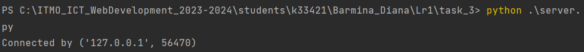
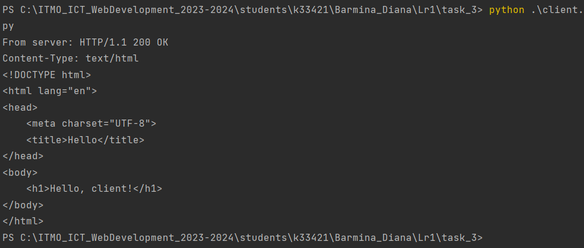

# Задание №3

>Реализовать серверную часть приложения. Клиент подключается к серверу. В ответ
клиент получает http-сообщение, содержащее html-страницу, которую сервер
подгружает из файла index.html.

**server**

```
import socket


if __name__ == '__main__':
    with socket.socket(socket.AF_INET, socket.SOCK_STREAM) as conn:
        conn.bind(("127.0.0.1", 14900))
        conn.listen(10)
        while True:
            client, address = conn.accept()
            with open('index.html', 'r') as file:
                html = file.read()
            print(f"Connected by {address}")
            client.send(("HTTP/1.1 200 OK \n" + "Content-Type: text/html \n" + html).encode('utf-8'))
```
**client**

```
import socket

if __name__ == '__main__':
    conn = socket.socket(socket.AF_INET, socket.SOCK_STREAM)
    conn.connect(("127.0.0.1", 14900))
    response = conn.recv(16384).decode('utf-8')
    print('From server: ' + response)
```
**html**
```
<!DOCTYPE html>
<html lang="en">
<head>
    <meta charset="UTF-8">
    <title>Hello</title>
</head>
<body>
    <h1>Hello, client!</h1>
</body>
</html>
```
**Демонстрация работы:**


**Сервер**

**Клиент**

**Сервер**

