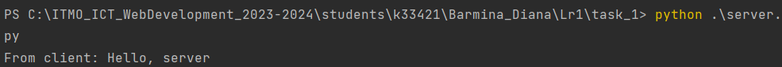
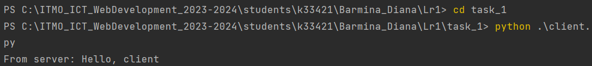

# Задание №1

>Реализовать клиентскую и серверную часть приложения. Клиент отсылает серверу
сообщение «Hello, server». Сообщение должно отразиться на стороне сервера.
Сервер в ответ отсылает клиенту сообщение «Hello, client». Сообщение должно
отобразиться у клиента.
Обязательно использовать библиотеку socket
Реализовать с помощью протокола UDP

**server**

```
import socket

if __name__ == '__main__':
    with socket.socket(socket.AF_INET, socket.SOCK_DGRAM) as conn:
        conn.bind(('127.0.0.1', 14900))
        while True:
            message_from, cl_address = conn.recvfrom(16384)
            decode_message = message_from.decode("utf-8")
            print('From client: ' + decode_message)
            message_to = 'Hello, client'.encode('utf-8')
            conn.sendto(message_to, cl_address)
```
**client**

```
import socket

if __name__ == '__main__':
    conn = socket.socket(socket.AF_INET, socket.SOCK_DGRAM)
    try:
        conn.sendto("Hello, server".encode('utf-8'), ("127.0.0.1", 14900))
        response = conn.recv(16384).decode('utf-8')
        print('From server: ' + response)
    except ConnectionResetError:
        print("Server not avaliable")

```
**Демонстрация работы:**


**Сервер**

**Клиент**
