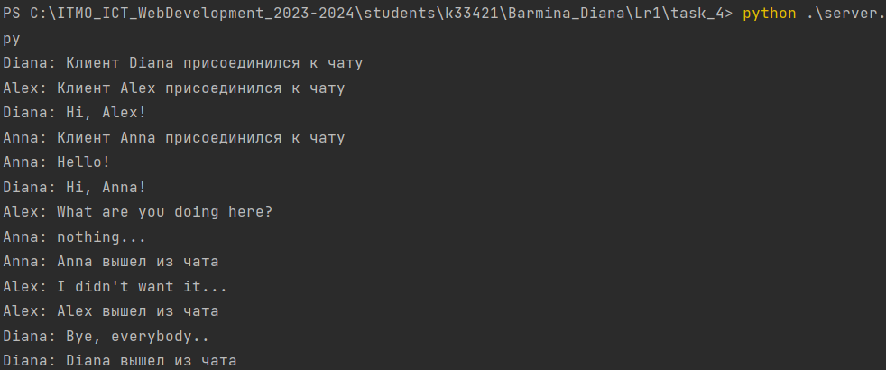
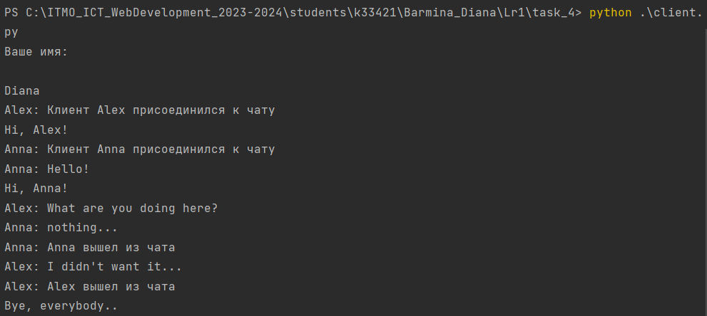
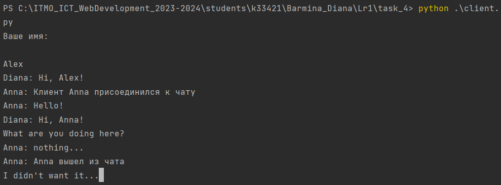
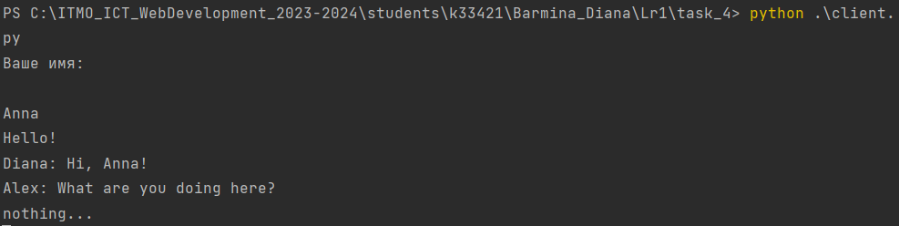

# Задание №4

>Реализовать двухпользовательский или многопользовательский чат. Реализация
многопользовательского часа позволяет получить максимальное количество
баллов.

**server**

```
import socket
from threading import Thread


def start_chat():
    global clients
    while True:
        client, address = conn.accept()
        name = client.recv(2048).decode('utf-8')
        clients[client] = name
        post_messages(f"Клиент {name} присоединился к чату", client)
        Thread(target=get_messages, args=(client,)).start()


def get_messages(client):
    global clients
    while True:
        try:
            message = client.recv(16384).decode()
            if message:
                post_messages(message, client)
        except:
            name = clients[client]
            post_messages(f"{name} вышел из чата", client)
            del clients[client]
            client.close()
            break


def post_messages(message, client):
    global clients
    for c in clients:
        if c != client:
            c.send(f"{clients[client]}: {message}".encode('utf-8'))
    print(f"{clients[client]}: {message}")


if __name__ == '__main__':
    conn = socket.socket(socket.AF_INET, socket.SOCK_STREAM)
    conn.bind(("127.0.0.1", 14900))
    conn.listen(10)
    clients = {}
    start_chat()
```
**client**

```
import socket
from threading import Thread


def get_messages():
    while True:
        get = conn.recv(16384).decode("utf-8")
        print(get)


def post_messages():
    while True:
        post = input()
        conn.sendall(post.encode('utf-8'))


if __name__ == '__main__':
    conn = socket.socket(socket.AF_INET, socket.SOCK_STREAM)
    conn.connect(("127.0.0.1", 14900))
    name = input("Ваше имя: \n")
    receive_th = Thread(target=get_messages)
    receive_th.start()
    respond_th = Thread(target=post_messages)
    respond_th.start()

```
**Демонстрация работы:**


**Сервер**

**Клиент 1**

**Клиент 2**

**Клиент 3**

