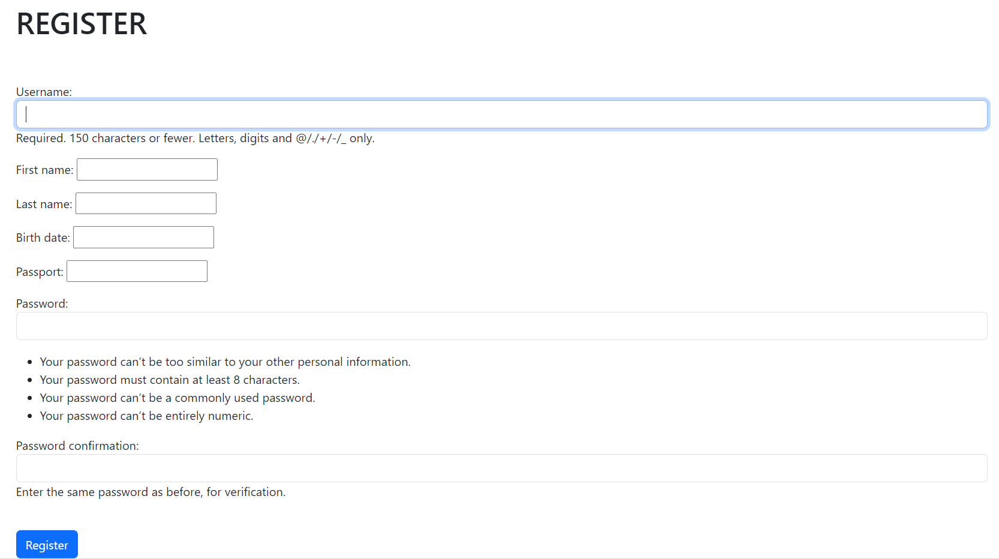
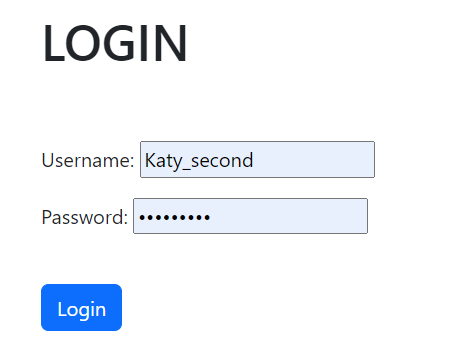
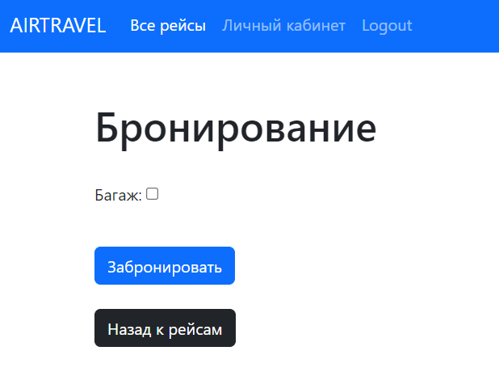
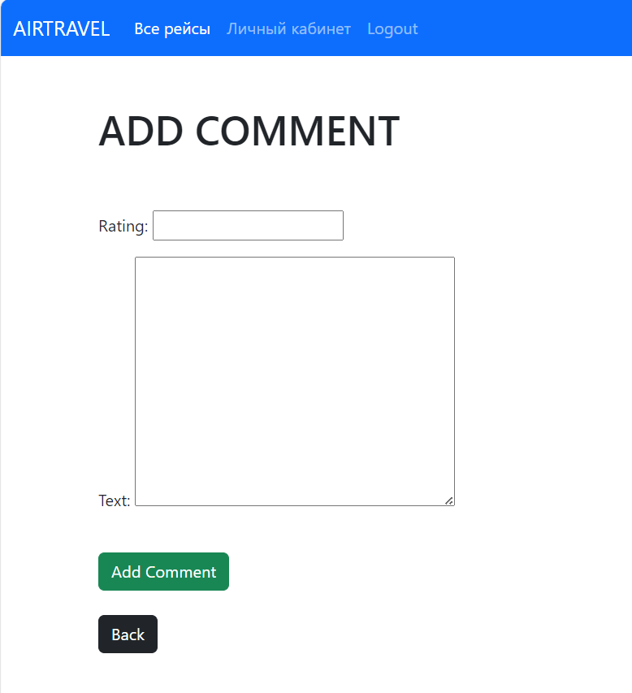

# Создание форм для регистрации, бронирования и добавления комментариев

**Форма для регистрации**

```

class SignUpForm(UserCreationForm):

    class Meta:
        model = Traveler
        fields = ('username', 'first_name', 'last_name', 'birth_date', 'passport', 'password1', 'password2')

    def __init__(self, *args, **kwargs):
        super(SignUpForm, self).__init__(*args, **kwargs)

        self.fields['username'].widget.attrs['class'] = 'form-control'
        self.fields['password1'].widget.attrs['class'] = 'form-control'
        self.fields['password2'].widget.attrs['class'] = 'form-control'

```

**Представление для регистрации**

```

class UserRegisterView(generic.CreateView):
    form_class = SignUpForm
    template_name = 'register.html'
    success_url = reverse_lazy('login')

```

**HTML-код для отображения формы регистрации**
```


Register



<h1>REGISTER</h1>

<br/><br/>
<div class="form-group">
    <form method="POST">
        
        {{ form.as_p }}
        <br/>
        <button class="btn btn-primary">Register</button>
    </form>
</div>



```



**Форма бронирования выбранного места**
</br> Так как только зарегистрированный пользователь может бронировать место,
его id уже есть, как и id рейса и место, так как он уже выбрал рейс и место, что сохранилось.
Соответственно, осталось единственное поле - наличие багажа.
```

class TicketForm(forms.ModelForm):

    class Meta:
        model = Ticket

        fields = ['baggage']
        labels = {
            'baggage': 'Багаж',
        }
        
```

**Представление для бронирования**

```
class TicketBookNewView(generic.CreateView):
    model = Ticket
    template_name = 'booking.html'
    form_class = TicketForm

    def get_success_url(self):
        return reverse('user-page', kwargs={'user_id': self.request.user.pk})
    
    def form_valid(self, form):
        form.instance.traveler_id = self.request.user
        form.instance.flight_id = Flight.objects.get(pk=self.kwargs['flight_id'])
        form.instance.seat_id = Seat.objects.get(pk=self.kwargs['seat_id'])
        return super().form_valid(form)
        
```

**HTML-код для отображения формы бронирования**

```




<h1>Бронирование</h1>
</br>
<form method="post">
    
    {{ form.as_p }}
    </br><button type="submit" class="btn btn-primary">Забронировать</button>
</form>
</br>
<a href="" class="btn btn-dark">Назад к рейсам</a>




```


**Форма для добавления комментариев**
</br> С добаалением комментариев логика такая же, как и с бронированием, id пользователя и рейса
мы уже имеем, следовательно, осталось добавить рейтинг и текст комментария

```

class CommentForm(forms.ModelForm):
    class Meta:
        model = Comment
        fields = ('rating', 'text')
        
```

**Представление для комментариев**
```

class AddCommentView(CreateView):
    model = Comment
    form_class = CommentForm
    template_name = 'add_comment.html'
    success_url = reverse_lazy('home')

    def get_success_url(self):
        return reverse('flight-detail', kwargs={'pk': self.kwargs['pk']})

    def form_valid(self, form):
        form.instance.flight = Flight.objects.get(pk=self.kwargs['pk'])
        form.instance.author = self.request.user
        form.instance.date_flight = Flight.objects.get(pk=self.kwargs['pk']).departure_time
        return super().form_valid(form)

```


**HTML-код для отображения формы добавления комментариев**
```





    <h1>ADD COMMENT</h1>
    <br/>
    <br/>

    <div class="form-group">
        <form method="POST">
            
            {{ form.as_p }}
            <br/>
            <button class="btn btn-success">Add Comment</button>
            <br/>
            <br/>
            <a href="" class="btn btn-dark">Back</a>
        </form>
    </div>




```
