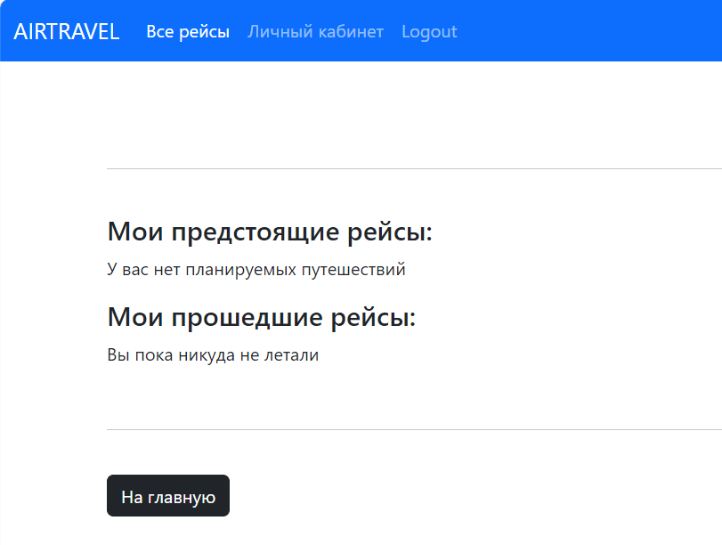

# Представления

**Домашняя стрaница с рейсами**
</br> Все предстоящие рейсы, на которые можно забронировать место
(фильтруются по дате, которая больше сегодняшней).
```

def HomeSortView(request):
    flights = Flight.objects.filter(departure_time__date__gt=datetime.now().date())
    return render(request, 'home.html', {'object_list': flights})
        
```
**HTML-код для отображения рейсов**
</br> Рейсы отображаются в виде карточек с указанием направления, время вылета и прилета
, авиакомпании и модели самолета. Внизу на карточке 2 конопки: 
"Посмотреть свободные места" - переход на страницу со списком свободных мест, 
"Пассажиры" - переход на таблицу с пассажирами и их местами.

```




<h1>Рейсы:</h1></br>

<ul>



    <div class="card mb-3" style="max-width: 540px;">
      <div class="row g-0 ">
          <div class="card-body">
            <h5 class="card-title">{{ flight.departure_site }} - {{ flight.landing_site }}</h5>
            <p class="card-text">{{flight.departure_time }}-{{flight.landing_time}}</p>
            <p class="card-text"><small class="text-body-secondary">Авиакомпания "{{ flight.airline }}" Модель самолета: {{ flight.plane_id.name}}</small></p>

              <a href="" class="btn btn-primary">Посмотреть свободные места</a>
              <a href="" class="btn btn-outline-primary">Пассажиры</a>
        </div>
      </div>
    </div>



</ul>


```


**Таблица с забронированными местами**
</br> Все занятые места, которые фильтруются по выбранному рейсу
```

def TicketFlightTableView(request, flight_id):
    tickets = Ticket.objects.filter(flight_id=flight_id)
    return render(request, 'ticket_table.html', {'tickets': tickets})
           
```
**HTML-код для таблицы**

```






  <p>Всего мест:  {{tickets.first.flight_id.plane_id.seats_number}} Забронировано: {{ tickets.count}}</p>

  <table class="table">
    <thead>
      <tr>
        <th scope="col">Имя</th>
        <th scope="col">Класс</th>
        <th scope="col">Место</th>
        <th scope="col">Наличие багажа</th>
      </tr>
    </thead>
    <tbody>
    
      <tr>
        <td>{{ ticket.traveler_id.first_name }} {{ ticket.traveler_id.last_name }}</td>
        <td>{{ ticket.seat_id.category }}</td>
        <td>{{ ticket.seat_id.name }}</td>
        <td>{{ ticket.baggage }}</td>
      </tr>
    
    </tbody>
  </table>

<p>На рейс пока никто не зарегистрировался</p>

<a href="" class="btn btn-dark">К рейсам</a>


```


**Страница рейса с комментариями**

```

class FlightDetailView(DetailView):
    model = Flight
    template_name = 'flight_detail.html'
            
```
**HTML-код для страницы рейса**
</br> Наверху отображаются детали рейса, ниже отзывы и ссылка на форму добавления отзывов.
```




<h2> {{ flight.departure_site }} - {{ flight.landing_site }} </h2>
<h3> {{ flight.departure_time }} - {{ flight.landing_time }} </h3>
<p>
    Авиакомпания "{{ flight.airline }}"  {{ flight.plane_id.name }} </br>
</p></br>


<br/>
<hr>
<h5>ОТЗЫВЫ</h5>
<br/>

    This post doesn't have any comments yet<a href="">  Add first</a>
    <br/><br/>
    <hr>

    <a href="">Add comment</a>
    <br/><br/>
    
        <strong>{{ comment.author.first_name }}  {{ comment.author.last_name }}</strong><br/>
        <small>Дата добавления: {{ comment.date_added }} </small><br/>
        Оценка: {{ comment.rating }}</br>
        <br/>{{ comment.text }}
        <br/>
        <hr>
    

<br/><br/>


<a href="" class="btn btn-dark">Назад</a>



```

**Личный кабинет**
</br> Сначала выбираются все билеты конкретного пользователя, затем все рейсы из этих билетов.
Рейсы делятся на прошедшие и на предстоящие.
```

def UserWithFlightsView(request, user_id):
    tickets = Ticket.objects.filter(traveler_id=user_id)
    tick = []
    for i in range(len(tickets)):
        tick.append(tickets[i].flight_id.pk)
    flights = Flight.objects.filter(pk__in=tick)
    flights_1 = flights.filter(departure_time__date__gt=datetime.now().date())
    flights_2 = flights.filter(departure_time__date__lte=datetime.now().date())
    user = get_object_or_404(Traveler, pk=user_id)
    return render(request, 'user_page.html', {'tickets': tickets, 'flights_1': flights_1, 'flights_2': flights_2, 'user': user})
        
```
**HTML-код для пользовательской страницы**
</br> Рейсы отображаются в виде карточек с указанием направления, время вылета и прилета
, авиакомпании, модели самолета, номера выхода и места. Внизу на карточке 2 вида кнопок: 1)если рейс предстоящий - 2 конопки: 
"Изменить билет" и "Удалить билет"; 2) если прошедший - "Отзывы", которая ведет на страничку рейса с отзывами.
Так незарегистрированный пользователь не сможет оставить комментарии, так как у него не будет возможности перейти на страницу.
```




<h2> {{ user.first_name }} {{ user.last_name }} </h2></br>

<hr>
</br>
<h4> Мои предстоящие рейсы: </h4>

    
        <div class="card mb-3" style="max-width: 540px;">
          <div class="row g-0 ">
              <div class="card-body">
                <h5 class="card-title">{{ f.departure_site }} - {{ f.landing_site }}</h5>
                <p class="card-text">{{ f.departure_time }}-{{ f.landing_time}}</p>
                <p class="card-text"><small class="text-body-secondary">Авиакомпания "{{ f.airline }}" Модель самолета: {{ f.plane_id.name}}</small></p>
                  
                  
                  <p class="card-text"><small class="text-body-secondary">Номер выхода: {{ f.gate }} Место: {{ t.seat_id.name }} Класс: {{ t.seat_id.category }}
                       (с багажом)  (без багажа) </small></p>
                      <a href="" class="btn btn-outline-danger">Удалить билет</a>
                      <a href="" class="btn btn-outline-warning">Изменить билет</a></br>
                  
                  
              </div>
          </div>
        </div>
    
    </br>

 <p>У вас нет планируемых путешествий</p>


<h4> Мои прошедшие рейсы: </h4>

    
        <div class="card mb-3" style="max-width: 540px;">
          <div class="row g-0 ">
              <div class="card-body">
                <h5 class="card-title">{{ f.departure_site }} - {{ f.landing_site }}</h5>
                <p class="card-text">{{ f.departure_time }}-{{ f.landing_time}}</p>
                <p class="card-text"><small class="text-body-secondary">Авиакомпания "{{ f.airline }}" Модель самолета: {{ f.plane_id.name}}</small></p>
                <a href="" class="btn btn-outline-primary">Отзывы</a></br>
              </div>
          </div>
        </div>
    
</br>

 <p>Вы пока никуда не летали</p>

</br><hr></br>
<a href="" class="btn btn-dark">На главную</a>




```



**Свободные места**
</br> Выбираются все места на самолете, привязанному к рейсу, 
затем исключаются все места, которые есть в билетах на этот рейс.
```

def SeatsView(request, flight_id):
    flight = get_object_or_404(Flight, pk=flight_id)
    tickets = Ticket.objects.filter(flight_id=flight_id)
    tick = []
    for i in range(len(tickets)):
        tick.append(tickets[i].seat_id.name)
    seats = Seat.objects.filter(plane_id=flight.plane_id)
    seats = seats.exclude(pk__in=tick)
    user_ticket = tickets.filter(traveler_id=request.user.pk)
    return render(request, 'seats.html', {'seats': seats, 'flight': flight, 'tickets': user_ticket})
        
```
**HTML-код для страницы с местами**
</br>Если количество свободных мест == 0, выводится сообщение, если нет - проверяется, авторизирован ли пользователь (нет - только список мест без возможности бронировать),
потом есть ли у нег билеты: нет - можно бронировать, есть - нельзя.
```






    
        
            
                    <li>{{ s.name }} ({{ s.category }}-класс)</br></br></li>
                
            
                
                    <li>{{ s.name }} ({{ s.category }}-класс)<a href="" class="btn btn-outline-primary btn-sm">Забронировать место</a></br></br></li>
                
        
    
        
            <li>{{ s.name }} ({{ s.category }}-класс)</br></br></li>
        
    

<p>Билетов на данный момент нет :( </br> Попробуйте заглянуть попозже</p>

</br>
<a href="" class="btn btn-dark">К рейсам</a>


```


**Изменение бронирования**
</br>Изменить можно только наличие/отсутствие багажа 
```

class TicketUpdateView(UpdateView):
    model = Ticket
    template_name = 'update_booking.html'
    form_class = TicketForm

    def get_success_url(self):
        return reverse('user-page', kwargs={'user_id': self.request.user.pk})

    def form_valid(self, form):
        form.instance.traveler_id = self.request.user
        form.instance.flight_id = Flight.objects.get(pk=Ticket.objects.get(pk=self.kwargs['pk']).flight_id.pk)
        form.instance.seat_id = Seat.objects.get(pk=Ticket.objects.get(pk=self.kwargs['pk']).seat_id.pk)
        return super().form_valid(form)
        
```
**HTML-код для страницы с местами**
```





<h1>Изменить билет</h1></br>
<form method="post">
    
    {{ form.as_p }}
    <br/><button type="submit" class="btn btn-warning">Изменить</button>
</form>
<br/><a href="" class="btn btn-dark">Назад в личный кабинет</a>



```


**Удаление бронирования**
```

class TicketDeleteView(DeleteView):
    model = Ticket
    template_name = 'delete_booking.html'

    def get_success_url(self):
        return reverse('user-page', kwargs={'user_id': self.request.user.pk})
        
```
**HTML-код для удаления**
</br>Подтвержение удаления места
```





<h1>Удалить билет</h1><br/>
<p>Вы уверены, что хотите удалить билет?</p>
<form method="post">
    
    <br/><button type="submit" class="btn btn-danger">Удалить</button>
</form>
<br/><a href="" class="btn btn-dark">Назад в личный кабинет</a>



```


