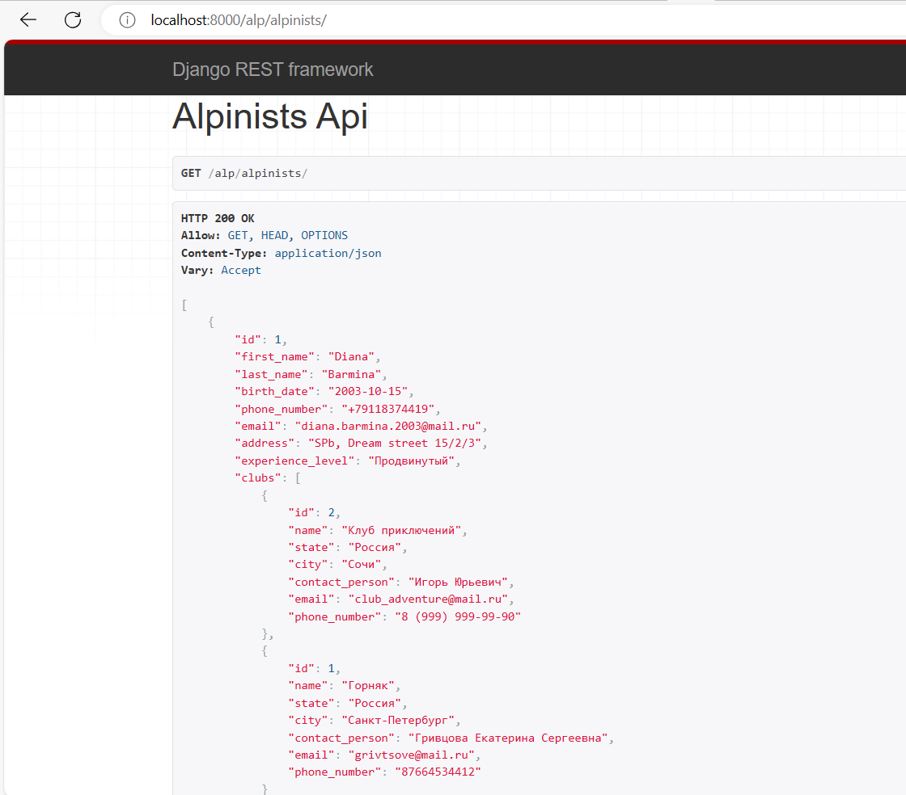
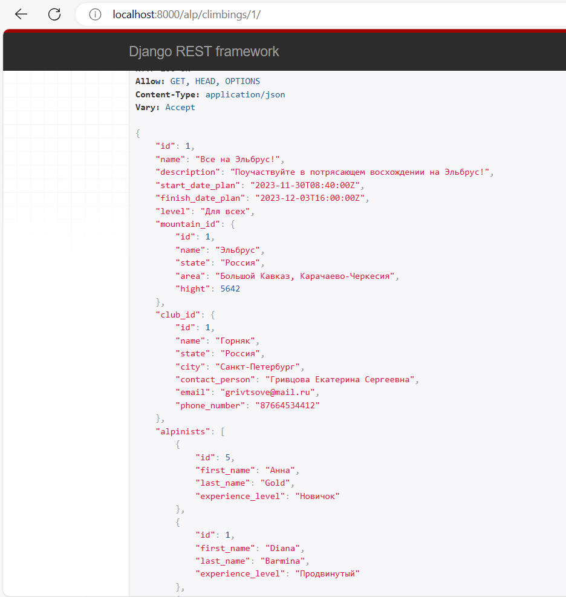
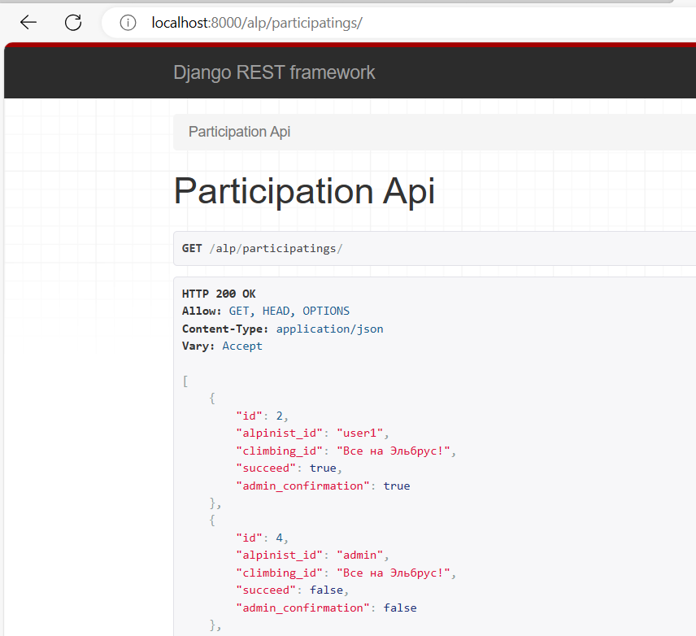
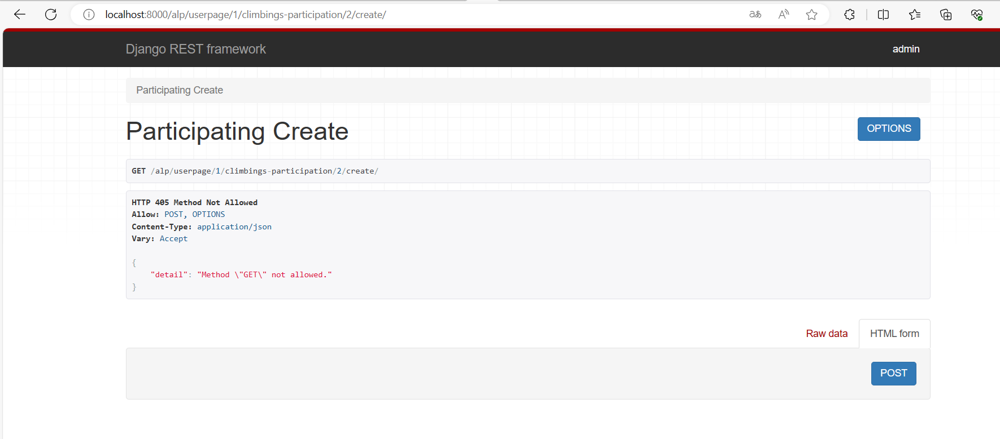

# Сериализаторы

Я использовала несколько разных видов сериализаторов, который повторялись 
по структуре, поэтому я представлю здесь несколько основных </br></br>


**Простейший сериализатор для альпинистов**</br>
</br> В данном сериализаторе указаны конкрестные поля (а не все), которые нужно возвращать
</br></br>Простейшие сериализаторы такого плана используются мной в основном как вложенные</br>
```
class AlpinistEasySerializer(serializers.ModelSerializer):

    class Meta:
        model = Alpinist
        fields = ['id', 'first_name', 'last_name', 'experience_level']

```



**Вывод подробной информации о восхождении**</br>
<br/> Благодаря вложенным сериализаторам можно увидеть не только списки номеров альпинистов, а подробную информацию о каждом, например.
```

class ClimbingsSerializer(serializers.ModelSerializer):

    mountain_id = MountainEasySerializer()
    club_id = ClubEasySerializer()
    alpinists = AlpinistEasySerializer(many=True)

    class Meta:
        model = Climbing
        fields = ['id', 'name', 'description', 'start_date_plan', 'finish_date_plan', 'level', 'mountain_id', 'club_id', 'alpinists']

```



**Имена вместо номеров**</br>
<br/> Таким образом вместо id восхождения мы видим его название, что для пользователей удобнее
```

climbing_id = serializers.StringRelatedField()

```



**Создание записи**</br>
<br/> Метод create добавляется для создания новой записи, fields в данном случае указывают на поля,
которые должны быть в форме создания - так как номера пользователя и восхождения подтягиваются из ссылки,
а успех и подтвержение администратора здесь лишние, мы вообще не выдает полей для заполнения

```

class ParticipatingCreateSerializer(serializers.ModelSerializer):

    class Meta:
        model = Participating
        fields = ['id']

    def create(self, validated_data):
        climbing_id = validated_data.pop('climbing_id')
        climbing = get_object_or_404(Participating, id=climbing_id)
        participating = Participating.objects.create(climbing_id=climbing)
        return participating

```

