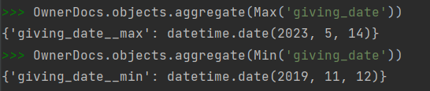
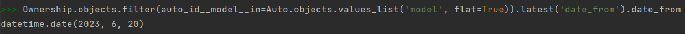
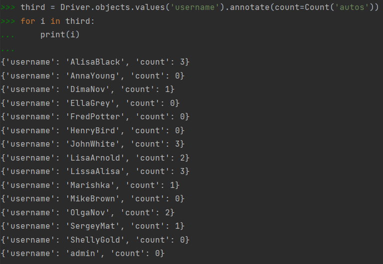
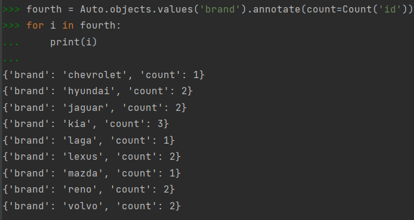
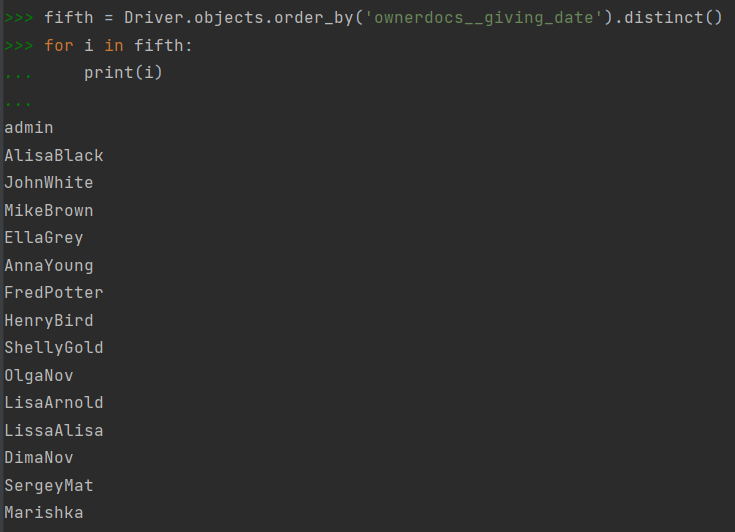

# Агрегирование и аннотирование

**Вывод даты выдачи самого старшего водительского удостоверения** 

**Укажите самую позднюю дату владения машиной, имеющую какую-то из существующих моделей в вашей базе** 

**Выведите количество машин для каждого водителя** 

**Подсчитайте количество машин каждой марки** 

**Отсортируйте всех автовладельцев по дате выдачи удостоверения** 

