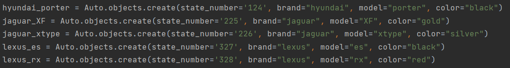
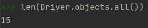

# Создание записей

Я использовала один способ создания новых записей, так как, на мой взгляд, он самыы простой и понятный. Кроме того, в дальнейшем 
проще использовать созданные объекты.  

**Добавление записей в таблицу Автомобили** 
  Сперва посмотрим изначальное количество записей про автомобили. Затем создаем новые записи и проверяем изменение количества.

.png)

**Добавление записей в таблицу Водители** 
  Сперва посмотрим изначальное количество водителей. Затем создаем новые записи и проверяем изменение количества.

**Добавление записей в таблицы Документы и Владение** 
  В создании данных записей использовались созданные ранее объекты - водители и автомобили

