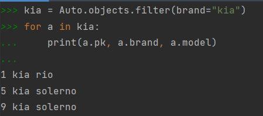
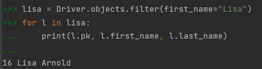
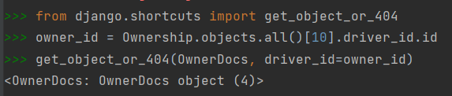
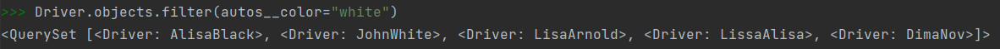
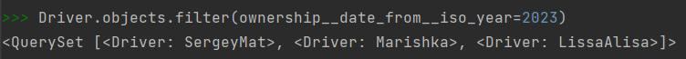

#Фильтрация

Я использовала один способ создания новых записей, так как, на мой взгляд, он самыы простой и понятный. Кроме того, в дальнейшем 
проще использовать созданные объекты.  

**Выведете все машины марки “KIA”** 

**Найти всех водителей с именем “Lisa”** 

**Взяв любого случайного владельца получить его id, и по этому id получить экземпляр удостоверения в виде объекта модели** 

**Вывести всех владельцев белых машин** 

**Найти всех владельцев, чей год владения машиной начинается с 2023** 

