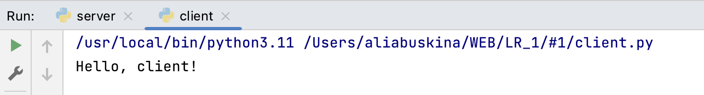

# Задание №1
> Реализовать клиентскую и серверную часть приложения. Клиент отсылает серверу
сообщение «Hello, server». Сообщение должно отразиться на стороне сервера.
Сервер в ответ отсылает клиенту сообщение «Hello, client». Сообщение должно
отобразиться у клиента. Реализовать с помощью протокола UDP

**server.py**

```python
import socket

conn = socket.socket()
conn.bind(('localhost', 9999))
conn.listen(1)

client, address = conn.accept()
msg = client.recv(1024)
print(msg.decode("utf-8"))
client.send(b"Hello, client!")
conn.close()
```


**client.py**

```python
import socket

conn = socket.socket()
conn.connect(('localhost', 9999))

conn.send(b'Hello server! \n')

data = conn.recv(1024)
print(data.decode("utf-8"))

conn.close()
```
