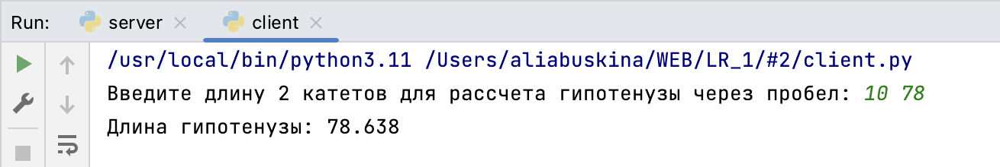

# Задание №2
> Реализовать клиентскую и серверную часть приложения. Клиент запрашивает у
сервера выполнение математической операции, параметры, которые вводятся с
клавиатуры. Сервер обрабатывает полученные данные и возвращает результат
клиенту. Решение квадратного уравнения. Реализовать с помощью протокола TCP.

**server.py**

```python
import socket
import math

conn = socket.socket(socket.AF_INET, socket.SOCK_STREAM)
conn.bind(('localhost', 10001))
conn.listen(10)
conn, addr = conn.accept()

data_from_client = conn.recv(5096)
cat = data_from_client.decode("utf-8")

r = cat.split()
a = float(r[0])
b = float(r[1])
c = round(math.sqrt(a**2 + b**2), 3)

conn.send(str(c).encode("utf-8"))

conn.close()
```

**client.py**

```python
import socket

conn = socket.socket(socket.AF_INET, socket.SOCK_STREAM)
conn.connect(('localhost', 10001))

cat = input("Введите длину 2 катетов для рассчета гипотенузы через пробел: ").encode('utf-8')
conn.send(cat)

data = conn.recv(4096)
c = data.decode('utf-8')
print(f'Длина гипотенузы: ' + c)

conn.close()
```
нахождение гипотенузы для катетов длиной 10 и 78
