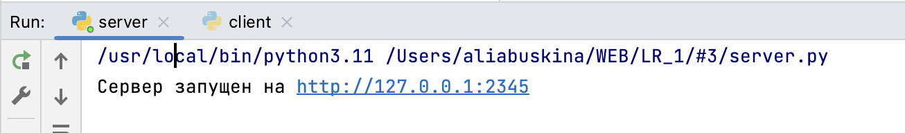

# Задание №3
>Реализовать серверную часть приложения. Клиент подключается к серверу. В ответ
клиент получает http-сообщение, содержащее html-страницу, которую сервер
подгружает из файла index.html.

**server.py**
```python
import socket

sock = socket.socket(socket.AF_INET, socket.SOCK_STREAM)
HOST = '127.0.0.1'
PORT = 2345
sock.bind((HOST, PORT))
sock.listen(1)
print(f"Сервер запущен на http://{HOST}:{PORT}")

with open('index.html', 'rb') as file:
    html_content = file.read()

while True:
    clientsocket, address = sock.accept()
    request_data = clientsocket.recv(1024)
    response_headers = "HTTP/1.1 200 OK\nContent-Type: text/html\n\n"

    clientsocket.sendall(response_headers.encode('utf-8') + html_content)

    clientsocket.close()
```
**index.html**
```
<!DOCTYPE html>
<html>
    <head>
        <title>Web LR_1</title>
    </head>
    <body>

    <h1>Hello, world! 3-й пункт лабораторной работы №1 выполнен</h1>

    </body>
</html>
```

[запущенный сервер]


[web-страница]
