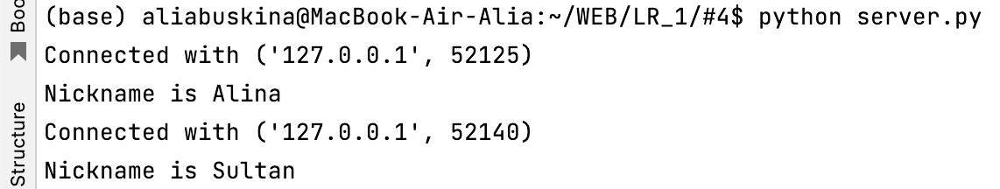
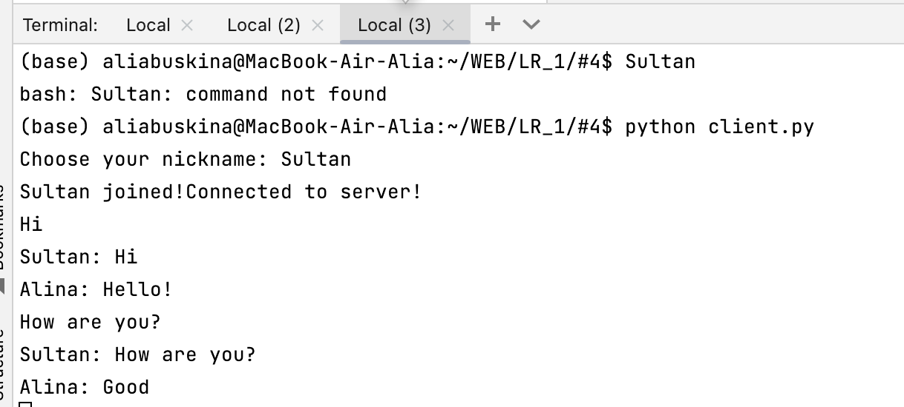
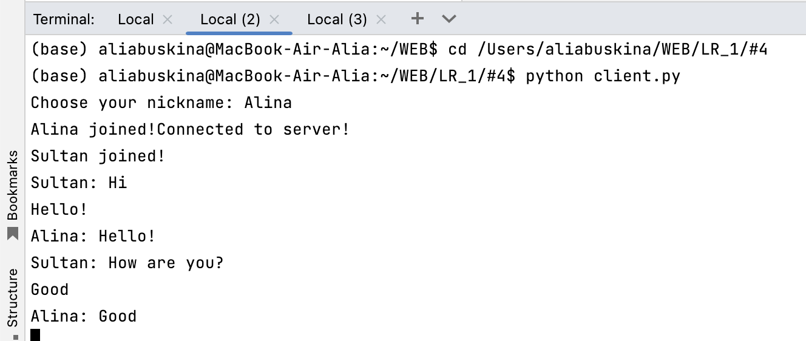

# Задание №4

> Реализовать многопользовательский чат. Реализовать с помощью протокола TCP.

**server.py**
```
import socket
import threading

server = socket.socket(socket.AF_INET, socket.SOCK_STREAM)
server.bind(('localhost', 9555))
server.listen()

clients = []
nicknames = []

def broadcast(message):
    for client in clients:
        client.send(message)

def handle(client):
    while True:
        try:

            message = client.recv(1024)
            broadcast(message)
        except:

            index = clients.index(client)
            clients.remove(client)
            client.close()
            nickname = nicknames[index]
            broadcast('{} left!'.format(nickname).encode('utf-8'))
            nicknames.remove(nickname)
            break

def receive():
    while True:

        client, address = server.accept()
        print("Connected with {}".format(str(address)))


        client.send('NICK'.encode('utf-8'))
        nickname = client.recv(1024).decode('utf-8')
        nicknames.append(nickname)
        clients.append(client)


        print("Nickname is {}".format(nickname))
        broadcast("{} joined!".format(nickname).encode('utf-8'))
        client.send('Connected to server!'.encode('utf-8'))


        thread = threading.Thread(target=handle, args=(client,))
        thread.start()

receive()
```

**client.py**
```python
import socket
import threading


nickname = input("Choose your nickname: ")

client = socket.socket(socket.AF_INET, socket.SOCK_STREAM)
client.connect(('127.0.0.1', 9555))


def receive():
    while True:
        try:
            message = client.recv(1024).decode('utf-8')
            if message == 'NICK':
                client.send(nickname.encode('utf-8'))
            else:
                print(message)
        except:
            print("An error occured!")
            client.close()
            break

def write():
    while True:
        message = '{}: {}'.format(nickname, input(''))
        client.send(message.encode('utf-8'))

receive_thread = threading.Thread(target=receive)
receive_thread.start()

write_thread = threading.Thread(target=write)
write_thread.start()
```

[то, что происходит на сервере]


[чат со стороны 1-го клиента]


[чат со стороны 2-го клиента]
