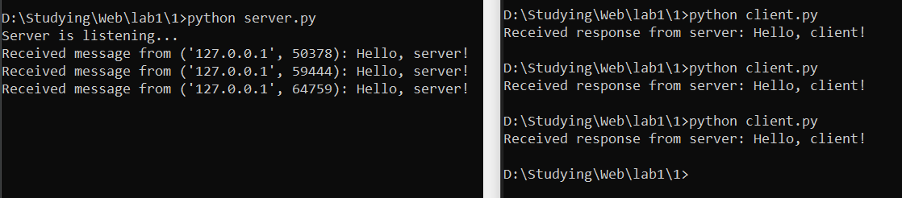
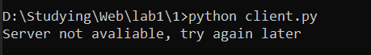

**Задание:** реализовать клиентскую и серверную часть приложения. Клиент отсылает серверу сообщение «Hello, server». Сообщение должно отразиться на стороне сервера.
Сервер в ответ отсылает клиенту сообщение «Hello, client». Сообщение должно отобразиться у клиента.
Обязательно использовать библиотеку socket. Реализовать с помощью протокола UDP.

**Листинг кода сервера:**
```python
import socket
from config import HOST, SERVER_PORT, BUFF_SIZE


if __name__ == '__main__':
    server_address = (HOST, SERVER_PORT)

    with socket.socket(socket.AF_INET, socket.SOCK_DGRAM) as conn:  # UDP
        conn.bind(server_address)
        print('Server is listening...')

        while True:
            data, client_address = conn.recvfrom(BUFF_SIZE)
            print(f'Received message from {client_address}: {data.decode("utf-8")}')

            message = 'Hello, client!'
            conn.sendto(message.encode('utf-8'), client_address)

```

**Листинг кода клиента:**
```python
import socket
from config import HOST, SERVER_PORT, BUFF_SIZE


if __name__ == '__main__':
    server_address = (HOST, SERVER_PORT)
    conn = socket.socket(socket.AF_INET, socket.SOCK_DGRAM)  # UDP

    message = 'Hello, server!'
    try:
        conn.sendto(message.encode('utf-8'), server_address)
        response = conn.recv(BUFF_SIZE)
        print(f'Received response from server: {response.decode("utf-8")}')
    except ConnectionResetError:
        print("Server not avaliable, try again later")

    conn.close()
```

**Скринкаст:**

Клиент-серверное взаимодействие:

Клиентская сторона, когда сервер недоступен (аналогичная логика реализована во всех остальных заданиях):
