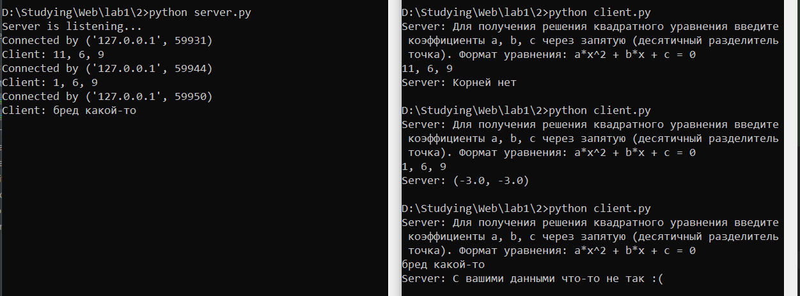

**Задание:** реализовать клиентскую и серверную часть приложения. Клиент запрашивает у сервера выполнение математической операции, параметры, которые вводятся с клавиатуры. Сервер обрабатывает полученные данные и возвращает результат клиенту. 

Варианты:

a. Теорема Пифагора

b. Решение квадратного уравнения.

c. Поиск площади трапеции.

d. Поиск площади параллелограмма.

Вариант выбирается в соответствии с порядковым номером в журнале. Пятый студент получает вариант 1 и т.д. 
Обязательно использовать библиотеку socket. Реализовать с помощью протокола TCP.

Мой вариант - b. Функция для решения квадратного уравнения снабжена доктестами для проверки её работы.

**Листинг кода сервера:**
```python
import socket
from config import HOST, SERVER_PORT, BUFF_SIZE
from math import sqrt


def solve_quadratic_equation(a, b, c):
    """
        >>> solve_quadratic_equation(1, -3, 2)
        (2.0, 1.0)
        >>> solve_quadratic_equation(1, -4, 4)
        (2.0, 2.0)
        >>> solve_quadratic_equation(0, 0, 0)
        'Бесконечно много корней'
        >>> solve_quadratic_equation(10, 0, 1)
        'Корней нет'
        >>> solve_quadratic_equation(0, 0, 1)
        'Корней нет'
    """
    if a == 0:
        if b == 0:
            if c == 0:
                return "Бесконечно много корней"
            else:
                return "Корней нет"
        else:
            root = -c / b
            return root

    discriminant = b ** 2 - 4 * a * c

    if discriminant > 0:
        root1 = (-b + sqrt(discriminant)) / (2 * a)
        root2 = (-b - sqrt(discriminant)) / (2 * a)
        return root1, root2
    elif discriminant == 0:
        root = -b / (2 * a)
        return root, root
    else:
        return "Корней нет"


if __name__ == '__main__':
    server_address = (HOST, SERVER_PORT)

    with socket.socket(socket.AF_INET, socket.SOCK_STREAM) as conn:  # TCP
        conn.bind(server_address)
        conn.listen(10)
        print('Server is listening...')

        while True:
            client_conn, addr = conn.accept()
            print(f"Connected by {addr}")

            with client_conn:
                message = """Для получения решения квадратного уравнения введите коэффициенты a, b, c через запятую (десятичный разделитель точка). Формат уравнения: a*x^2 + b*x + c = 0"""
                client_conn.sendall(message.encode('utf-8'))

                recieved = client_conn.recv(BUFF_SIZE)
                recieved = recieved.decode('utf-8')
                print(f'Client: {recieved}')

                try:
                    try:
                        a, b, c = map(float, recieved.split(','))
                    except Exception:
                        a, b, c = map(float, recieved.split())

                    solution = str(solve_quadratic_equation(a, b, c))
                    client_conn.sendall(solution.encode('utf-8'))
                except Exception:
                    client_conn.sendall("С вашими данными что-то не так :(".encode('utf-8'))
```

**Листинг кода клиента:**
```python
import socket
from config import HOST, SERVER_PORT, BUFF_SIZE


if __name__ == '__main__':
    server_address = (HOST, SERVER_PORT)
    conn = socket.socket(socket.AF_INET, socket.SOCK_STREAM)  # TCP
    try:
        conn.connect(server_address)

        response = conn.recv(BUFF_SIZE)
        print(f'Server: {response.decode("utf-8")}')

        coefficients = input()
        conn.sendall(coefficients.encode('utf-8'))

        response = conn.recv(BUFF_SIZE)
        print(f'Server: {response.decode("utf-8")}')
    except ConnectionRefusedError:
        print("Server not avaliable, try again later")

    conn.close()
```

**Скринкаст:**

Клиент-серверное взаимодействие:
