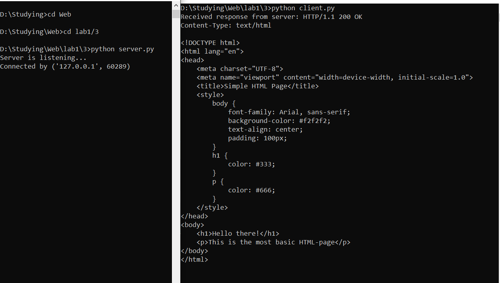
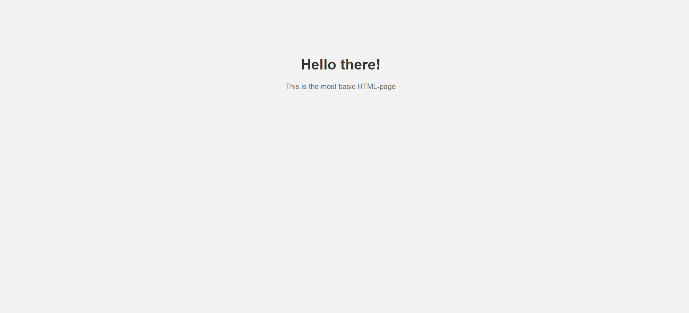

**Задание:** реализовать серверную часть приложения. Клиент подключается к серверу. В ответ клиент получает http-сообщение, содержащее html-страницу, которую сервер подгружает из файла index.html.

В рамках данного задания для проверки работоспособности была также реализована клиентская сторона.

**Листинг кода сервера:**
```python
import socket
from config import HOST, SERVER_PORT


def handle_client(client_socket):
    # про формат http-сообщений: https://selectel.ru/blog/http-request/
    http_response = """HTTP/1.1 200 OK
Content-Type: text/html

{}
""".format(html_content)
    client_socket.sendall(http_response.encode())
    client_socket.close()


if __name__ == '__main__':
    with open('index.html', 'r') as html_file:
        html_content = html_file.read()

    server_address = (HOST, SERVER_PORT)

    with socket.socket(socket.AF_INET, socket.SOCK_STREAM) as conn:
        conn.bind(server_address)
        conn.listen(10)
        print('Server is listening...')

        while True:
            client_conn, addr = conn.accept()
            print(f"Connected by {addr}")
            handle_client(client_conn)
```

**Листинг кода клиента:**
```python
import socket
from config import HOST, SERVER_PORT, BUFF_SIZE


if __name__ == '__main__':
    server_address = (HOST, SERVER_PORT)
    conn = socket.socket(socket.AF_INET, socket.SOCK_STREAM)
    try:
        conn.connect(server_address)

        response = conn.recv(BUFF_SIZE)
        print(f'Received response from server: {response.decode("utf-8")}')
    except ConnectionRefusedError:
        print("Server not avaliable, try again later")

    conn.close()
```

**Листинг содержимого index.html:**
```html
<!DOCTYPE html>
<html lang="en">
<head>
    <meta charset="UTF-8">
    <meta name="viewport" content="width=device-width, initial-scale=1.0">
    <title>Simple HTML Page</title>
    <style>
        body {
            font-family: Arial, sans-serif;
            background-color: #f2f2f2;
            text-align: center;
            padding: 100px;
        }
        h1 {
            color: #333;
        }
        p {
            color: #666;
        }
    </style>
</head>
<body>
    <h1>Hello there!</h1>
    <p>This is the most basic HTML-page</p>
</body>
</html>
```

**Скринкаст:**

Клиент-серверное взаимодействие:

index.html:
