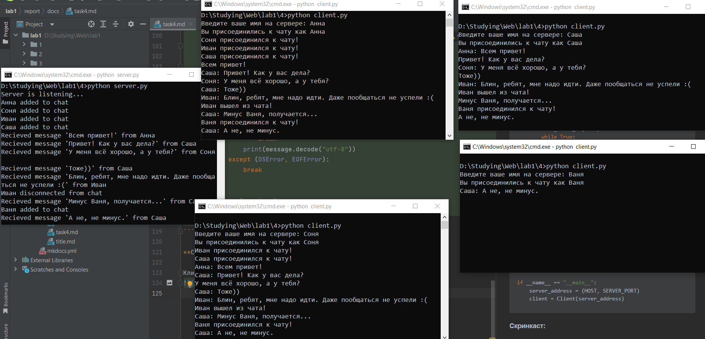

**Задание:** Реализовать двухпользовательский или многопользовательский чат. Реализация многопользовательского часа позволяет получить максимальное количество баллов.
Обязательно использовать библиотеку (не отображается в ТЗ).
Реализовать с помощью протокола TCP – 100% баллов, с помощью UDP – 80%. 
Обязательно использовать библиотеку threading.
Для реализации с помощью UDP, thearding использовать для получения сообщений у клиента.
Для применения с TCP необходимо запускать клиентские подключения, прием и отправку сообщений всем юзерам на сервере в потоках. Не забудьте сохранять юзеров, чтобы потом отправлять им сообщения.

Мной был реализован многопользовательский чат с помощью протокола TCP.

**Листинг кода сервера:**
```python
import socket
import threading
from config import HOST, SERVER_PORT, BUFF_SIZE


class Server:
    def __init__(self, server_address):
        self.clients = {}  # {socket: name}

        self.conn = socket.socket(socket.AF_INET, socket.SOCK_STREAM)
        self.conn.bind(server_address)
        self.conn.listen(10)
        print('Server is listening...')

    def get_messages(self, client_socket):
        while True:
            try:
                message = client_socket.recv(BUFF_SIZE).decode()
                print(f"Recieved message '{message}' from {self.clients[client_socket]}")
                if message:
                    self.broadcast(client_socket, message)
            except (ConnectionResetError, OSError):
                name = self.clients[client_socket]
                print(f"{name} disconnected from chat")
                self.broadcast(client_socket, f"{name} вышел из чата!", add_name=False)
                del self.clients[client_socket]
                break

    def broadcast(self, client_socket, message, add_name=True):
        name = self.clients[client_socket]
        for client in self.clients:
            if client != client_socket:
                if add_name:
                    client.sendall(f"{name}: {message}".encode())
                else:
                    client.sendall(message.encode())

    def run(self):
        try:
            while True:
                client_socket, addr = self.conn.accept()

                client_socket.sendall("Введите ваше имя на сервере: ".encode('utf-8'))
                name = client_socket.recv(BUFF_SIZE).decode('utf-8')
                self.clients[client_socket] = name
                print(f"{name} added to chat")
                self.broadcast(client_socket, f"{name} присоединился к чату!", add_name=False)

                threading.Thread(target=self.get_messages, args=(client_socket,)).start()
        except KeyboardInterrupt:
            self.broadcast("", f"Чат завершен!", add_name=False)
            self.clients = {}
            self.conn.close()
            print(f"Server stopped")


if __name__ == "__main__":
    server_address = (HOST, SERVER_PORT)
    server = Server(server_address)
    server.run()
```

**Листинг кода клиента:**
```python
import socket
import threading
from config import HOST, SERVER_PORT, BUFF_SIZE


class Client:
    def __init__(self, server_address):
        self.conn = socket.socket(socket.AF_INET, socket.SOCK_STREAM)
        try:
            self.conn.connect(server_address)
            name_question = self.conn.recv(BUFF_SIZE).decode("utf-8")
            name = input(name_question)
            self.name = name
            self.conn.sendall(name.encode('utf-8'))
            print(f"Вы присоединились к чату как {self.name}")

            threading.Thread(target=self.send_messages, args=()).start()
            threading.Thread(target=self.recieve_messages(), args=()).start()
        except ConnectionRefusedError:
            print("Сервер недоступен, попробуйте позже")

    def send_messages(self):
        while True:
            try:
                message = input()
                self.conn.sendall(message.encode("utf-8"))
            except (OSError, EOFError):
                break

    def recieve_messages(self):
        while True:
            try:
                message = self.conn.recv(BUFF_SIZE)
                if not message:
                    break
                print(message.decode("utf-8"))
            except (OSError, EOFError):
                break


if __name__ == "__main__":
    server_address = (HOST, SERVER_PORT)
    client = Client(server_address)
```

**Скринкаст:**

Клиент-серверное взаимодействие:

