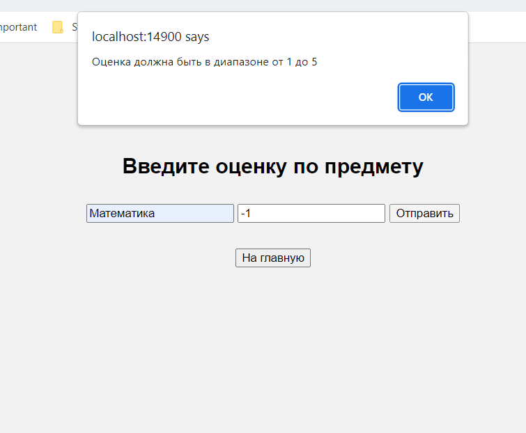
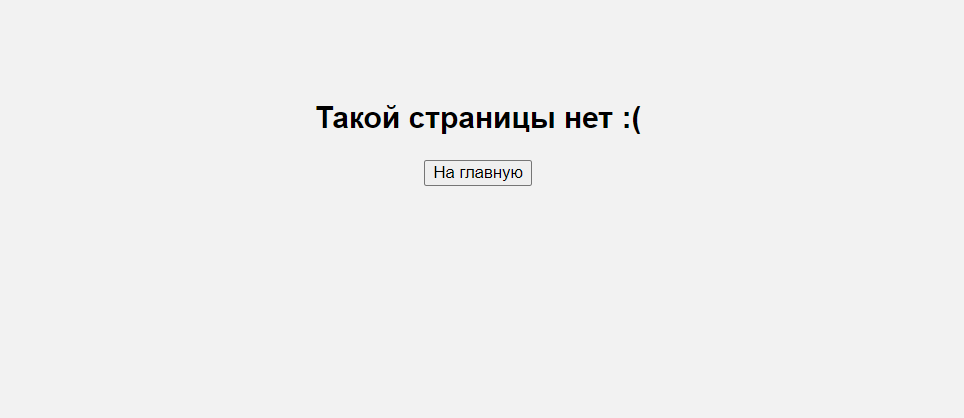

**Задание:** необходимо написать простой web-сервер для обработки GET и POST http
запросов средствами Python и библиотеки socket.

Базовый класс для простейшей реализации web-сервера доступен
https://docs.google.com/document/d/1lv_3D9VtMxz8tNkA6rA1xu9zaWEIBGXiLWBo1cse-
0k/edit?usp=sharing

Подробный мануал по работе доступен https://iximiuz.com/ru/posts/writing-python-web-server-part-3/

Задание: сделать сервер, который может:

* Принять и записать информацию о дисциплине и оценке по дисциплине.

* Отдать информацию обо всех оценах по дсициплине в виде html-страницы.

Мой код в данном задании по большей части представляет собой копипаст кода из приведенного выше мануала с некоторыми дополнениями.

**Листинг кода сервера:**
```python
import socket
from email.parser import Parser
from functools import lru_cache
from urllib.parse import parse_qs, urlparse

HOST = '127.0.0.1'
SERVER_PORT = 14900

MAX_LINE = 64 * 1024
MAX_HEADERS = 100

HTML_STYLE = """
<style>
    body {
        font-family: Arial, sans-serif;
        background-color: #f2f2f2;
        text-align: center;
        padding: 100px;
    }
    h1 {
        color: #333;
    }
    p {
        color: #666;
        font-size: 30px;
    }
</style>
"""


class Request:
    def __init__(self, method, target, version, headers, rfile):
        self.method = method
        self.target = target
        self.version = version
        self.headers = headers
        self.rfile = rfile

    @property
    def path(self):
        return self.url.path

    @property
    def body(self):
        size = self.headers.get('Content-Length')
        if not size:
            return None
        content = self.rfile.read(int(size))
        return content.decode('utf-8')

    @property
    @lru_cache(maxsize=None)
    def url(self):
        return urlparse(self.target)

    @property
    @lru_cache(maxsize=None)
    def query(self):
        return parse_qs(self.url.query)

    @property
    @lru_cache(maxsize=None)
    def query_body(self):
        return parse_qs(self.body)


class Response:
    def __init__(self, status, reason, headers=None, body=None):
        self.status = status
        self.reason = reason
        self.headers = headers
        self.body = body


class MyHTTPServer:
    def __init__(self, server_address):
        self.server_address = server_address
        self.conn = None
        self.grades = {}  # {subject: [grades]}

    def serve_forever(self):
        server_sock = socket.socket(socket.AF_INET, socket.SOCK_STREAM)
        try:
            server_sock.bind(self.server_address)
            server_sock.listen(10)
            print("Server is listening...")
            while True:
                client_socket, _ = server_sock.accept()
                try:
                    self.serve_client(client_socket)
                except Exception as e:
                    print('Connection failed', e)
        finally:
            server_sock.close()
            print("Server stopped")

    def serve_client(self, conn):
        try:
            req = self.parse_request(conn)
            response = self.handle_request(req)
            self.send_response(conn, response)
        except ConnectionResetError:
            conn = None
        except Exception as e:
            print("Error", e)
        if conn:
            conn.close()

    def parse_request(self, conn):
        rfile = conn.makefile('rb')
        raw = rfile.readline(MAX_LINE + 1)
        if len(raw) > MAX_LINE:
            raise Exception('Request line is too long')

        req_line = str(raw, 'iso-8859-1')
        req_line = req_line.rstrip('\r\n')
        words = req_line.split()
        if len(words) != 3:
            raise Exception('Malformed request line')

        method, target, version = words
        if version != 'HTTP/1.1':
            raise Exception('Unexpected HTTP version')

        headers = self.parse_headers(rfile)

        host = headers.get('Host')
        if not host:
            raise Exception('Bad request')

        return Request(method, target, version, headers, rfile)

    @staticmethod
    def parse_headers(rfile):
        headers = []

        while True:
            line = rfile.readline(MAX_LINE + 1)
            if len(line) > MAX_LINE:
                raise Exception('Header line is too long')

            if line in (b'\r\n', b'\n', b''):
                break

            headers.append(line)
            if len(headers) > MAX_HEADERS:
                raise Exception('Too many headers')

        sheaders = b''.join(headers).decode('iso-8859-1')
        return Parser().parsestr(sheaders)

    def handle_request(self, req):
        if req.path == '/' and req.method == 'POST':
            return self.handle_post(req)
        if req.method == 'GET':
            if req.path == '/add_grade':
                body = """<!DOCTYPE html>
                        <html lang="ru">""" + HTML_STYLE + """
                        <head>
                            <meta charset="UTF-8">
                            <meta name="viewport" content="width=device-width, initial-scale=1.0">
                        </head>
                        <script>
                            function validateGrade() {
                                const gradeInput = document.getElementById("grade");
                                const gradeValue = parseInt(gradeInput.value);
                            
                                if (isNaN(gradeValue) || gradeValue < 1 || gradeValue > 5) {
                                    alert("Оценка должна быть в диапазоне от 1 до 5");
                                    return false; 
                                }
                            
                                return true;
                            }
                        </script>
                        <body>
                            <h2>Введите оценку по предмету</h2>
                            <p>
                                <form method="POST" action="/" onsubmit="return validateGrade()">
                                    <input type="text" id="subject" name="subject" placeholder="Предмет">
                                    <input type="text" id="grade" name="grade" placeholder="Оценка">
                                    <input type="submit" value="Отправить">
                                </form>
                            </p>
                            <form action="/">
                                <input type="submit" value="На главную"/>
                            </form>
                        </body>
                        """
                return self.handle_get(body)
            elif req.path == '/':
                return self.handle_get()
        content = """<!DOCTYPE html>
                <html lang="ru">""" + HTML_STYLE + """
                <body>
                    <h2>Такой страницы нет :(</h2>
                    <form action="/">
                        <input type="submit" value="На главную"/>
                    </form>
                </body>
                </html>
                """
        return self.handle_get(content)

    def handle_get(self, body=None):
        content_type = 'text/html; charset=utf-8'
        if body is None:
            body = """
                <!DOCTYPE html>
                <html lang="ru">""" + HTML_STYLE + """
                <head>
                    <meta charset="UTF-8">
                    <meta name="viewport" content="width=device-width, initial-scale=1.0">
                </head>
                <body>
                    <h2>Ваши оценки</h2>
                    <table style="border-collapse: collapse; width: 70%;" align="center">
                        <tr>
                            <th style="border: 1px solid black; padding: 4px;">Предмет</th>
                            <th style="border: 1px solid black; padding: 4px;">Оценка</th>
                        </tr>
                """
            for subject, grades in self.grades.items():
                for grade in grades:
                    body += f"""
                            <tr>
                                <td style="border: 1px solid black; padding: 4px;">{subject}</td>
                                <td style="border: 1px solid black; padding: 4px;">{grade}</td>
                            </tr>
                        """

            body += """
                    </table>
                    <form action="/add_grade" style="padding: 10px;">
                        <input type="submit" value="Добавить"/>
                    </form>
                </body>
                </html>
                """

        body = body.encode('utf-8')
        headers = [('Content-Type', content_type),
                   ('Content-Length', len(body))]
        return Response(200, 'OK', headers, body)

    def handle_post(self, req):
        subject = req.query_body['subject'][0]
        grade = req.query_body['grade'][0]
        try:
            self.grades[subject].append(grade)
        except KeyError:
            self.grades[subject] = [grade]
        return self.handle_get()

    @staticmethod
    def send_response(conn, resp):
        wfile = conn.makefile('wb')
        status_line = f'HTTP/1.1 {resp.status} {resp.reason}\r\n'
        wfile.write(status_line.encode('iso-8859-1'))

        if resp.headers:
            for (key, value) in resp.headers:
                header_line = f'{key}: {value}\r\n'
                wfile.write(header_line.encode('iso-8859-1'))

        wfile.write(b'\r\n')

        if resp.body:
            wfile.write(resp.body)

        wfile.flush()
        wfile.close()


if __name__ == '__main__':
    server_address = (HOST, SERVER_PORT)
    my_server = MyHTTPServer(server_address)
    my_server.serve_forever()
```

**Скринкаст:**

Стартовая страница:

Страница добавления оценки:

Добавление некорректной оценки:

После добавления корректной оценки:

Чуть больше оценок:

Несуществующая страница:
