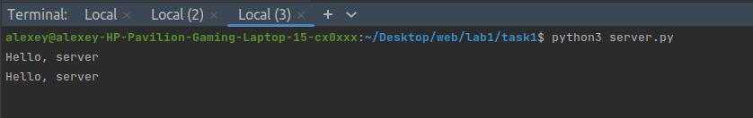
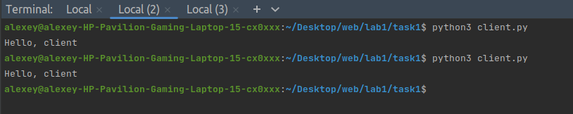

## Задача №1

Реализовать клиентскую и серверную часть приложения. Клиент отсылает 
серверу сообщение “Hello, server”. Сообщение должно отразиться на 
сервере.
Сервер в ответ отсылает клиенту сообщение «Hello, client». Сообщение 
должно отобразиться у клиента.
Обязательно использовать библиотеку socket.
Реализовать с использованием протокола UDP.

## Решение

1. Сервер

```
import socket

if __name__ == "__main__":
    # Задаем IP-адрес и порт сервера, на котором будем слушать входящие сообщения.
    server_ip = '127.0.0.1'
    server_port = 7000

    # Создаем UDP сокет (SOCK_DGRAM) и связываем его с указанным IP-адресом и портом.
    conn = socket.socket(socket.AF_INET, socket.SOCK_DGRAM)
    conn.bind((server_ip, server_port))

    # Бесконечный цикл для прослушивания входящих сообщений.
    while True:
        # Получаем данные и адрес отправителя.
        data, addr = conn.recvfrom(1024)

        # Выводим полученные данные (раскодированные из байтовой строки) на экран.
        print(data.decode("utf-8"))

        # Отправляем ответное сообщение "Hello, client" обратно клиенту по адресу отправителя.
        conn.sendto(b"Hello, client", addr)
```
2. Клиент

```
import socket

if __name__ == "__main__":
    # Задаем IP-адрес и порт сервера, к которому мы хотим подключиться.
    server_ip = '127.0.0.1'
    server_port = 7000

    # Создаем UDP сокет (SOCK_DGRAM) и устанавливаем соединение с сервером.
    conn = socket.socket(socket.AF_INET, socket.SOCK_DGRAM)
    conn.connect((server_ip, server_port))

    # Отправляем сообщение "Hello, server" серверу.
    conn.send(b"Hello, server")

    # Получаем данные от сервера и адрес, с которого пришли данные.
    data, addr = conn.recvfrom(1024)

    # Выводим полученные данные (раскодированные из байтовой строки) на экран.
    print(data.decode("utf-8"))
```

## Пример работы программы



