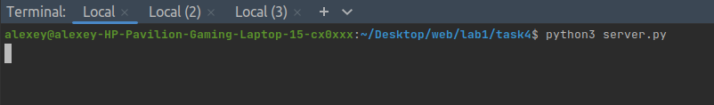
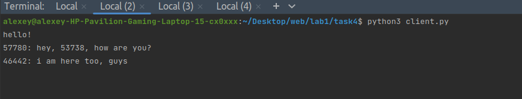
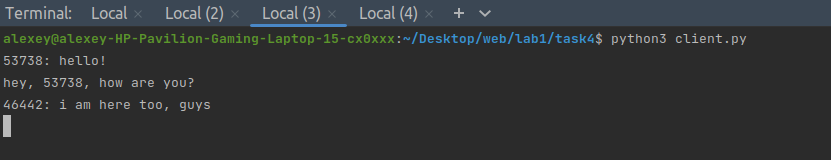
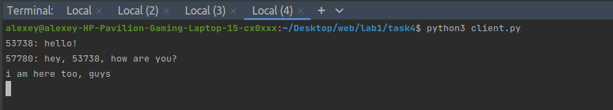

## Задача №3

Реализовать двухпользовательский или многопользовательский чат. 
Реализация многопользовательского чата позволяет получить максимальное количество баллов.


## Решение

1. Сервер

```
import socket
import threading

if __name__ == "__main__":
    # Создаем список для хранения клиентских соединений и мьютекс для синхронизации доступа к списку.
    clients_list = []
    lock = threading.Lock()

    # Задаем IP-адрес и порт сервера, на котором будем слушать входящие соединения.
    server_ip = "127.0.0.1"
    server_port = 7011

    # Функция для обработки отправки сообщений клиентам.
    def send_message_handler(client, address, clients_list):
        while True:
            # Получаем данные от клиента.
            data = client.recv(16384).decode("utf-8")
            if not data:
                break
            # Отправляем сообщение от клиента всем остальным клиентам.
            with lock:
                for c in clients_list:
                    if c != client:
                        c.send(f"{address[1]}: {data}".encode("utf-8"))

    # Создаем сокет и настраиваем опции для переиспользования адреса.
    conn = socket.socket(socket.AF_INET, socket.SOCK_STREAM)
    conn.setsockopt(socket.SOL_SOCKET, socket.SO_REUSEADDR, 1)
    conn.bind((server_ip, server_port))
    conn.listen(10)

    while True:
        try:
            # Принимаем входящее соединение от клиента.
            client, address = conn.accept()
            # Добавляем клиентский сокет в список активных клиентов.
            with lock:
                clients_list.append(client)
            # Запускаем отдельный поток для обработки отправки сообщений клиентам.
            threading.Thread(target=send_message_handler, args=(client, address, clients_list)).start()
        except KeyboardInterrupt:
            # Закрываем серверное соединение при завершении программы.
            conn.close()
            break
```

2. Клиент

```
import socket
import threading

# Функция обработки входящих сообщений от сервера
def receive_message_handler(client):
    while True:
        # Получаем сообщение от сервера и декодируем его из байтовой строки
        message_obj = client.recv(16384).decode("utf-8")
        # Выводим полученное сообщение на экран
        print(message_obj)

if __name__ == "__main__":
    # Задаем IP-адрес и порт сервера, к которому будем подключаться.
    server_ip = "127.0.0.1"
    server_port = 7011

    # Создаем TCP сокет (SOCK_STREAM) и устанавливаем соединение с сервером.
    conn = socket.socket(socket.AF_INET, socket.SOCK_STREAM)
    conn.connect((server_ip, server_port))

    # Создаем отдельный поток для приема сообщений от сервера
    receive_thread = threading.Thread(target=receive_message_handler, args=(conn,))
    receive_thread.start()

    while True:
        try:
            # Читаем сообщение с клавиатуры
            message = input()
            # Отправляем сообщение серверу, предварительно кодируя его в байты
            conn.send(message.encode("utf-8"))
        except KeyboardInterrupt:
            # Закрываем соединение при нажатии Ctrl+C и завершаем программу
            conn.close()
            break
```


## Демонстрация работы





