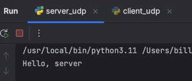
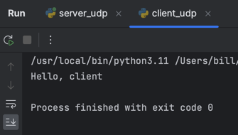

# Задание 1
Реализовать клиентскую и серверную часть приложения. Клиент отсылает серверу сообщение «Hello, server». Сообщение
должно отразиться на стороне сервера. Сервер в ответ отсылает клиенту сообщение «Hello, client». Сообщение должно
отобразиться у клиента.

Использовать библиотеку ```socket```.

Реализовать с помощью протокола UDP.

---

# Выполнение

**Cерверная часть**

```python
import socket


conn = socket.socket(socket.AF_INET, socket.SOCK_DGRAM)
conn.bind(("127.0.0.1", 5000))

while True:
    data, addr = conn.recvfrom(1024)
    print(data.decode("utf-8"))
    conn.sendto(b"Hello, client", addr)
```

С помощью библиотеки ```socket``` создаем сокет, который будет принимать сообщения от клиента. Для этого используем 
метод ```bind()```, который принимает кортеж из двух элементов: адрес и порт. В нашем случае адрес — ```127.0.0.1```,
порт — ```5000```. Далее в бесконечном цикле принимаем сообщения от клиента с помощью метода ```recvfrom()``` и при 
наличии запроса отправляем ответ с помощью метода ```sendto()```.

**Клиентская часть**

```python
import socket


conn = socket.socket(socket.AF_INET, socket.SOCK_DGRAM)
conn.connect(("127.0.0.1", 5000))
conn.send(b"Hello, server")
data, addr = conn.recvfrom(1024)
print(data.decode("utf-8"))
```

С помощью библиотеки ```socket``` создаем сокет, который будет отправлять сообщения серверу. Для этого используем 
метод ```connect()```, который принимает кортеж из двух элементов: адрес и порт. В нашем случае адрес — ```127.0.0.1```,
порт — ```5000```. Далее отправляем сообщение с помощью метода ```send()``` и принимаем ответ с помощью метода 
```recvfrom()``` (по логике серверной части, при наличии запроса сервер отправляет ответное приветствие клиенту).

---

# Пример работы программы


