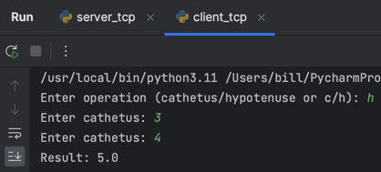
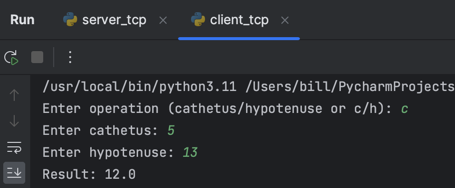
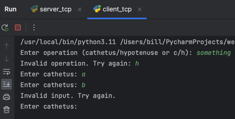
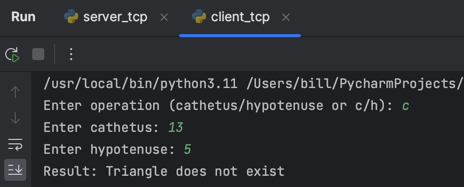

# Задание 2
Реализовать клиентскую и серверную часть приложения. Клиент запрашивает у сервера выполнение математической операции,
параметры, которые вводятся с клавиатуры. Сервер обрабатывает полученные данные и возвращает результат клиенту.

**Вариант:** теорема Пифагора.

Использовать библиотеку ```socket```.

Реализовать с помощью протокола TCP.

---

# Выполнение

**Cерверная часть**

```python
import socket


def calculate(cathetus_1, cathetus_2=None, hypotenuse=None):
    if cathetus_2 is None and hypotenuse is None:
        return "Invalid input"
    if hypotenuse and cathetus_1 >= hypotenuse:
        return "Triangle does not exist"
    if cathetus_2 is None:
        return (hypotenuse**2 - cathetus_1**2) ** 0.5
    if hypotenuse is None:
        return (cathetus_1**2 + cathetus_2**2) ** 0.5
    return "Something went wrong"


conn = socket.socket(socket.AF_INET, socket.SOCK_STREAM)
conn.bind(("127.0.0.1", 5000))
conn.listen()

conn, addr = conn.accept()
while True:
    data = conn.recv(1024).decode("utf-8")
    if not data:
        break
    operation, a, b = data.split()
    a, b = float(a), float(b)
    if operation == "hypotenuse":
        result = calculate(cathetus_1=a, cathetus_2=b)
    elif operation == "cathetus":
        result = calculate(cathetus_1=a, hypotenuse=b)
    else:
        result = "Invalid operation"
    conn.send(bytes(str(result), encoding="utf-8"))
```

Программа состоит из двух частей:

* функция ```calculate()```, которая выполняет математическую операцию: по заданным параметрам вычисляет третий 
  (недостающий катет или гипотенузу). На стороне сервера производится проверка, все ли параметры были переданы, а 
  также существует ли такой треугольник;
* основная часть программы, которая принимает запросы от клиента, обрабатывает их и отправляет ответ. Формат запроса:
  ```<операция> <первый параметр> <второй параметр>```. Возможные операции: ```hypotenuse``` (вычисление гипотенузы) и 
  ```cathetus``` (вычисление катета). При некорректном запросе сервер отправляет сообщение об ошибке. Корректность 
  ввода проверяется на стороне клиента.

**Клиентская часть**

```python
import socket


conn = socket.socket(socket.AF_INET, socket.SOCK_STREAM)
conn.connect(("127.0.0.1", 5000))

operation = input("Enter operation (cathetus/hypotenuse or c/h): ")
while operation not in ("cathetus", "c", "hypotenuse", "h"):
    operation = input("Invalid operation. Try again: ")
if operation in ("c", "h"):
    operation = "cathetus" if operation == "c" else "hypotenuse"
while True:
    if operation == "cathetus":
        a = input("Enter cathetus: ")
        b = input("Enter hypotenuse: ")
    else:
        a = input("Enter cathetus: ")
        b = input("Enter cathetus: ")
    try:
        a = float(a)
        b = float(b)
        break
    except ValueError:
        print("Invalid input. Try again.")

conn.send(bytes(f"{operation} {a} {b}", encoding="utf-8"))
result = conn.recv(1024).decode("utf-8")
print(f"Result: {result}")
```

Программа просит ввести операцию, которую необходимо выполнить (```cathetus```, ```hypotenuse``` или их сокращённые 
варианты). При некорректном вводе программа просит повторить ввод. Далее в зависимости от выбранной операции 
программа просит ввести параметры. При некорректном вводе (если были введены не числа) программа просит повторить ввод. 
После ввода параметров программа отправляет запрос серверу, получает ответ и выводит его.

---

# Пример работы программы

Тест 1. Вычисление гипотенузы.



Тест 2. Вычисление катета.



Тест 3. Некорректный ввод.



Тест 4. Несуществующий треугольник.

