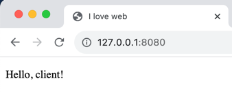

# Задание 3

Реализовать серверную часть приложения. Клиент подключается к серверу. В ответ
клиент получает http-сообщение, содержащее html-страницу, которую сервер
подгружает из файла index.html.

Использовать библиотеку ```socket```.

---

# Выполнение

```python
import socket


content = open("index.html").read()

conn = socket.socket(socket.AF_INET, socket.SOCK_STREAM)
conn.bind(("127.0.0.1", 8080))
conn.listen()

while True:
    socket = conn.accept()[0]
    data = socket.recv(1024)
    response = "HTTP/1.1 200 OK\nContent-Type: text/html; charset=utf-8\n\n" + content
    socket.send(response.encode())
    socket.close()
```

Программа читает содержимое HTML-страницы и сохраняет его в переменную ```content```. Затем создаёт сокет, 
привязывает его к адресу ```127.0.0.1:8080``` и по протоколу TCP начинает прослушивание входящих соединений.

При получении соединения программа считывает данные, отправленные клиентом, и отправляет ответ, содержащий ответ 
следующего формата:

```
HTTP/1.1 200 OK
Content-Type: text/html; charset=utf-8

<содержимое файла index.html>
```

---

# Пример работы программы

