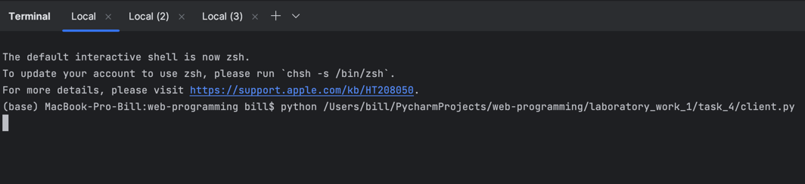
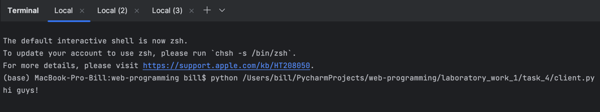
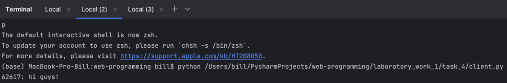
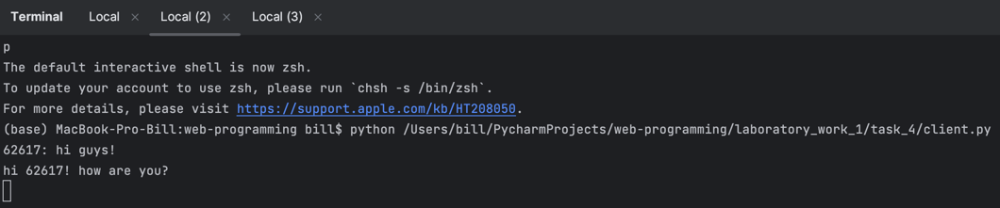
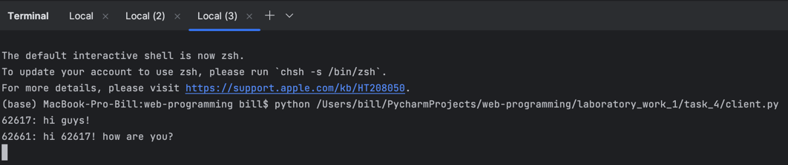

# Задание 4

Реализовать многопользовательский чат.

Использовать библиотеки `socket`, `threading`.

Использовать протокол TCP.

---

# Выполнение

**Серверная часть**

```python
import socket
import threading


clients = []
lock = threading.Lock()


def send_message(client, addr):
    while True:
        data = client.recv(16384).decode("utf-8")
        if not data:
            break
        with lock:
            for c in clients:
                if c != client:
                    c.send(f"{addr[1]}: {data}".encode("utf-8"))


conn = socket.socket(socket.AF_INET, socket.SOCK_STREAM)
conn.setsockopt(socket.SOL_SOCKET, socket.SO_REUSEADDR, 1)
conn.bind(("127.0.0.1", 8000))
conn.listen(5)

while True:
    try:
        client, addr = conn.accept()
        with lock:
            clients.append(client)
        threading.Thread(target=send_message, args=(client, addr)).start()
    except KeyboardInterrupt:
        conn.close()
        break
```

Программа создает сокет, привязывает его к адресу `127.0.0.1:8000` и начинает прослушивание (максимум 5 подключений).
При подключении нового клиента создается новый поток, который будет принимать сообщения от клиента и отправлять их всем 
остальным клиентам. С помощью блокировки `lock` реализована синхронизация доступа к списку клиентов `clients`.

Ником пользователя является номер порта, с которого он подключился. Таким образом, сервер отправляет сообщения формата
`<ник>: <сообщение>`.

**Клиентская часть**

```python
import socket
import threading


def receive_message(client):
    while True:
        message = client.recv(16384).decode("utf-8")
        print(message)


conn = socket.socket(socket.AF_INET, socket.SOCK_STREAM)
conn.connect(("127.0.0.1", 8000))

receive_thread = threading.Thread(target=receive_message, args=(conn,))
receive_thread.start()

while True:
    try:
        message = input()
        conn.send(message.encode("utf-8"))
    except KeyboardInterrupt:
        conn.close()
        break
```

Программа создает сокет и подключается к серверу. Затем создается поток, который будет принимать сообщения от 
сервера. Пользователь вводит сообщения в консоль, которые отправляются на сервер, а остальные пользователи получают 
это сообщение.

---

# Пример работы программы

Три пользователя подключаются к серверу:



Пользователь 1 отправляет сообщение:



Пользователи 2 и 3 получают сообщение:



Пользователь 2 отправляет сообщение:



Отображение предыдущих сообщений у пользователя 3:

