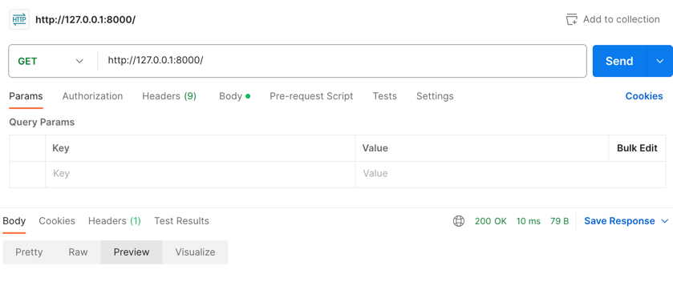
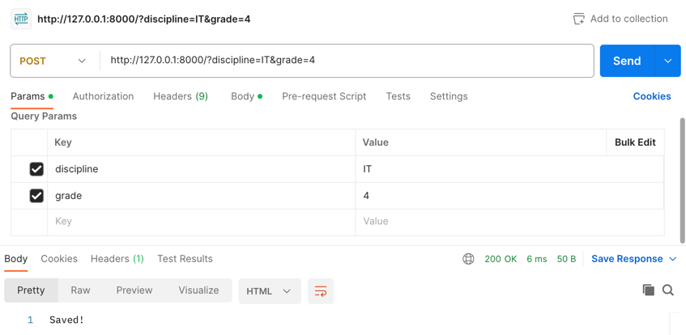
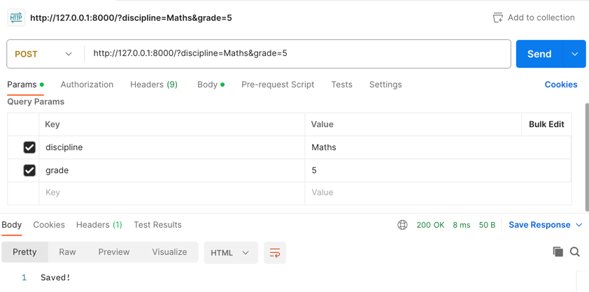
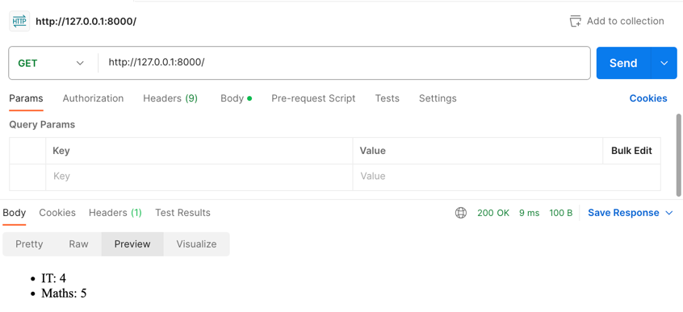

# Задание 5

Необходимо написать простой web-сервер для обработки GET и POST http-запросов средствами Python и библиотеки socket.

Задание: сделать сервер, который может:

* Принять и записать информацию о дисциплине и оценке по дисциплине.
* Отдать информацию обо всех оценках по дисциплине в виде html-страницы.

---

# Выполнение

```python
import socket


class MyHTTPServer:
    def __init__(self, host, port):
        self.conn = socket.socket(socket.AF_INET, socket.SOCK_STREAM)
        self.conn.setsockopt(socket.SOL_SOCKET, socket.SO_REUSEADDR, 1)
        self.conn.bind((host, port))
        self.conn.listen(1)
        self.grades = {}

    def serve_forever(self):
        while True:
            client, addr = self.conn.accept()
            self.serve_client(client)

    def serve_client(self, client):
        data = client.recv(16384).decode("utf-8")
        self.parse_request(client, data)

    def parse_request(self, client, data):
        lines = data.split("\n")
        method, url, version = lines[0].split()
        params = (
            {p.split("=")[0]: p.split("=")[1] for p in url.split("?")[1].split("&")}
            if "?" in url
            else None
        )
        self.handle_request(client, method, params)

    def handle_request(self, client, method, params):
        if method == "GET":
            self.send_response(client, 200, "OK", self.grades_to_html())
        elif method == "POST":
            discipline = params.get("discipline")
            grade = params.get("grade")
            self.grades[discipline] = grade
            self.send_response(client, 200, "OK", "Saved!")
        else:
            self.send_response(client, 404, "Not Found", "Incorrect method.")

    def send_response(self, client, code, reason, body):
        response = f"HTTP/1.1 {code} {reason}\nContent-Type: text/html\n\n{body}"
        client.send(response.encode("utf-8"))
        client.close()

    def grades_to_html(self):
        page = (
            f"<html><body><ul>"
            f"{''.join([f'<li>{discipline}: {grade}' for discipline, grade in self.grades.items()])}"
            f"</ul></body></html>"
        )
        return page


if __name__ == "__main__":
    host = "127.0.0.1"
    port = 8000
    server = MyHTTPServer(host, port)
    try:
        server.serve_forever()
    except KeyboardInterrupt:
        server.conn.close()
```

Программа запускает сервер на порту 8000, инициализирует внутри класса словарь для хранения оценок и ожидает запросов.

При получении запроса он парсится методом `parse_request`, который выделяет из него метод, url и параметры. После этого 
вызывается метод `handle_request`, который в зависимости от вида запроса либо сохраняет оценку в словарь, возвращая
ответ с кодом 200 и сообщением "Saved!", либо возвращает html-страницу с оценками методом `grades_to_html`.

---

# Пример работы программы

Для тестирования GET и POST запросов была использована программа Postman.

Первый GET-запрос (возвращает пустую страницу):



POST-запросы (сохраняют оценки по дисциплинам):





Второй GET-запрос (возвращает страницу с оценками):

