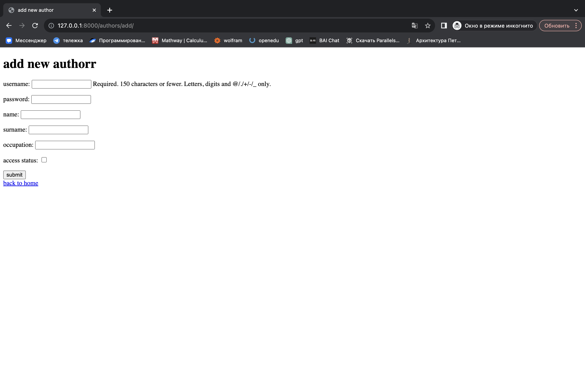
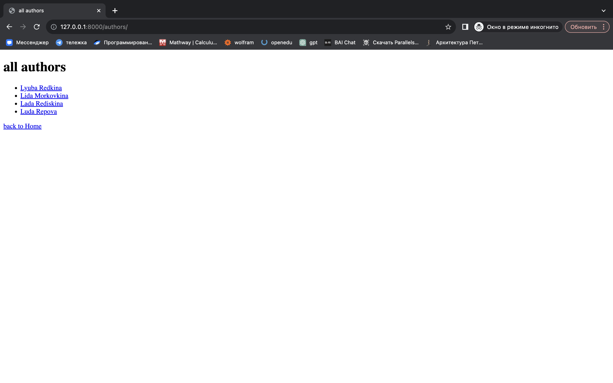
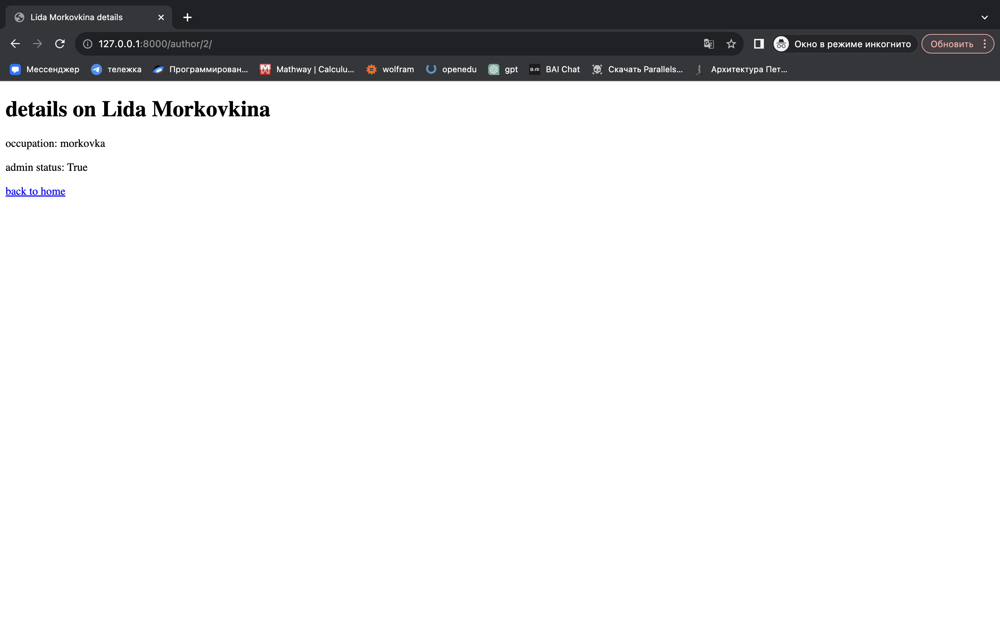

### templates.py


В проекте я использую множество html-страниц для представления информации о приложении на строне клиента.
Для удобства я создала папку templates, где и храню все шаблоны.

В целом можно сказать, что все шаблоны делятся на:

1. шаблоны для добавления объекта
2. шаблоны для просмотра всех объектов в списке
3. шаблоны для просмотра объекта
4. шаблоны для редактирования объекта

Страницы для добавления объектов выглядят почти одинаково, вне зависимости от того, какие модели я использую.
Все странцы этого типа:

1. содержат форму для отправки данных методом POST на URL 'add_object'.
2. имеют поля формы в виде параграфов (инпуты и лейблы для полей модели).
3. имеют кнопку для отправки формы `<button type="submit">submit</button>`.
4. предоставляют ссылку для возврата на главную страницу, используя URL `home`.
```
<!DOCTYPE html>
<html>
<head>
    <title>add new author</title>
</head>
<body>
    <h1>add new author</h1>

    <!-- Форма для добавления нового автора -->
    <form method="post" action="">
         <!-- CSRF-токен для безопасности формы -->
        {{ form.as_p }}   <!-- Вставка полей формы в виде параграфов -->
        <button type="submit">submit</button> <!-- Кнопка для отправки формы -->
    </form>

    <!-- Ссылка для возврата на главную страницу -->
    <a href="">back to home</a>
</body>
</html>
```


Страницы группы `all_objects` отображают все объекты одного класса в веб-приложении Django. 
Они похожи тем, что:

1. содержат цикл типа `` для перебора всех объектов в списке.
2. каждый объект представлен в виде элемента списка, где его аттрибут(-ы) являются гиперссылкой (`<a>`), ведущей на страницу деталей об объекте ('object_detail'), используя идентификатор объекта (object.id).
3. предоставляют ссылку `<a href="">back to Home</a>` для возврата на домашнюю страницу.
```
<!DOCTYPE html>
<html>
<head>
    <title>all authors</title>
</head>
<body>
    <h1>all authors</h1>

    <!-- Список всех авторов -->
    <ul>
        
            <li><a href="">{{ author.first_name }} {{ author.last_name }}</a></li>
        
    </ul>

    <!-- Ссылка для возврата на главную страницу -->
    <a href="">back to Home</a>
</body>
</html>
```


Страницы типа object_details отображают подробности об определенном объекте веб-приложения Django.
Их объединяет то, что:

1. их заголовок, который отображается во вкладке браузера, использует аттрибуты объекта `<title>{{ author.first_name }} {{ author.last_name }} details</title>`.
2. они содержат параграфы (`<p>`), отображающие различные атрибуты объекта.
3. предоставляют ссылку `<a href="">back to Home</a>` для возврата на домашнюю страницу.
```
<!DOCTYPE html>
<html>
<head>
    <title>{{ author.first_name }} {{ author.last_name }} details</title>
</head>
<body>
    <h1>details on {{ author.first_name }} {{ author.last_name }}</h1>

    <!-- Подробности об авторе -->
    <p>occupation: {{ author.occupation }}</p>
    <p>admin status: {{ author.is_admin }}</p>

    <!-- Ссылка для возврата на главную страницу -->
    <a href="">back to home</a>
</body>
</html>
```


Страницы типа `edit_object` нужны для редактирования информации об объекте.
Все страницы этого типа:

1. содержат форму для отправки данных методом POST на URL `edit_object`.
2. содержат кнопку `<button type="submit">submit</button>` для отправки данных формы.
3. предоставляют ссылку `<a href="">back to Home</a>` для возврата на домашнюю страницу.
```
<!DOCTYPE html>
<html>
<head>
    <title>edit author</title>
</head>
<body>
    <h1>edit author</h1>

    <!-- Форма для редактирования данных об авторе -->
    <form method="post" action="">
        

        <!-- Поля формы, автоматически сгенерированные на основе модели формы -->
        {{ form.as_p }}

        <!-- Кнопка для отправки данных формы -->
        <button type="submit">submit</button>
    </form>

    <!-- Ссылка для возврата на главную страницу -->
    <a href="">back to home</a>
</body>
</html>
```


Также есть страница, не входящая ни в одну из категорий - она нужна для просмотра авторов по конференциям, как того требует задание.
Эта страница использует цикл `:` по словарю `authors_by_conference`, где `conference` - ключ (конференция), `authors_info` - значение (список авторов).
Кроме этого, страница содержит ненумерованный список `<ul>:` для отображения авторов, а также вложенный цикл `:` для прохода по списку авторов .

Наконец, страница представляет каждого автора данной конференции как элемент списка с именем, фамилией и занимаемой должностью.
`<li>{{ info.author.first_name }} {{ info.author.last_name }} - {{ info.title }}</li>:`

И, разумеется, имеет ссылку для возврата на главную страницу, используя URL 'home'.
```
<!DOCTYPE html>
<html>
<head>
    <title>conference authors</title>
</head>
<body>
    <h1></h1>

    <!-- Цикл по словарю authors_by_conference, где ключи - конференции, значения - списки авторов -->
    
        <h2>{{ conference.title }}:</h2>

        <!-- Вложенный цикл для отображения списка авторов для текущей конференции -->
        <ul>
            
                <li>{{ info.author.first_name }} {{ info.author.last_name }} - {{ info.title }}</li>
            
        </ul>
    

    <!-- Ссылка для возврата на главную страницу -->
    <a href="">back to Home</a>
</body>
</html>
```
