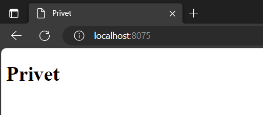

## Задача №3

Реализовать серверную часть приложения. Клиент подключается к серверу. 
В ответ клиент получает http-сообщение, содержащее html-страницу, 
которую сервер подгружает из файла index.html.

## Решение

1. Сервер

```
import socket

def handle_request(client_socket):
    # Загрузка содержимого файла index.html
    with open('index.html', 'r') as file:
        content = file.read()

    # Формирование HTTP-ответа
    response = 'HTTP/1.1 200 OK\nContent-Type: text/html\n\n' + content

    # Отправка ответа клиенту
    client_socket.sendall(response.encode())

    # Закрытие соединения
    client_socket.close()

def run_server():
    # Создание сокета
    server_socket = socket.socket(socket.AF_INET, socket.SOCK_STREAM)

    # Привязка сокета к адресу и порту
    server_address = ('localhost', 8000)
    server_socket.bind(server_address)

    # Прослушивание подключений
    server_socket.listen(1)
    print('Сервер запущен на {}:{}'.format(*server_address))

    while True:
        # Ожидание подключения клиента
        client_socket, client_address = server_socket.accept()
        print('Получено подключение от {}:{}'.format(*client_address))

        # Обработка запроса
        handle_request(client_socket)

if __name__ == '__main__':
    run_server()
```

## Пример работы программы
**При переходе по нужному сокету в браузере видим:**