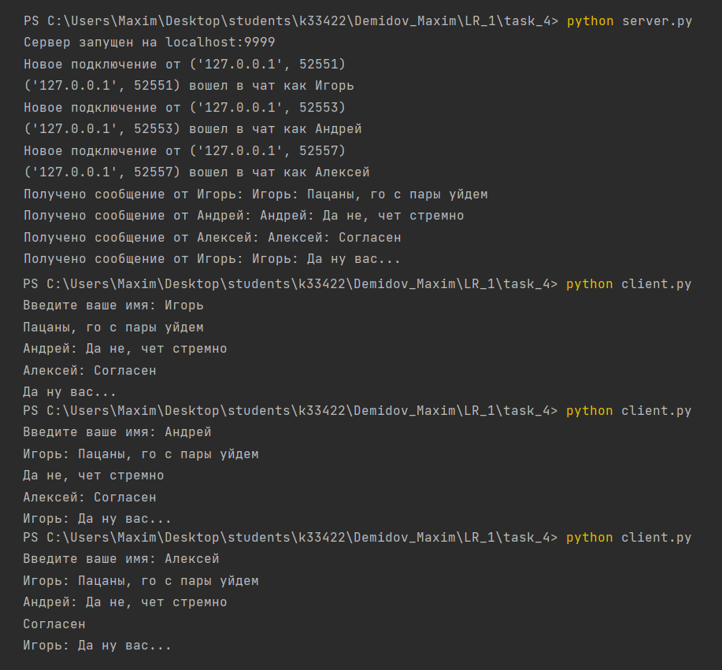

## Задача №4

Реализовать двухпользовательский или многопользовательский чат. 
Реализация многопользовательского чата позволяет получить максимальное количество баллов.


## Решение

1. Сервер

```
import socket
import threading

def handle_client(client_socket, client_address):
    print(f"Новое подключение от {client_address}")

    # Получаем имя пользователя от клиента
    username = client_socket.recv(1024).decode()
    print(f"{client_address} вошел в чат как {username}")

    while True:
        try:
            message = client_socket.recv(1024)
            if not message:
                break
            message = message.decode()
            print(f"Получено сообщение от {username}: {message}")

            # Отправляем сообщение всем клиентам, кроме отправителя
            for client in clients:
                if client != client_socket:
                    client.sendall(message.encode())

        except OSError:
            break

    client_socket.close()
    print(f"Подключение с {client_address} закрыто")

def start_server():
    host = 'localhost'
    port = 9999

    server_socket = socket.socket(socket.AF_INET, socket.SOCK_STREAM)
    server_socket.bind((host, port))
    server_socket.listen(5)

    print(f"Сервер запущен на {host}:{port}")

    while True:
        client_socket, client_address = server_socket.accept()
        client_thread = threading.Thread(target=handle_client, args=(client_socket, client_address))
        client_thread.start()
        clients.append(client_socket)

clients = []

start_server()
```

2. Клиент

```
import socket
import threading

def receive_messages(client_socket):
    while True:
        try:
            message = client_socket.recv(1024).decode()
            print(message)
        except OSError:
            break

def send_message(client_socket, username):
    while True:
        message = input()
        full_message = f"{username}: {message}"
        client_socket.send(full_message.encode())

def start_client():
    host = 'localhost'
    port = 9999

    username = input("Введите ваше имя: ")

    client_socket = socket.socket(socket.AF_INET, socket.SOCK_STREAM)
    client_socket.connect((host, port))

    # Отправляем имя пользователя серверу
    client_socket.send(username.encode())

    receive_thread = threading.Thread(target=receive_messages, args=(client_socket,))
    receive_thread.start()

    send_thread = threading.Thread(target=send_message, args=(client_socket, username))
    send_thread.start()

start_client()
```


## Пример работы программы 
**Запуск server.py и 3 пользователя:**
