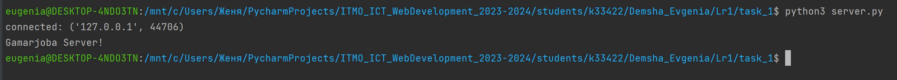
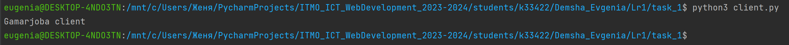
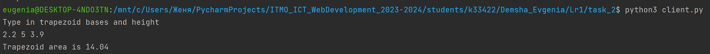

# ЛP 1. Работа с сокетами

 
 

## Практическое задание 1

Реализовать клиентскую и серверную часть приложения. Клиент отсылает серверу
сообщение «Hello, server». Сообщение должно отразиться на стороне сервера.
Сервер в ответ отсылает клиенту сообщение «Hello, client». Сообщение должно
отобразиться у клиента. Обязательно использовать библиотеку socket. Реализовать с помощью протокола UDP.
 
 

**server.py**

    import socket

    localIP = "127.0.0.1"
    localPort = 9090
    bufferSize = 1024

    udp_socket = socket.socket(socket.AF_INET, socket.SOCK_DGRAM)
    sock = socket.socket()
    sock.bind((localIP, localPort))
    sock.listen()
    conn, addr = sock.accept()
    
    print('connected:', addr)
    
    while True:
        data = conn.recv(1024)
        if not data:
            break
        print(data.decode())
        conn.sendall('Gamarjoba client'.encode())
    
    conn.close()

 

**client.py**

    import socket

    sock = socket.socket()
    sock.connect(('127.0.0.1', 9090))
    send_data = "Gamarjoba Server!"
    sock.send(send_data.encode())
    
    receive_data = sock.recv(1024)
    print(receive_data.decode())
    sock.close()
 

**Запуск сервера**

**Запуск клиента**

 
 

## Практическое задание 2

Реализовать клиентскую и серверную часть приложения. Клиент запрашивает у
сервера выполнение математической операции (вариант c. Поиск площади трапеции), параметры, которые вводятся с
клавиатуры. Сервер обрабатывает полученные данные и возвращает результат
клиенту. Обязательно использовать библиотеку socket. 
Реализовать с помощью протокола TCP.
 
 

**server.py**

    import socket
    import struct
    
    s = socket.socket(socket.AF_INET, socket.SOCK_STREAM)
    s.bind(('localhost', 9090))
    s.listen(1)
    conn, addr = s.accept()
    conn.sendall('Type in trapezoid bases and height'.encode())
    data = conn.recv(1024).decode()
    try:
        a_base, b_base, height = [float(x) for x in data.split()]
        area = (a_base + b_base) / 2 * height
        area = round(area, 3)
        conn.sendall(struct.pack('f', area))
    except:
        conn.sendall('Data should be floats'.encode())
    
    conn.close()

 

**client.py**

    import socket
    import struct
    
    s = socket.socket(socket.AF_INET, socket.SOCK_STREAM)
    s.connect(('localhost', 9090))
    print(s.recv(1024).decode())
    data = input()
    s.sendall(data.encode())
    
    result = s.recv(1024)
    s.close()
    print('Trapezoid area is', *struct.unpack('f', result))
 

**Запуск клиента**

 
 

## Практическое задание 3

Реализовать серверную часть приложения. Клиент подключается к серверу. В ответ
клиент получает http-сообщение, содержащее html-страницу, которую сервер
подгружает из файла index.html.
 
 

**server.py**

    import socket

    sock = socket.socket(socket.AF_INET, socket.SOCK_STREAM)
    sock.bind(("127.0.0.1", 9090))
    sock.listen()
    
    while True:
        connection, address = sock.accept()
        connection.recv(2048)
        with open("index.html") as index:
            html_body = index.read()
        response = "HTTP/1.1 200 OK \nContent-Type: text/html \n\n" + html_body
        connection.send(response.encode())    # посылаем ответ клиенту
        connection.close()
 

**index.html**

    <!DOCTYPE html>
    <html>
    <body>
    
    <h1 style="text-align:center;">Good morning</h1>
    
Have a nice day!

    
    </body>
    </html>

 

**HTML-страничка в браузере**

 
 

## Практическое задание 4

Реализовать двухпользовательский или многопользовательский чат.Для применения с TCP необходимо 
запускать клиентские подключения, прием и отправку сообщений всем юзерам на сервере в потоках. 
Не забудьте сохранять юзеров, чтобы потом отправлять им сообщения.
 
 

**server.py**

    import socket
    import threading
    from collections import defaultdict
    
    s = socket.socket(socket.AF_INET, socket.SOCK_STREAM)
    s.bind(('localhost', 9090))
    ThreadCount = 0
    s.listen()
    print('Socket is listening..')
    
    clients = defaultdict(dict)
    
    
    def receiving(*arg):
        session = arg[0]
        name = arg[1]
        while True:
            try:
                data = session.recv(2048).decode()
                if not data:
                    raise Exception
                broadcast(name, data)
                mes_to_send = f'{name}: {data}'
                print(mes_to_send)
            except Exception:
                del clients[name]
                session.close()
                broadcast('localhost', f"{name} disconnected")
                print(f"{name} disconnected")
                break
    
    
    def sending(*arg):
        while True:
            response = input()
            broadcast('localhost', response)
    
    
    def multi_threaded_client(session, address):
        threading.Thread(target=receiving, args=(session, address)).start()
    
    
    def broadcast(author, mes):
        mes_to_send = f'{author}: {mes}'
        for nm, data in clients.items():
            if nm != author:
                c_session = data['session']
                c_session.send(mes_to_send.encode())
    
    
    threading.Thread(target=sending).start()
    
    while True:
        session, (ip, port) = s.accept()
        print('Connected to: ' + ip + ':' + str(port))
        name = session.recv(2048).decode()
        while name in clients.keys():
            session.send('This name is already taken by another chat member'.encode())
            name = session.recv(2048).decode()
        else:
            threading.Thread(target=receiving, args=(session, name)).start()
            ThreadCount += 1
            print('Thread Number: ' + str(ThreadCount))
            clients[str(name)]['IP'] = ip
            clients[str(name)]['port'] = port
            clients[str(name)]['session'] = session
            session.send(f'Welcome to the chat, {name}'.encode())
     

**client.py**

    import socket
    import threading
    
    s = socket.socket(socket.AF_INET, socket.SOCK_STREAM)
    host = 'localhost'
    port = 9090
    s.connect((host, port))
    name = input('Enter your name: ')
    s.sendall(name.encode())
    
    def receiver():  # function for receiving the data
        while True:
            res = s.recv(1024)
            print(res.decode())
    
    def sender():  # function for sending the data
        while True:
            msg = input()
            s.send(msg.encode())
    
    r_thr = threading.Thread(target=receiver).start()
    s_thr = threading.Thread(target=sender).start()
 

**Запуск сервера**

**Запуск первого клиента**

**Запуск второго клиента**

**Запуск третьего клиента**

 
 

## Практическое задание 5

Необходимо написать простой web-сервер для обработки GET и POST http
запросов средствами Python и библиотеки socket.
Задание - сделать сервер, который может:
* Принять и записать информацию о дисциплине и оценке по дисциплине.
* Отдать информацию обо всех оценах по дсициплине в виде html-страницы.
 
 

**server.py**

    import socket
    from collections import defaultdict
    
    
    class MyHTTPServer:
        def __init__(self, host, port):
            self.host = host
            self.port = port
            self.journal = defaultdict(list)
    
        def socket_work(self):
            TCPServerSocket = socket.socket(socket.AF_INET, socket.SOCK_STREAM)
            try:
                TCPServerSocket.bind((self.host, self.port))
                TCPServerSocket.listen()
                while True:
                    client, address = TCPServerSocket.accept()
                    try:
                        self.client_work(client)
                    except Exception:
                        print('Something went wrong')
            finally:
                TCPServerSocket.close()
    
        def client_work(self, conn):
            data = conn.recv(16384)
            data = data.decode('utf-8')
            url, method, headers, body = self.parse_request(data)
            resp = self.handle_request(url, method, body)
            if resp:
                self.send_response(conn, resp)
    
        def parse_request(self, data):
            data = data.replace('\r', '')
            lines = data.split('\n')
            method, url, protocol = lines[0].split()
            end_headers = lines.index('')
            headers = lines[1:end_headers]
            body = lines[-1]
            return url, method, headers, body
    
        def handle_request(self, url, method, body):
            if url == '/':
                if method == 'GET':
                    response = "HTTP/1.1 200 OK \n\n"
                    with open('index.html', 'r') as file:
                        response += file.read()
                    return response
                if method == 'POST':
                    response = "HTTP/1.1 200 OK \n\n"
                    parameters = body.split('&')
                    sbjct, grd = [x.split('=')[1] for x in parameters]
                    self.journal[sbjct].append(grd)
    
                    response += "<html><head><title>Journal</title></head><body><ol>"
                    response += "<pre>"
                    response += f"<b>Subject{' '*10}Grades</b>"
                    for sbjct, grd in self.journal.items():
                        response += f"
{sbjct}{' '*(10+7-len(sbjct))}{','.join(grd)}
"
                    response += "</pre>"
                    response += '<a href="/">Go back to submitting grades</a>'
                    response += "</ol></body></html>"
                    return response
    
        def send_response(self, conn, resp):
            conn.send(resp.encode('utf-8'))
    
    
    if __name__ == '__main__':
        host = 'localhost'
        port = 9090
        serv = MyHTTPServer(host, port)
        try:
            serv.socket_work()
        except KeyboardInterrupt:
            pass

 

**index.html**

    <!DOCTYPE html>
    <html lang="en">
    <head>
        <meta charset="UTF-8">
        <meta http-equiv="X-UA-Compatible" content="IE=edge">
        <title>Journal</title>
        
    </head>
    <body>
    <b>Journal</b>

            <form action="/" method="post">
                <pre>
                <label for="subject">Subject:</label>
                <input type="text" name="subject" id="subject"/> 
                <label for="grade">Grade:</label>
                <input type="number" name="grade" id="grade"/> 
                <button>Send</button>
                </pre>
            </form>
        

    </body>
    </html>

 

**Выставление оценок**

**Журнал оценок**

 
 

