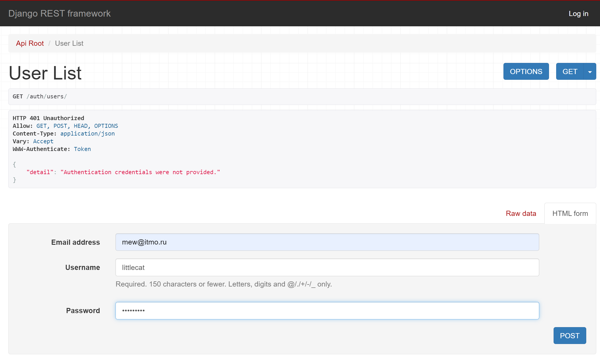
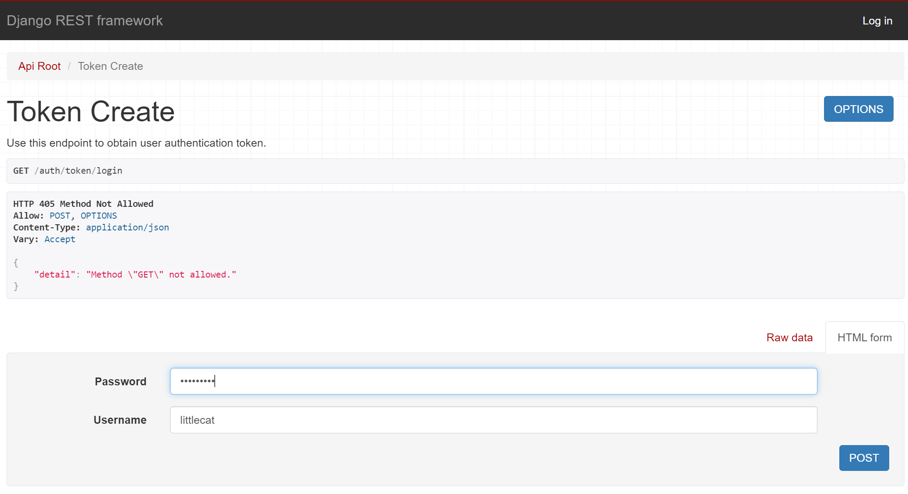
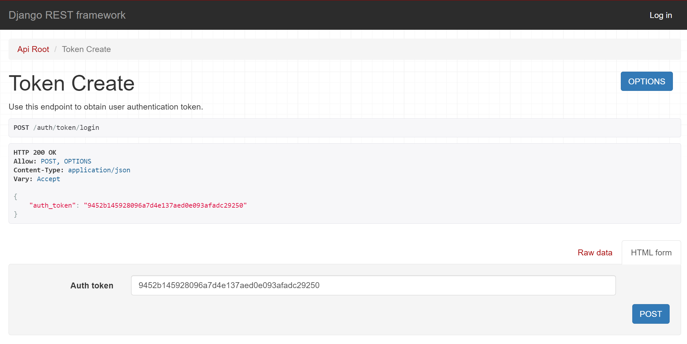

# Аутентификация

Настроим аутентификацию по токенам.


```commandline
 pip install -U djoser
```


=== "http://127.0.0.1:8000/auth/users/"

    

=== "http://127.0.0.1:8000/auth/token/login"

    

=== "Получение токена"

    

