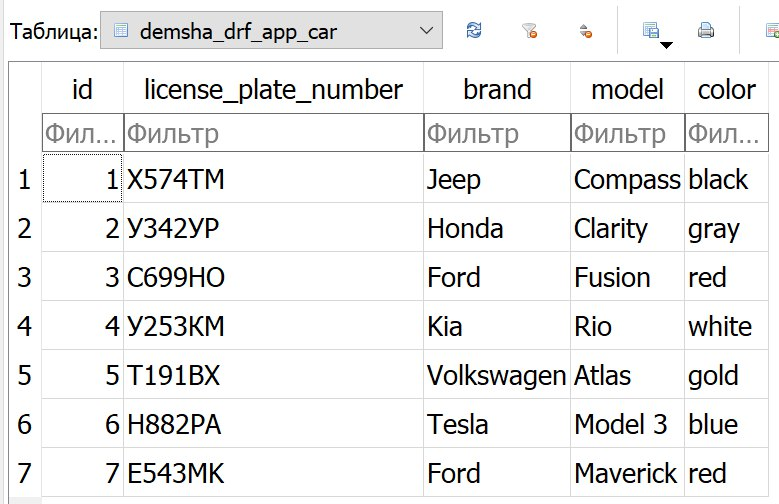
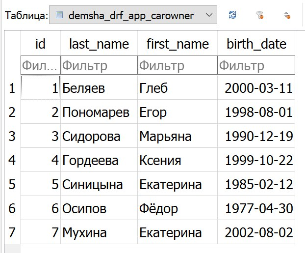

# Практика

Работа с запросами в Django ORM.

=== "Модели"

    ```Python
    from django.db import models
    
    
    class CarOwner(models.Model):
        last_name = models.CharField(max_length=30)
        first_name = models.CharField(max_length=30)
        birth_date = models.DateField()
    
        def __str__(self):
            return f'{self.first_name} {self.last_name}'
    
    
    class Licence(models.Model):
        LICENSE_TYPE = (
            ('B', 'passenger car'),
            ('C', 'truck'),
            ('D', 'bus'),
        )
        car_owner = models.ForeignKey(CarOwner, on_delete=models.CASCADE, related_name="licence")
        license_number = models.IntegerField()
        type = models.CharField(max_length=2, choices=LICENSE_TYPE)
        date_of_issue = models.DateField()
    
    
    class Car(models.Model):
        license_plate_number = models.CharField(max_length=15)
        brand = models.CharField(max_length=20)
        model = models.CharField(max_length=20)
        color = models.CharField(max_length=30)
        owner = models.ManyToManyField(CarOwner, through='Ownership')
    
        def __str__(self):
            return self.license_plate_number
    
    
    class Ownership(models.Model):
        user = models.ForeignKey(CarOwner, on_delete=models.CASCADE, related_name="ownership")
        car = models.ForeignKey(Car, on_delete=models.CASCADE, related_name="ownership")
        date_start = models.DateField()
        date_end = models.DateField(null=True, blank=True)
        ended = models.BooleanField()
    ```

=== "Задание 1"

    ```Python
    
    from django.utils import timezone
    from demsha_drf_app.models import CarOwner, Car, Ownership, Licence
    import os
    import django
    
    os.environ.setdefault('DJANGO_SETTINGS_MODULE', 'demsha_drf_project.settings')
    django.setup()
    
    
    owners = CarOwner.objects.bulk_create(
        [
            (gleb := CarOwner(last_name="Беляев", first_name="Глеб ", birth_date="2000-03-11")),
            (egor := CarOwner(last_name="Пономарев", first_name="Егор", birth_date="1998-08-01")),
            (mariana := CarOwner(last_name="Сидорова", first_name="Марьяна", birth_date="1990-12-19")),
            (ksenia := CarOwner(last_name="Гордеева", first_name="Ксения", birth_date="1999-10-22")),
            (kate1 := CarOwner(last_name="Синицына", first_name="Екатерина", birth_date="1985-02-12")),
            (fedor := CarOwner(last_name="Абрамов", first_name="Фёдор", birth_date="1977-04-30")),
            (kate2 := CarOwner(last_name="Мухина", first_name="Екатерина", birth_date="2002-08-02")),
        ]
    )
    
    cars = Car.objects.bulk_create(
        [
            (jeep := Car(license_plate_number="Х574ТМ", brand="Jeep", model="Compass", color="black")),
            (honda := Car(license_plate_number="У342УР", brand="Honda", model="Clarity", color="gray")),
            (ford1 := Car(license_plate_number="С699НО", brand="Ford", model="Fusion", color="red")),
            (kia := Car(license_plate_number="У253КМ", brand="Kia", model="Rio", color="white")),
            (vw := Car(license_plate_number="Т191ВХ", brand="Volkswagen", model="Atlas", color="gold")),
            (tesla := Car(license_plate_number="Н882РА", brand="Tesla", model="Model 3", color="blue")),
            (ford2 := Car(license_plate_number="E543MK", brand="Ford", model="Maverick", color="red")),
        ]
    )
    
    ownerships = Ownership.objects.bulk_create(
        Ownership(user=gleb, car=ford1, date_start="2019-10-25", date_end="2021-11-15"),
        Ownership(user=egor, car=tesla, date_start="2018-11-15", date_end="2022-06-06"),
        Ownership(user=egor, car=honda, date_start="2022-07-07"),
        Ownership(user=mariana, car=tesla, date_start="2017-12-03", date_end="2018-11-14"),
        Ownership(user=mariana, car=honda, date_start="2018-11-19", date_end="2022-07-05"),
        Ownership(user=mariana, car=kia, date_start="2022-05-13"),
        Ownership(user=ksenia, car=jeep, date_start="2020-03-14"),
        Ownership(user=kate2, car=honda, date_start=" 2017-08-11", date_end="2020-12-23"),
        Ownership(user=kate2, car=ford1, date_start="2021-11-15"),
        Ownership(user=fedor, car=ford1, date_start="2018-01-29", date_end="2019-10-20"),
        Ownership(user=fedor, car=vw, date_start=" 2020-12-25"),
        Ownership(user=fedor, car=tesla, date_start="2022-06-07"),
        Ownership(user=kate2, car=ford2, date_start="2023-06-16"),
    )
    
    licences = Licence.objects.bulk_create(
        [Licence(owner=owners[i], licence_number=str(i + 1) * 10, type="B", date_of_issue=timezone.now()) for i in range(7)]
    )

    ```
    
    

=== "Задание 2"

    ```Python
    from django.utils import timezone
    from demsha_drf_app.models import CarOwner, Car, Licence
    import os
    import django
    
    os.environ.setdefault('DJANGO_SETTINGS_MODULE', 'demsha_drf_project.settings')
    django.setup()
    
    fords = Car.objects.filter(brand="Ford").all()
    
    kates = CarOwner.objects.filter(first_name="Екатерина").all()
    
    random_id = CarOwner.objects.order_by("?").values("id").first()
    random_licence = Licence.objects.get(owner_id=random_id)
    
    red_car_owners = CarOwner.objects.filter(ownership__car__color="red").all()
    
    this_year_owners = CarOwner.objects.filter(licence__date_of_issue__year=timezone.now().year).all()

    ```

=== "Задание 3"

    ```Python

    from django.db.models import Min, Max, Count
    from demsha_drf_app.models import CarOwner, Car, Ownership, Licence
    import os
    import django
    
    os.environ.setdefault('DJANGO_SETTINGS_MODULE', 'demsha_drf_project.settings')
    django.setup()
    
    old_licence = Licence.objects.aggregate(max_issue_date=Min("date_of_issue"))["max_issue_date"]
    
    new_ownership = Ownership.objects.aggregate(max_start_date=Max("start_date"))["max_start_date"]
    
    ownership_count = CarOwner.objects.annotate(count=Count("ownership"))
    
    cars_brands_count = Car.objects.values("brand").annotate(count=Count("id"))
    
    owners_sort = CarOwner.objects.order_by("ownership__start_date").all()

    ```
